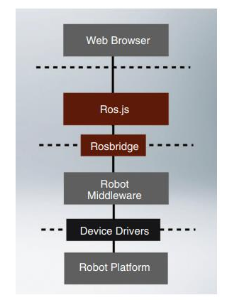
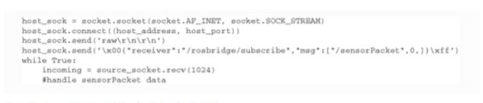

<!-- Text can be **bold**, _italic_, or ~~strikethrough~~.

[Link to another page](./another-page.html).

There should be whitespace between paragraphs.

There should be whitespace between paragraphs. We recommend including a README, or a file with information about your project. -->

<!-- # Johdanto

Vuoden 2019 lopussa maailma kohtasi maailmanlaajuisen COVID-19-pandemian. Pandemia on levinnyt hälyttävällä nopeudella ja taloudellinen toiminta on lähes pysähtynyt maiden asetettua tiukkoja liikkumisrajoituksia. Maailman kokema taloudellinen shokki on suurin vuosikymmeniin. Marraskuussa 2020 julkaistun Satakunnan-talous katsauksen mukaan 2020 keväällä joka 20.s työpaikka katosi. Satakunnan talouden tila oli kuitenkin alkanut heiketä jo aiemmin. Pandemia on siis syventänyt jo alkanutta taantumaa. Koko teollisuuden liikevaihto laski 3,3 %, viennin arvo laski 5,1 % ja henkilöstömäärä supistui 4,1 %.  Automaatio- ja robotiikka-alojen liikevaihto putosi 5,5 % vaikka henkilöstömäärää lisättiin 4,5 %.  Supistusta on kuitenkin tapahtunut selvästi vähemmän kuin Suomessa keskimäärin. Merkkejä talouden elpymisestä on kuitenkin jo nähty kuluvana vuonna 2021. OECD:n kuvasta yksi nähdään Suomen ennustettu palautuminen pandemiaa edeltävälle tasolle. (The Global Economic..., 2020; Vähäsantanen, 2020.)

##### Kuva 1: Palautuminen pandemiaa edeltävälle tasolle (The OECD Economic Outlook, 2021)

Satakuntaliiton keväällä vuonna 2017 tekemä seutukierros Satakunnan kunnissa kertoo kuntien painottavan koulutusta, saavutettavuutta sekä kasvun mahdollisuutta. Kyselyssä nousivat esiin koulutuksen saatavuus, koulutuksen ja työvoiman kysynnän vastaavuus sekä korkeakoulutuksen turvaaminen ja kehittäminen. (Satakuntaliitto, 2017) Robotiikan koulutus kasvuyritysten ohjenuorana- hanke paneutuu kuntien esille nostamiin seikkoihin ja auttaa omalta osaltaan luomaan uutta osaamispääomaa ja levittämään sitä ajan myötä koko Satakuntaan. Hankkeessa kehitetty ROS-robottiekosysteemiin keskittyvä täydennyskoulutuskokonaisuus tuo merkittävän lisän alueen aikuiskoulutustarjontaan. Vastaavaa täysin maksutonta koulutusta ei Suomessa ole tarjolla. Muuntuvilla robotiikkaratkaisuilla luodaan yrityksille kaivattua kustannustehokkuutta sekä helpotetaan robotiikan kehittämistä tekemällä siitä nopeampaa ja yhteisöllisempää. Hankkeessa käytetty SAMK (Satakunnan ammattikorkeakoulu) Yhteistyö Moodle on sähköinen koulutusalusta, joka mahdollistaa ajasta ja paikasta riippumattoman opiskelun, jolloin opiskelijat eivät ole sidottuja pendelöimään oman asuinalueensa ja Porin korkeakoulujen välillä. 

Robottikäyttöjärjestelmän kehittäminen edellyttää järjestelmien suunnittelutekniikoiden perusteellista tuntemusta, suunnittelutavoitteiden tuntemusta ja tiukkojen kehitysprosessien noudattamista. Avoimen lähdekoodin robotiikan syntyminen on mahdollistanut robotiikan kehittäjien ja toteuttajien omien robotiikkajärjestelmien kehityksen. Nämä perustuvat sisäisiin taitoihin sekä julkisesti saatavilla oleviin robotiikan väliohjelmiin, simulaattoreihin, kirjastoihin ja työkalupakkeihin. ROS:in suosio perustuu laajaan yhteensopivuuteen ja toimivuuteen muiden avoimen lähdekoodin hankkeiden kanssa. (Petrara, 2019.) -->

# Robot Operating System, ROS

Vuonna 2007 Stanfordin Artificial Intelligence laboratoriossa ja Willow Garagen avustuksella kehitetty Robot Operating System (ROS) edustaa avoimen lähdekoodin politiikkaa ja on siten muodostunut yhdeksi suosituimmista ohjelmistokehyksistä robotiikassa. Se on suunniteltu hajautetuksi ja modulaariseksi, jotta käyttäjät voivat käyttää ROS:ia tarpeidensa mukaan. ROS-ekosysteemissä on yli 3 000 pakettia ja siinä on laskettuna vain ne, jotka ovat ihmisten julkistamia. ROS tukee mobiili-, teollisuus-, kirurgia- ja avaruusrobotiikkaa sekä autonomisia autoja. ROS on eräänlainen aarreaitta täynnä algoritmeja, ohjelmistoja, ajureita, toimintoja ja paljon muuta. ROS:in joustavuus pohjautuu sen kykyyn toimia informatiivisena perustana innovatiiviselle kehitykselle. Muokattavuutensa vuoksi ROS mahdollistaa käyttäjien omien suunnittelumallien käytön. Käyttäjäyhteisönsä jatkuvan kehittämisen ja lähdekoodin avoimuuden vuoksi ROS:in käyttö koetaan turvallisena ja luotettavana. (Is ROS For..., n.d.; Vozel, 2019.)

##### Kuva 2: ROS kasvuodotukset vuoteen 2027 (Research and Markets, 2021)

ROS markkinoiden odotetaan kasvavan vuoden 2020 arvioidusta 216,6 M$:sta tarkistettuun 356,8 M$:iin vuoteen 2027 mennessä (Kuva 2). Sen vuotuinen CAGR (Compound Annual Growth Rate) tällä aikajaksolla olisi täten 7,4 %. COVID-19 pandemian aiheuttaman ekonomisen kriisin vuoksi CAGR:in on arvioitu tippuvan 7,1 %. Tutkimus- ja kehitystyöhön liittyvät teollisuus automaation varat, yhteistyössä toimivien modulaaristen robottien lisääntyvä käyttö sekä RaaS (Robotics-as-a-Service) kasvava kysyntä ennustavat edullisten ROS teollisuusrobottien käyttöönottoa. (Markets and markets, 2019; Research and Markets..., 2021.)

&nbsp;
 

## ROS 1

Kun lähdetään toteuttamaan uutta robottisovellusta, on viestintäjärjestelmä yksi ensimmäisistä tarpeista. ROS:ia käytetään monissa robottiympäristöissä ja monien antureiden, ohjaimien ja moottoreiden on kommunikoitava keskenään, lähetettävä ja vastaanotettava tietoja haluttujen tehtävien suorittamiseksi. ROS:in sisäänrakennetulla ja hyvin testatulla viestintäjärjestelmällä säästetään aikaa ROS:in toimiessa hajautettuna arkkitehtuurina, joka käyttää julkaisija/tilaaja (engl. publisher/subscriber) -viestejä solmujen (engl. node) välillä. Jokaisella solmulla on yksi, tai useampia aiheita (engl. topic) tai palveluita (engl. service), jotka ovat irtautuneet ja joita voidaan käyttää uudelleen. Esimerkki julkaisijasta on 3D-kamera, joka tuottaa striimattua kuvadataa, ja tilaajana on tiedon käyttäjä. Palvelu puolestaan on asiakas/palvelin malli, jossa käytetään pyyntö/vastaus viestejä. Esimerkkinä voidaan käyttää kuvatietoja, jotka muotoillaan toiseen muotoon ja saatu vastaus saadaan pakattuna datana. ROS-viestinnässä käytetään kuvan kolme esimerkin mukaista tapaa solmujen välillä, missä Talker on julkaisijana ja Listener on tilaajana. ROS master edesauttaa aiheita löytämään toisensa. Tätä kutsutaan sentraaliseksi viestinvälitykseksi, jossa kommunikaatio alustetaan ja jonka jälkeen jokainen aihe voi kommunikoida suoraan keskenään. Näiden viestirajapintojen rakenne on määritelty IDL-sanomassa (Interface Description Language).  (Core Components, n.d; DiLuoffo, et al., 2017.) 

##### Kuva 3: ROS viestintä (DiLuoffo, et al., 2017)
 
Julkaisija/tilaaja järjestelmän ollessa anonyymi ja asynkroninen voidaan dataa tallentaa ja toistaa ilman mitään muutoksia koodiin. Rosbag record tilaa aiheet ja kirjoittaa niistä bag-tiedoston, jossa on kaikki julkaistut viestisisällöt. Tiedosto sisältää lomitetut ja sarjoitetut ROS-viestit, joista on suoraan tehty yksi tiedosto niiden tulohetkellä. Tämä on tehokkain ja levy ystävällisin tallennusmuoto. Bag-tiedostoa luodessa voidaan tiedosto vielä pakata, jolloin säästyy levytilaa. (Core Components, n.d ; rosbag/Commandline, 2020.)

ROS 1 käyttää Cpp:lle roscpp:tä ja Pythonille rospy:ta. Se tukee Python 2:sta. Kirjastot ovat täysin itsenäisiä ja ne on rakennettu tyhjästä, tarkoittaen sitä, ettei ohjelmointirajapinta niiden välillä välttämättä ole sama, jolloin niiden ominaisuudet on kehitetty vain toiselle. ROS 1 ei ole varsinaisesti mitään rakennetta, miten kirjoittaa solmujen toiminnallisuus ja jokaisen toteutus voi olla ainutlaatuinen. Käynnistystiedostojen kirjoittamisessa käytetään XML:ia (Extensible Markup Language). ROS 1 käynnistetään aina ensin ROS-isäntä, roscore, joka toimii solmujen DNS-palvelimena (Domain Name System), jotta ne voivat hakea ja tunnistaa toisensa. Palvelut ovat synkronoituja mikä tarkoittaa sitä, että pyyntö on jumissa, kunnes palvelin joko vastaa tai epäonnistuu. Solmut rakennetaan käyttämällä catkiniä, joka on ROS:in virallinen rakennusjärjestelmä ja alkuperäisen rosbuildin seuraaja. (catkin/ conceptual_overview, 2020; The Robotics Back-End, 2021.) 

Väliohjelmiston pääkomponenttien lisäksi ROS:lla on tarjolla robottikohtaisia kirjastoja ja työkaluja, joilla robotti saadaan nopeasti toimintavalmiiksi. Tässä niistä muutama: 

-	Robottien vakioviestimääritelmät
-	Robotin geometria kirjasto
-	Robotin kuvauskieli
-	Ennakoitavat etäsuoritukset
-	Diagnostiikka 
-	Asento arviointi
-	Paikannus
-	Kartoitus
-	Navigaatio

(Core Components, n.d)

ROS:lla on aktiivinen tukijoukko, johon kuuluvat mm. käyttäjät, ROS ytimen ja pakettien kehittäjät sekä työkalujen ylläpitäjät. He kuuluvat joko vapaaehtoisiin tai Open Source Robotics Foundationin työntekijöihin. ROS:lla on oma Stack Overflown tyylinen Q&A nettisivusto, ROS Answers 13. Moni käyttäjä kokee tämän olevan luotettava ongelmienratkaisukanava. Pakettien ylläpitäjät ja yhteisöpäälliköt käyttävät postituslistoja ilmoituksiin kuten tärkeät korjaukset tai julkaisut. Helmikuussa 2016 avattiin ROS Discource foorumi, jossa voi keskustella ROS:sin tulevaisuuteen liittyvistä asioista. Sivusto on kohdistettu lähinnä kokeneemmille käyttäjille, pakettien ylläpitäjille ja yhteisöpäälliköille. Suurin osa paketeista löytyy kuitenkin GitHub-alustalta. (Estefo, et al., 2019.)

Uusin ja viimeiseksi ROS 1 distribuutioksi jäävä 2020 julkaistu Noetic EOL (End of Life) päättyy 2025. Viimeisen ROS 1 versioon päätavoite on tarjota Python 3 tukea kehittäjille ja organisaatioille. (The Robotics Back-End, 2021.)  

&nbsp;
  

## ROS 2

Alfa-koodina alun perin ilmestynyt ROS 2 otettiin käyttöön vuonna 2014. Alpha code 3Q2015 versio ei kuitenkaan täyttänyt vaadittuja turvatoimia. Tämän vuoksi kehitettiin seuraajaversio: ROS 2, joka käyttää erilaista lähestymistapaa viestintäkerroksissa ollen nyt OMG:in (Object Management Group) teollisuusstandardi DDS (Data Distribution Service). ROS 2 on alun hankaluuksien jälkeen julkaistu jo monta versiota (Kuva 4). (Basheer & Varol, 2019; Maruyama, et al., 2016.) 

##### Kuva 4: Luettelo ROS 2 julkaisuista. (New Version of..., 2021)

DDS turvallisuusspesifikaation laajennus julkaistiin 2016. DDS käyttää IDL-määritystä, jonka OMG määritteli sanomien määrittelyyn ja sarjoitukseen. Sen ydin on DCPS (Data-Centric Publish-Subscibe) joka on suunniteltu tarjoamaan tehokas tiedonsiirto jopa hajautetuissa heterogeenisissä alustoissa. Oletuksena oleva hakujärjestelmä on hajautettu etsintäjärjestelmä, joka sallii minkä tahansa kahden DDS-ohjelman kommunikoida ilman ROS masteria ja joka täyttää turvallisuutta, joustavuutta, skaalautuvuutta, vikasietoisuutta ja turvallisuutta koskevat vaatimukset. Moni DDS-toimittaja tosin tarjoaa vaihtoehtoja staattiselle etsinnälle, joten dynaamisen etsintämekanismin käyttö ei ole välttämätöntä. (DiLuoffo, et al., 2017; Maruyama, et al., 2016; Woodall, n.d.)

DDS:ää on käytetty monipuolisesti eri asennuksissa kuten: 

- taistelulaivoissa
- suurissa hyötylaitoksissa kuten padoissa
  - rahoitusjärjestelmissä
  - avaruusjärjestelmissä
  - lentojärjestelmissä
  - junien vaihdejärjestelmissä
- sekä monissa muissa skenaarioissa

Sen johtospesifikaatio DDSI-RTPS, toiselta nimeltään RTPS (The REAL-time Publish-Subscibe Protocol) on joustavuutensa vuoksi käytettävissä luotettavaan, korkean tason järjestelmäintegraatioon sekä reaaliaikaisiin sovelluksiin sulautetuissa laitteissa. DDSI-RTPS korvaa ROS 1:sen TCPROS- (Transmission Control Protocol) ja UDPROS (User Datagram Protocol) johdinprotokollat julkaisuille ja tilauksille. (Woodall, n.d.)

Jotta DDS:stä voisi tulla ROS 2:sen toteutuksen yksityiskohta on kaikki DDS-spesifiset ohjelmointirajapinnat ja sanomamäärittelyt piilotettava. DDS tarjoaa etsinnän, viestin määrittelyn sekä julkaisu- ja tilausliikenteen. ROS 2 tarjoaa vastaavanlaisen käyttöliittymän kuin ROS 1, jolloin suuri osa DDS:n monimutkaisuudesta olisi piilotettuna osalta ROS-käyttäjiä tarjoten erikseen pääsyn DDS-toteutukseen käyttäjille, joilla on äärimmäisiä käyttötapauksia tai joiden tarvitsee integroitua muiden olemassa olevien DDS-järjestelmien kanssa (Kuva 5). (Woodall, n.d.)

 
##### Kuva 5: DDS ja ROS API (Application Programming Interface) pohja (Woodall, n.d.)
 
 DDS-toteutuksen käyttöön tarvitaan lisäpaketti, jota ei normaalisti ole käytössä. Pakettiriippuvuuksien avulla selvitetään, onko paketti sitonut itsensä tiettyyn DDS-myyjään. ROS:lle on tulossa yksi parhaiten tuettu DDS-toteutus, jonka avulla voidaan löytää ratkaisuja reaaliaikaisiin ympäristöihin ja pieniin sulautettuihin järjestelmiin vähentämällä kirjastojen kokoa ja muistijälkiä. (Woodall, n.d.)

 
##### Kuva 6: ROS 1 / ROS 2 arkkitehtuuri (Maruyma & al., 2016)

ROS 2:ssa on enemmän kerroksia kuin edeltäjällään (Kuva 6). Peruskirjastoja on vain yksi, C:llä toteutettu rcl (ROS Client Libraries). Tämä sisältää kaikki ROS 2 ydinominaisuudet. Kirjastoa ei käytetä suoraan ohjelmissa vaan siinä käytetään toista asiakaskirjastoa, joka on rakennettu rcl:n päälle. Kehittäjille tämä tarkoittaa siis sitä, että muiden asiakaskirjastojen luominen ja käyttö on helpompaa ja tarvitsee tehdä vain C-sidos rcl:llä. Oletusarvoisesti käytetään Cpp 11:tä ja 14:ää ja suunnitelmissa on myös Cpp 17. Nämä uudet Cpp-versiot omaavat hyödyllisiä toimintoja, joilla kehityksestä tulee helpompaa, nopeampaa ja turvallisempaa. Solmuja kirjoitettaessa on luotava luokka, joka perii solmuobjektin esim. rclcpp::Node Cpp:ssä ja rclpy.node.Node Pythonissa. Python versioista on käytössä vähintään 3.5. Luokassa on kaikki ROS 2 funktionaalisuudet. Nodelettien toiminnallisuus on sisällytetty ytimeen ja sitä kutsutaan komponentiksi. Käynnistysohjelmien kirjoittamiseen käytetään Pythonia. On myös olemassa ohjelmistorajapinta, jonka avulla voidaan käynnistää solmut, hakea määritystiedostoja, lisätä parametreja jne. Halutessaan voi toki käyttää myös XML:ia, mutta Pythonia suositellaan käytettävän sen modulaarisuuden ja suuremman dokumentaatio määrän vuoksi. ROS 2:ssa ei enää käytetä ROS-isäntää vaan jokainen solmu kykenee löytämään muut solmut itsenäisesti. Käynnistys onnistuu, oli isäntää tai ei. Tämän avulla voidaan luoda täysin hajautettu järjestelmä. Globaaleja parametrejä ei enää ole, vaan jokainen parametri on solmulle spesifi. Palvelut ovat asynkronisia. (The Robotics Back-End, 2021.)

ROS 2 mukana tulee QoS (Quolity of Service) jonka avulla voidaan valita miten solmut käsittelevät viestintää. Halutaanko vastaanottaa kaikki viestit vai päivitetäänkö tietoja usein, jolloin voidaan menettää joitakin viestejä. QoS on ROS 2:ssa oletusarvona, joten siltä voidaan olettaa samaa käyttäytymistä kuin ROS 1. Vain tilauksen jälkeiset viestit julkaistaan ja TCP takaa viestien toimituksen. Mikäli joudutaan käyttämään heikkoa langatonta verkkoyhteyttä tai suurta kaistanleveyttä, on QoS paikallaan. Aloittelijalle tai yksinkertaiselle sovellukselle QoS ei ole ensisijainen valinta. ROS 2:ssa ei enää rakenneta solmuja catkinillä vaan siihen käytetään Amentia, jonka mukana tulee colcon (collective construction) komentorivityökalu, jolloin kääntämiseen käytetään ”colcon build” komentoa. Syy nimen muuttamiseen on, ettei sen haluttu olevan ristiriidassa catkinin kanssa ja aiheuttavan siten sekaannuksia olemassa olevien catkin dokumentaatioiden kanssa. Ament koostuu muutamasta tärkeästä varastokirjastosta, jotka kaikki ovat ament GitHub-organisaatiossa:
-	ament_package paketti
-	ament_cmake varastokirjasto
-	ament_lint varastokirjasto
-	build työkalut
Uutta ROS 2:ssa on myös se, että sitä voidaan käyttää Ubuntun lisäksi myös MacOS:ssa ja Windows:ssä.

(About the build..., 2021; The Robotics Back-End, 2021.) 

Yksi suurimmista eroista ROS 1 ja ROS 2 välillä on simulaatiokyky. ROS 1:llä on Gazebo ja siinä muutamia simulaatiomahdollisuuksia, mutta integrointi on hankalaa ja Gazebo itsessään melko monoliittinen. Ignition Gazebo ja ROS 2 taas puolestaan tarjoavat täydennetyn robotin ja täysin toimivan dynaamisen ympäristön. Erilaiset kilpailut, kuten DARPA SubT (DARPA Subterranean Challenge), RobotX Challenge ja AWS JPL Open Source Rover Challenge ovat osoittaneet, että malli on onnistunut. Gazebon nykyinen versio on nimeltään Ignition Citadel ja sillä voi simuloida fysiikkaa, ympäristörajoituksia sekä antureita. Siihen on kiinnitetty kaikki ROS-elementit, eli mikäli simulaatiossa on virtuaalikamera ja virtuaalinen LiDAR (Ligth Detection and Ranging) eli lasertutka, ovat saadut numerot melko samanlaisia, kuin mitä ne olisivat todellisessa maailmassa. (Quetzalli, 2020.)

ROS 1-koodipohjan siirto ROS 2:seen onnistuu yhteensopimattomasta kommunikaatiosta huolimatta ROS 1-bridge-pakettiadaptaatiolla. Siirron voi suorittaa aluksi muutamalla paketilla ja vähitellen lisätä yhä enemmän paketteja, kunnes ROS 1:ssä ei ole enää paketteja jäljellä. Sovellus toimii odotetusti koko siirron ajan. (The Robotics Back-End, 2021.)

&nbsp;
 

### micro-ROS
Mikro-ROS on räätälöity erityisesti sulautetuille ja resurssirajoitteisille alustoille kuten mikrokontrollerit. Suurin osan ominaisuuksista ja arkkitehtuurista periytyy ROS 2:lta yhdistäen saumattomasti ’makro’ ja ’mikro’ robotiikan. Se toimii RTOS:ssä (Real-Time Operating System) ja käyttää DDS-väliohjelmistoa Micro XRCE-DDS (eXtremly Resource Constrained Environment) (Kuva 7), eli DDS:ää äärimmäisen resurssirajoitetuissa ympäristöissä. Käytettävissä on tehokkaita kehitystyökaluja kuten täydellinen koontijärjestelmä eri laitteistoalustoille ja koko robottiohjelmien joukko, joka on saatavilla ROS 2-ympäristössä. Yksi hyödyistä siirryttäessä vähemmän resursseja vaativiin robotiikkasovelluksiin on kustannusten aleneminen, jolloin se on erityisen kätevä teollisen massatuotannon kilpailukyvylle. (Competitive Warehouse Automation..., 2020; XRCE-DDS, 2021.) 

##### Kuva 7: Micro-ROS:in arkkitehtuuri. Tummansiniset kerrokset ja komponentit on kehitetty mikro-ROS-laitteille. Vaalean siniset kerrrokset rmw ja rlc uudelleenkäytetään ROS 2:sta. (Lange, 2021) 

Seitsemän keskeistä ominaisuutta tekee mikro-ROS:sta käyttövalmiin mikrokontrolleripohjan erilaisiin robottiprojekteihin.

- *Optimoitu asiakasrajapinta, joka tukee kaikkia tärkeimpiä ROS-konsepteja* 
  Mikro-ROS:in avulla kaikki solmut, julkaisu/tilaus, asiakas/palvelu, solmukaavio jne. tuodaan MCU:lle (Microcontroller Unit). Asiakasrajapinta perustuu vakio-ROS 2 rcl-kirjastoon sekä sarjaan laajennuksia ja soveltuvuustoimintoja (sclc). Näiden yhdistelmä on optimoitu MCU:lle. (Features and Architecture, 2021.)
- *Saumaton integrointi ROS 2:n kanssa* 
  Mikro-ROS agentti yhdistää MCU:in mikro-ROS-solmut saumattomasti ROS 2 järjestelmiin mahdollistaen näin pääsyn mikro-ROS-solmuihin ROS 2:sta tunnetuilla työkaluilla ja API:lla tavallisten solmujen tapaan. (Features and Architecture, 2021.)
- *Erittäin resurssirajoitettu mutta joustava väliohjelmisto* 
  eProsiman Mikro XRCE-DDS täyttää kaikki sulautetuille järjestelmille asetetut vaatimukset. Ajon aikaisten muistin allokointien välttämiseksi ROS-väliohjelmiston rajapinnassa otettiin käyttöön staattiset muistivarastot. (Features and Architecture, 2021.)
- *Multi-RTOS-tuki yleisellä koontijärjestelmällä* 
  Mikro-ROS tukee kolmea avoimen lähdekoodin reaaliaikaista käyttöjärjestelmää (RTOS): FreeRTOS, Zephyr ja NuttX. Se voidaan siirtää mihin tahansa POSIX-käyttöliittymän omaavaan RTOS:iin. ROS 2-pakettina toimitettavaan asennusohjelmaan on integroitu RTOS-spesifiset rakennusjärjestelmät. Näin ROS-kehittäjät voivat käyttää tavallisia komentorivityökaluja. (Features and Architecture, 2021.)
- *Lupalisenssi* 
  Mikro-ROS kuuluu samaan Apache License 2.0 lisenssiin kuin ROS 2. Tämä koskee mikro-ROS-asiakaskirjastoa, väliohjelmistokerrosta sekä työkaluja. RTOS projektia luotaessa on otettava huomioon ROS-projektin tai toimittajan lisenssit. (Features and Architecture, 2021.)
- *Vilkas yhteisö ja ekosysteemi* 
  Jatkuvasti kasvava, itseorganisoitunut yhteisö on kehittänyt mikro-ROS:in ja sitä tukee virallinen ROS 2-työryhmä, Embedded Working Group. Yhteisö jakaa aloitustason opetusohjelmia, tarjoaa tukea Slackin ja GitHubin kautta ja tapaa kuukausittaisissa julkisissa Working Group-videopuheluissa. Yhteisö kehittää myös työkaluja mikro-ROS:in ympärille. Esimerkkinä MCU-laitteistolle kehitetyt benchmarkkaustyökalut, joiden avulla voidaan tarkistaa muistin käyttö, suorittimen ajankulutus sekä yleinen suorituskyky. (Features and Architecture, 2021.)
- *Pitkäaikainen ylläpito ja yhteentoimivuus* 
  Pitkäaikaisen ylläpidettävyyden takaamiseksi mikro-ROS-spesifisen koodin määrää minimoitiin käyttäen avoimen lähdekoodin RTOS:ia, standardoitua väliohjelmistoa sekä vakio ROS 2 Client Support kirjastoa. SOSS (System-Of-Systems Synthesizer), nopea ja kevyt OMG DDS-XTYPES-integraatiotyökalu voi liittää muita väliohjelmistoprotokollia. (Features and Architecture, 2021.)

&nbsp;
 

### OpenCV

OpenCV (Open Source Computer Vision Library) on avoimen lähdekoodin koneoppimisen ja -näön ohjelmistokirjasto. Se kehitettiin tarjoamaan yhteinen infrastruktuuri konenäön sovelluksille, jotta kaupallisten tuotteiden koneellinen tunnistus nopeutuisi.  OpenCV on BSD-lisensioitu (Berkeley Software Distribution) tuote mikä merkitsee sitä, että yritysten on helppo käyttää ja muokata koodia. Kirjastossa on yli 2 500 optimoitua algoritmia. Algoritmeja voidaan käyttää kasvojen sekä esineiden havaitsemiseen ja tunnistamiseen. Niillä voidaan luokitella mm. ihmisten erilaisia toimia, seurata liikkuvaa kohdetta, erotella 3D-mallit kohteista, yhdistää kuvia korkean resoluution aikaansaamiseksi, tunnistaa maisemat ja luoda merkkejä, joiden avulla maisema peitetään lisätyllä todellisuudella (engl. Augmented Reality, AR). Monet yritykset, tutkimusryhmät ja valtiolliset elimet käyttävät kirjastoa. ROS käyttää omaa sensor_msgs/Image viestimuotoaan. CvBridge on ROS-kirjasto, joka tarjoaa käyttöliittymän ROS:in ja OpenCV:n välillä. (About - OpenCV, 2021; cv_bridge/ Tutorials/ Using..., 2017.)

OpenCV:tä käytetään monenlaisissa eri sovelluksissa, joita ovat mm. katunäkymien kuvien yhdistäminen, automaattinen tarkistus ja valvonta, autonomisen auton navigointi ja hallinta sekä lääketieteellinen kuva-analyysi (OpenCV, 2021).

&nbsp;
 

### Docker

Docker on sekä yritys että ilmainen ohjelmisto avoimen lähdekoodin yhteisölle.  Dockerissa voi luoda eristettyjä ympäristöjä projekteille ja asentaa riippuvuuksia, jotka eivät toisissa ympäristöissä aiheuta ongelmia muiden projektien kanssa. Näitä ympäristöjä kutsutaan konteiksi, jotka toimivat kuin virtuaalikoneet vaikka eivät sellaisia olekaan. Kontit eivät tarvitse erillistä käyttöjärjestelmää, vaan ne toimivat itsenäisesti laitteistokerroksen päällä jakaen isäntälaitteen resurssit. Muistia tarvitaan vähemmän ja nopeuttakin saattaa olla enemmän kuin virtuaalikoneella. Dockerin ja virtuaalikoneen eroavaisuus näkyy kuvassa kahdeksan. (Lentin & Ramkumar , 2019.)
  

##### Kuva 8: Virtuaalikoneen ja Dockerin eroavaisuuksia (Lentin & Ramkumar, 2019)
 
 ROS-projekti saattaa koostua useista alapaketteja sisältävistä metapaketeista, joiden toimivuuteen tarvitaan riippuvuuksia. Voi olla ärsyttävää asentaa paketteja ROS:iin, sillä eri paketit saattavat käyttää joko samoja tai eri riippuvuuksia eri versioista johtaen näin kääntämisongelmiin. Kontit ovat käytännöllinen tapa ratkaista riippuvuusversiomuutosten vuoksi ilmaantuneita ongelmia. Ne ovat nopeita ja toisin kuin käyttöjärjestelmän prosessi voivat käynnistyä tai pysähtyä muutamassa sekunnissa. Laitteiston päivitykset tai paketit eivät vaikuta sisällä oleviin kontteihin tai muihin paikallaan oleviin kontteihin. (Lentin & Ramkumar , 2019.)

&nbsp;
  
### Matlab & Simulink

Matlabilla on tehokas tietojenkäsittelykyky ja graafinen ohjelmointi, jolla voidaan käyttää suurta määrää kehittyneitä algoritmeja. Se on varustettu tehokkailla työkaluilla, kuten konenäkö, ohjausjärjestelmä sekä signaalinkäsittely. Näin ollen se on varsin hyödyllinen käyttöliittymä tutkijoille ja opiskelijoille. Matlab ja Simulink voidaan yhdistää ROS 1 ja ROS 2 verkkoon käyttämällä ROS Toolbox käyttöliittymää, jolloin voidaan vuorovaikutteisesti tutkia robotin ominaisuuksia ja visualisoida anturitietoja. ROS-yhteensopivilla roboteilla ja robottisimulaattorilla (esim. Gazebo) voidaan testata, kehittää ja tarkastaa robotiikan algoritmeja. Matlabilla ja Simulinkilla voidaan myös luoda itsenäinen ROS-verkko ja tuoda ROS-lokitiedostoja (rosbags) jolloin dataa voidaan visualisoida, analysoida tai jälkikäsitellä (Kuva 9). (Mahtani, et al., 2018; MathWorks, 2021.) 

##### Kuva 9: ROS MATLAB ja Simulink tuki (MathWorks, n.d.) 

Jotta kommunikointi muiden solmujen kanssa onnistuu, voidaan Matlabissa ja Simulinkissa määrittää omat mukautetut viesti- ja palvelutyypit. Muiden Matlab-käyttäjien kanssa voidaan jakaa mukautettuja viestirajapintoja. Simulink Coder-sovelluksella voidaan luoda C++ koodi erilliselle ROS-sovellukselle, joka toimii millä tahansa Linux-alustalla. (MathWorks, 2021.)

&nbsp;
  
### Tekoäly

Vuoteen 2000 saakka ihmisen tieto tallennettiin analogisiin laiteisiin, kuten kirjoihin, sanomalehtiin ja magneettinauhoihin. Vuonna 1993 tiedon pakkaamiseen olisi tarvittu 15,8 eksatavua tilaa eli 15,8 miljardia gigatavua. Vuonna 2018 tiedon määrä oli kasvanut 33 zetatavuun, joka taas on 33 000 miljardia gigatavua. Suurten tietomäärien lataamiseksi pilvipalveluntarjoajien on turvauduttava kuljettamaan kontinkokoisia kiintolevyjä. Kaiken tämän tiedon analysoimiseen tarvitaan myös laskentatehoa. Tietomäärän ja laskentatehon yhdistymisen myötä vuoden 2010 aikoihin tuli sekä mahdolliseksi että tarpeelliseksi opettaa koneita oppimaan. Yhdistämällä tekoäly robotiikkaan saadaan luotua älykkäämpiä autonomisia järjestelmiä. (Winder, 2021.)

Suuren yleisön suhtautuminen tekoälyyn ja yleiseen robotisaation kehitykseen on edelleen epäröivä ja ahdistunut, sillä luullaan niiden vievän työpaikat. Tosiasiahan on, että osa perinteisistä työpaikoista häviää ja osa muuttuu, mutta sen myötä syntyy myös uusia työpaikkoja. Tähän haasteeseen on vastattava opetuksen ja koulutuksen avulla. Kuvasta 10 nähdään tekoälyn käyttötapauksia vuonna 2020. Tekoälytaitoja Euroopassa on kehitettävä ja edistettävä erilaisilla koulutusohjelmilla. Digitaalisia taitoja, tieteen, teknologian, tekniikan ja matematiikan taitoja, yrittäjyyttä ja luovuutta olisi tuettava. Yhteiskunnilla on edessään valtava muutos ja tekoälyn myönteisistä vaikutuksista olisi saatava tietoa kansan keskuuteen.  (Artificial Intelligence for..., 2020.)

##### Kuva 10: Tekoälyn johtavat käyttötapaukset vuonna 2020. (Mehta & Senn-Kalb , 2021)

Sana tekoäly (engl. Artificial Intelligence, AI) aiheuttaa suurimmalle osalle ihmisistä paljon hämmennystä, josta suurin osa juontuu termien tekoäly ja koneoppiminen (engl. Machine Learning, ML) väärinkäytöstä. Lyhyesti ilmaistuna, tekoäly on tieteen ala, joka kattaa tietokoneiden kyvyn tehdä päätöksiä ja oppia kuten ihminen. Koneoppimisessa taas luodaan ohjelmisto, joka oppii sille annetusta datasta. Koneoppimistyyppejä ovat: valvottu oppiminen (engl. Supervised Learning), valvomaton oppiminen (engl. Unsupervised Learning) sekä vahvistusoppiminen (engl. Reinforcement Learning) (Kuva 11). (Olson, 2018.)

##### Kuva 11: Kaaviossa nähdään intuitiivinen kuva tekoälyn kentästä (Palanisamy, 2018) 
 
Terminologia on hämmentävä, koska niihin liittyy sekoitus eri tekniikoita ja monessa on mukana sana ”oppiminen”. Esimerkkinä kolme koneoppimisen ydintyyppiä: Reinforcement Learning (RL), Deep Reinforcement Learning (DRL) sekä Deep Learning (DL). (Olson, 2018.)

*Reinforcement Learning*, vahvistusoppimisessa ei ole tarpeen tietää jokaista oikeaa askelta, riittää kun päämäärä on selvillä. Päätöksentekijä oppii kokeilemalla ja erehtymällä, vuorovaikutuksesta ympäristön kanssa. Ts. sen on itse opittava yrityksen ja erehdyksen kautta. Tekoäly saa joko palkkioita tai rangaistuksia suorittamistaan toimista samaan tapaan kuin esim. koiraa palkitaan herkuilla onnistuneesta suoritteesta. Ihmisen tehtävät rajoittuvat lähinnä ympäristön muuttamiseen ja palkitsemis- ja rangaistusjärjestelmän säätämiseen. Vahvistusoppiminen on tällä hetkellä tehokkain tapa ymmärtää koneen luovuutta. (Brown & Zai, 2020; Osiński & Budek, 2018; Winder, 2021.)

Robotiikan alalla on monia erilaisia sovelluksia, jotka käyttävät vahvistusoppimista. Näistä esimerkkejä ovat mm. robotin liikkeiden, teollisen valmistuksen parantaminen ja pannukakkujen kääntäminen. RL:n avulla voidaan parantaa pilvipalveluita, vähentää rakennusten käyttämän energian määrää, parantaa liikennevalojen hallintaa ja aktiivista kaistanhallintaa. Myös rahoitusala käyttää RL:ää kauppojen tekemiseen ja sijoitussalkkujen kohdentamiseen. Autonomiset ajoneuvot ovat myös hyvin aktiivisen tutkimuksen kohteena ja viime aikoina terveydenhuollossa on esiintynyt kiinnostusta vahvistusoppimiseen. Mikään ala ei siis jää koskemattomaksi. (Osiński & Budek, 2018.)

*Deep Learning*, syväoppiminen on suunniteltu kehittyneempien tehtävien suorittamiseen ja se koostuu useiden neuroverkkojen (engl. Neural Network, NN) kerroksista. Syväoppimisen malli on lähtöisin yksinkertaistetuista ihmisen aivoista. Nämä mallit koostuvat muutamista neuroverkoista, jotka periaatteessa oppivat tietystä datasta abstrakteja toimintoja asteittain. Jokainen neuroverkon kerros käyttää edellisen kerroksen tulosta syötteenä ja siten koko verkko koulutetaan yhtenä kokonaisuutena. Kehysympäristöt kuten Tensorflow, Keras ja PyTorch ovat tehneet koneoppismallien kehittämisestä paljon helpompaa. Hienoudestaan huolimatta syväoppimisen ratkaisut eivät vastaa ihmisen aivoja. (Osiński & Budek, 2018.)

Syviä neuroverkkoja on eri muotoisia ja kokoisia. Kaikki ne kuitenkin pohjimmiltaan perustuvat neuronien pinoamiseen. Sanalla ”syvä” viitataan suureen määrään piilotettuja kerroksia, joita tarvitaan abstraktien käsitteiden mallintamiseen. (Winder, 2021.) 
-	*Multilayer perceprions (MLPs)*, ovat syvistä neuroverkoista yksinkertaisimpia ja perinteisimpiä arkkitehtuureja. Täysin kytkettyjen NN-kerroksien ylimmän kerroksen neuronin tuotos ohjataan jokaisen alla olevan kerroksen neuroniin. Neuronien määrä syöttökerroksessa on sama kuin datan koko. Todennäköisyysjakauma luokkien välillä saadaan usein johtamalla neuronit softmax-funktion (monen luokan logistinen regressio) läpi. (Winder, 2021; Wood, n.d.) 
-	*Deep belief networks (DBNs)*, ovat kuin MLP:t, paitsi, että ylimmän kerroksen väliset tiedot voivat siirtyä takaisin toiselta kerrokselta ensimmäiselle. Ne ovat siis suuntaamattomia. Suuntaamattomat kerrokset ovat rajoitettuja Boltzmann-koneita (engl. Restricted Boltzmann Machines, RBMs). RBM sallii tiedon mallintamisen ja MLP kerrokset mahdollistavat luokittelun mallin mukaan. (Winder, 2021.) 
-	*Autoencoder* arkkitehtuuri kaventuu keskikohtaa kohti kuten tiimalasi ja sen tavoitteena on tuottaa syötedataa mahdollisimman hyvin ottaen huomioon kavennuksen rajoitteet, ollen näin eräänlainen puristusmuotti. Monissa arkkitehtuureissa ”autoenkoodaajat” ovat eräänlaisia autonomisia ominaisuuksien poimijoita. (Winder, 2021.) 
-	*Convolutional Neural Networks (CNNs)*, toimivat hyvin alueilla, joilla yksittäiset havainnot korreloituvat paikallisesti. Oletuksena CNN esiprosessoi datan konvoluutioksi kutsuttujen suodattimien avulla. Monien suodatinkerrosten jälkeen tulos syötetään MLP:hen. (Winder, 2021.) 
-	*Recurrent NNs*, ovat arkkitehtuuriluokka, joka palauttaa yhden aika-askeleen seuraavaan syötteeseen. RNN:t ”muistavat” menneisyyden ja voivat siten hyödyntää tietoja päätösten tekemisessä. Takaisinkytkennästä johtuen ovat RNN:t pahamaineisen tunnettuja vaikeasti koulutettavina. Pitkä lyhytkestomuisti (engl. Long short-term memory, LSTM) ja porteilla rajatut toistuvuusyksiköt (engl. Gated Recurrent Units, GRUs) parantavat RNN-arvoja katkaisten tuhoisan takaisinkytkennän. (Winder, 2021.) 
-	*Echo state networks (ESNs)*, käyttävät satunnaisesti alustettua RNN-varantoa muuntaakseen tulot suurempiin dimensioihin. ESN avulla RNN:ia ei tarvitse kouluttaa, jolloin siihen liittyvät ongelmat poistuvat. (Winder, 2021.)

*Deep Reinforcement Learning*, syvävahvistusoppiminen yhdistää kahden edellä mainitun parhaat puolet.  NN on vastuussa kokemusten tallentamisesta ja siten parantaa tehtävän suorittamista. Tyypillisesti DRL:ssä ympäristö on kuvattu kuvilla. Kuvat analysoidaan ja niistä poimitaan asiaankuuluvat tiedot. Saatuja tietoja käytetään informoimaan mitä toimintoja tulisi suorittaa. Syvävahvistusoppiminen suoritetaan yleensä joko arvopohjaisena tai käytäntöperusteisena oppimisena. DRL:n ja DL:n ero on siinä, että ensimmäisessä syötteet muuttuvat jatkuvasti, kun taas jälkimmäisessä näin ei ole.  (Nelson, 2021.)

Arvopohjaiset oppimistekniikat käyttävät algoritmeja ja arkkitehtuureja kuten konvoluutio neuroverkkoja ja Deep-Q-Networksia. Algoritmi muuntaa kuvan harmaasävyiseksi ja rajaa kuvasta tarpeettomat osat. Kuvan olennaisimmat osat käyvät läpi erilaisia konvoluutio- ja yhdistämisoperaatioita. Tärkeistä osista lasketaan Q-arvo eri toiminnoille, jotka voidaan suorittaa. (Nelson, 2021.)

Käytäntöperusteisia menetelmiä käytetään, kun on mahdollista toimia erittäin monella eri tavalla. Q-arvojen laskeminen jokaiselle yksittäiselle toimelle ei ole käytännöllistä, siksi tarvitaan erilainen lähestymistapa. Yksittäisen arvon laskemisen sijaan käytännöt opitaan usein suoraan ”Policy Gradient”-tekniikoilla. Nämä tekniikat vastaanottavat tilan ja laskevat toiminnan todennäköisyydet aiempien kokemusten perusteella. Todennäköisin toiminta valitaan. Tätä toistetaan arviointijakson loppuun saakka, jolloin palkinnot jaetaan ja verkon parametrit päivitetään vastavirta-algoritmilla. (Nelson, 2021.)

##### Kuva 12: Suunnikkaan – suorakulmion – neliön suhde (Osiński & Budek, 2018)

Kuvasta 12 nähdään, ettei näiden koneoppimisten välissä ole itseasiassa mitään selvää eroa. Laajin luokka on ML ja kapein puolestaan DRL. RL puolestaan on kone- ja syväopetustekniikoiden erikoissovellus, joka on suunniteltu ratkaisemaan ongelmia tietyllä tapaa. Erilaisissa projekteissa malleja ei ole suunniteltu pitämään kiinni vain yhdestä tietystä tyypistä vaan suorittamaan annettu tehtävä mahdollisimman tehokkaasti. Mitkään näistä eivät kuitenkaan korvaa toisiaan.  (Osiński & Budek, 2018.) 
Vuosien saatossa tekoäly on kehittynyt reaktiivisuudesta tietoisuuteen (Kuva 13). Tekoälyn soveltaminen edistää kasvua yksilö-, yritys- ja taloustasolla. Se tukee ja nopeuttaa tuottavuuden kasvua mikro- ja makrotasolla. (Mehta & Senn-Kalb , 2021.)

##### Kuva 13: Tekoälyn kehityskulku (Mehta & Senn-Kalb , 2021)

Mikrotasolla hyötyjä odotetaan olevan mm. alentuneet työvoimakustannukset, lisääntynyt suorituskyky, parempi laatu ja lyhyemmät seisonta-ajat. Makrotasolla taas puolestaan automaation odotetaan johtavan tuottavuuden kasvuun (Kuva 14).

##### Kuva 14: Tekoälyn vaikutus työn tuottavuuteen kehittyneissä maissa vuonna 2035. (Mehta & Senn-Kalb , 2021)

Hyödyistään huolimatta koneet ovat improvisoinnin suhteen edelleen rajallisia. Ne seuraavat enimmäkseen valmiiksi ohjelmoituja algoritmeja, jotka sallivat niiden toimia vain ennalta määrätyillä tavoilla. Uuden tilanteen edessä ja ”terveen järjen” puuttuessa ne ovat mahdottoman edessä. Koneet alkavat kuitenkin pikkuhiljaa voittaa ihmiset eri aloilla, jopa niillä, jotka vaativat kognitiivisia kykyjä. (Mehta & Senn-Kalb , 2021.)

Alla muutama esimerkki:
-	Libratus: Carnegie Mellonin yliopiston kehittämä tekoäly. Ensimmäinen tietokone, joka voitti neljä pokerin ammattilaista.
-	AlphaGo: Googlen DeepMindin kehittämä tekoälyjärjestelmä, joka voitti maailman parhaana Go-pelin pelaajana pidetyn Lee Sedolin. Go on muinainen kiinalainen lautapeli, jossa on lukemattomia permutaatioita ja yhdistelmiä.
-	Tekoälykone nimeltä Dr. Fill voitti toukokuussa 2021 lähes 1 300 ihmistä amerikkalaisessa ristisanatehtäväturnauksessa.

(Mehta & Senn-Kalb , 2021.)

&nbsp;
  

### OpenAI

OpenAI on San Franciscon lahden alueella sijaitseva tekoälyn tutkimuslaitos ja yksi heidän suurimmista panoksistaan on avoimen lähdekoodin OpenAI ”Gym”. Pythonille julkaistu paketti tarjoaa monia ympäristöjä, joissa käyttäjät voivat aloittaa vahvistavien oppimisalgoritmien käytön. Työkalupakki esittelee standardin ohjelmointirajapinnan liitännän RL oppimiseen suunnattujen ympäristöjen kanssa. Jokaisessa ympäristössä on versio, joka takaa tähdelliset vertailut ja toistettavat tulokset kehittyvien algoritmien ja ympäristön kanssa. RL:n yhteydessä ympäristöllä viitataan varsinaiseen tehtävään, Markovin päätöksentekoprosessiin (engl. Markov Decision Process, MDP), joka ratkaistaan algoritmin avulla. Ympäristö määrittää tehtävän tilan ja toimintavälin. (Beysolow II, 2019; Habib, 2019; Palanisamy, 2018.)

&nbsp;
  

### ROS Industrial

Vuonna 2012 Yaskawa Motoman Robotics, Willow Garage ja saksalainen Southwest Research Institute (SwRI) aloittivat ROS-Industrial projektin. ROS-Industrial laajentaa ROS-ohjelmiston kehittyneitä ominaisuuksia teollisuusrobotteihin. Se koostuu monista ohjelmistopaketeista, joita voidaan käyttää teollisuusrobottien rajapinnassa. Paketit ovat BSD/Apache 2.0 lisensioituja ja ne pitävät sisällään kirjastoja, ohjaimia ja työkaluja teollisuuslaitteille. (Mahtani, et al., 2018.) 
ROS-Industrial mahdollistaa laitteiden käytön langattomissa verkoissa, edistyneen 2D-näön sekä 3D-pistepilvisensorien käsittelyn. Ohjelmiston kehitystyökaluihin kuuluu yleinen tiedonkeruu, virheiden tarkastus sekä automatisoitu koodaus. Monien robotin reitin suunnittelijoiden ja optimoijien avulla kehittäjät voivat valita ja mukauttaa korkean tason vapausasteen omaavia järjestelmiä. (Southwest Research Institute..., 2012.) 
ROS-Industrial konsortio käyttää laajasti MoveItia jo olemassa olevien kaupallisten robottien hallintaan, kuten Kuka, Universal Robots, Motoman, ABB sekä Fanuc. ROS-Industrial paketit tarjoavat sekä yhteyden MoveItiin että robottien ROS-ohjaimet, joiden avulla hallita robotteja. (Tellez, 2018.)

&nbsp;
  

### MoveIt

MoveIt on avoimen lähdekoodin projekti, joka on saatu aikaan suuren kansainvälisen yhteisön ja useiden organisaatioiden yhteistyöllä. Se on joukko työkaluja, jotka on tarkoitettu mobiilikäyttöön. Internet-sivusto sisältää dokumentaatiota, opetus- ja asennusohjelmia sekä esimerkkiesittelyjä monilla käsivarsiroboteilla tai roboteilla, jotka käyttävät MoveItia manipulointiin. Kirjasto sisältää nopean käänteisen kinematiikan ratkaisijan, huipputason algoritmeja manipulointiin, 3D-havainnollistuksen, kinematiikan, kontrolloinnin sekä navigoinnin. Lisäksi se tarjoaa helppokäyttöisen käyttöliittymän uusien käsivarsirobottien määrittämiseen ja Rviz-liitännät liikkeiden suunnitteluun. Sitä on käytetty yli 150 eri robottiin. (Martinez, et al., 2018; Moving robots into..., n.d.)

##### Kuva 15: MoveIt! arkkitehtuuri (Martinez, et al., 2018)

Move_group-elementin ajatuksena on, että liitäntäryhmät ja muut elementit määritellään liikkeensuunnittelualgoritmien avulla (Kuva 15), jotta liiketoiminnot saadaan suoritettua. Nämä algoritmit käsittelevät paikan ja ryhmän liitäntöjen ominaisuudet, joissa kohteet ovat vuorovaikutuksessa. Ryhmä määritetään käyttäen ROS:in vakio työkaluja ja määrityskieliä kuten YAML (YAML Ain’t Markup Language), URDF ja SDF (Simple Data Format). Ryhmään kuuluvat nivelet on siis määriteltävä niiden liitäntärajoilla. MoveIt tarjoaa GUI-toiminnon (Graphical User Interface), jolla määrittely tietylle robotille voidaan tehdä. Määrittelyn jälkeen voidaan suorittaa liittyminen C++ ja Python rajapinnan avulla. MoveIt sallii erilaisten kirjastojen käytön liikkeen suunnitteluun, kuten OMPL (Open Motion Planning Library), käyttäen ROS-toimintoja tai -palveluita. (Martinez, et al., 2018.)

Yksi MoveItin tärkeimmistä ominaisuuksista on törmäyksien ja niiden välttämisen tarkistus. Tämä tehdään rinnakkain liikesuunnittelun ja IK-algoritmi (Inverse Kinematics) ratkaisun kanssa. Robotti voi törmätä joko itsensä (mallista riippuen) tai jonkin ympäristössä olevan kanssa. MoveIt kykenee hallitsemaan molemmat tapaukset. Pakettiin on sisällytetty avoimen lähdekoodin FCL (Flexible Collision Library), joka suorittaa erilaiset törmäyksen havainnointi- ja välttämisalgoritmit. Törmäyksen tarkistukseen kuuluu objekteja kuten mesh-verkko, primitiiviset muodot, kuten laatikot ja sylinterit sekä OctoMap. (Martinez, et al., 2018.)

OctoMap-kirjasto muodostaa 3D-varauksellisen ruudukon, jota kutsutaan ”octreeksi”. Se koostuu ympäristön esteiden tilastomatemaattisesta tiedosta. MoveIt-paketti rakentaa OctoMapin käyttämällä 3D-pistepilveä ja siirtämällä se suoraan FCL:lle törmäyksen tarkistusta varten. (Martinez, et al., 2018.)

&nbsp;
 

### SROS

Kehitteillä oleva ja kokeellinen SROS (Secure ROS) tukee alkuperäistä TLS-toimintoa (Transport Layer Security) tarjoten näin ROS-ohjelmointirajapintaan ja ekosysteemiin lisäystä, jolla tuetaan nykyaikaisia salauksia ja turvatoimia. Ominaisuuksiin kuuluvat mm. natiivi TLS-tuki kaikille IP/liitäntä tason viestinnälle, luottamusketjujen salliminen x.509-sertifikaattien avulla, määriteltävissä oleva nimitila ROS-solmujen rajoituksille ja sallituille rooleille sekä kätevä käyttäjätilan työkalu solmujen avainparien automaattiseen luomiseen sekä ROS-verkkojen tarkistus, pääsynvalvonnan rakentaminen ja kouluttaminen. (Portugal, et al., 2018; White, et al., 2016.)

TLS:n käyttö kahden kommunikoivan sovelluksen välillä edesauttaa yksityisyyttä, henkilöllisyyden todennusta sekä datan eheyttä. Käynnistyksen yhteydessä SROS tarjoaa ROS-riippumattoman avainpalvelimen, joka luo ja jakaa avaimia ja sertifikaatteja ROS-solmuille. Saumattomasti integroitu SROS:in avainpalvelin yksinkertaistaa käyttäjien kokemuksia ja kehitystä. (Portugal, et al., 2018.)

&nbsp;
  

### Rosbridge

Rosbridge tarjoaa robotiikkaan ylimääräisen sovelluskerroksen (Kuva 16), joka mahdollistaa muidenkin kuin ROS-asiakasprosessien toiminnan yhdessä ROS-prosessien kanssa, mukaan lukien Web-rajapinnat. Rosbridge suhtautuu ROS:iin palvelinpuolena. Näin sovelluskehittäjät eivät tarvitse intiimejä tietoja matalan tason ohjausrajapinnoista, väliohjelmien koontijärjestelmistä tai monimutkaisista robotintunnistus- ja ohjausalgoritmeista. Minimissään heidän on kuitenkin ymmärrettävä väliohjelmistopaketin rakenne ja kuljetusmekanismit. (Crick, et al., 2016.)

##### Kuva 16: Rodbridgea käyttävän verkkosovelluksen rakenne (Alexander & al., 2012) 

Rosbridgen avulla asiakkaat voivat julkaista ja tilata ROS-aiheita ja käynnistää ROS-palveluita palvelimen ajonaikaisessa ympäristössä kuljettamalla JSON-muotoiset (JavaScript Object Notation) viestit TCP- ja Websockettien kautta. Rosbridgen asiakkaat ovat kieliriippumattomia, tarkoittaen sitä, että voidaan käyttää mitä tahansa Websocketin tukemaa kieltä. Se ei myöskään rajoita asiakkaita ROS:iin. Rosbridge mahdollistaa yksinkertaisen viestinkäsittelyn sekä HTML5-verkkosovitteissa (Hypertext Markup Language) että standardeissa POSIX IP (Portable Operating System Interface) suoritinkannoissa. Esimerkkinä ”/sensorPacket” niminen ROS-aihe, jonka julkaisijana on yksinkertainen Python-asiakas (Kuva 17). (Alexander, et al., 2012; Crick, et al., 2016.)

##### Kuva 17: "sensorPacket", ROS-topic (Crick & al., 2016)

JSON-pohjainen rosbridge protokolla on suunniteltu mahdollistamaan datan julkaisu, tilaaminen ja palveluiden hyödyntäminen minkä tahansa asiakkaan ja palvelimen välillä alustasta riippumatta. Onnistuneita toteutuksia on tehty mm. Linuxilla, Windowsilla, iOS:lla, Androidilla ja yleisillä Web-selaimilla. Vakaa ROS rosbridge-palvelin ja protokolla löytyvät ROS.org sivuilta: http://wiki.ros.org/rosbridge_suite (Alexander, et al., 2012.)  

&nbsp;
 

### ROSJS

Vuosien varrella laskentaparadigmat ovat kehittyneet ja nykyinen tekniikka mahdollistaa avoimen hallinnon, ylimääräisen muistin ja välittömän heterogeenisillä alustoilla toimivien ohjelmistojen käyttöönoton älypuhelimista moniytimisiin pöytäkoneisiin. Tämä on synnyttänyt joukon käyttäjiä, jotka ymmärtävät perusverkkoteknologiat, kuten HTML ja JavaScript. Osaaminen ulottuu ammattimaisten sovelluskehittäjien ulkopuolelle, käyttäjiin, jotka eivät ehkä kutsu itseään ohjelmoijiksi, mutta kuitenkin käyttävät verkkoa kaikkeen luovaan. Rosbridgen tavoitteena onkin laajentaa robotiikkaa kirjailijoiden, artistien, opiskelijoiden ja suunnittelijoiden joukkoon. JavaScriptistä on tullut verkon oletuskieli ja se onkin yksi maailman suosituimmista kielistä. (Crick, et al., 2016.)

JavaScript kirjasto nimeltään ros.js rakennettiin helpottamaan viestintää selaimen ja rosbridgen välillä. Käyttäen ros.js ja rosbridgea selaimessa käynnissä oleva JavaScript sovellus kykenee kommunikoimaan etärobotilla tai palvelimella olevan ROS-sovelluksen kanssa. Ros.js on suunniteltu kevyeksi ja tapahtumapohjaiseksi. Sen kevyt koodi sallii helpomman integraation jo olemassa oleviin, laajamittaisiin JavaScript sovelluksiin. Tapahtumapohjainen ros.js mahdollistaa responsiivisemman käyttöliittymän ja erottaa ros.js moduulin muista JavaScript-moduuleista. (Alexander, et al., 2012.)  

&nbsp;
  

## Turvallisuus verkossa

Robottien laaja lisääntyminen useilla eri aloilla on herättänyt keskustelua niiden käytön turvallisuudesta. Turvallisuus onkin ollut usein unohdettu ongelma robottijärjestelmissä, sillä painopiste on yleisesti ollut vain niiden toiminnallisuudessa ja innovaatioissa. Vaikka robottien käytön hyödyt on laajalti tiedostettu ja dokumentoitu, aiheuttavat nämä uusia turvallisuus- ja yksityisyydensuoja ongelmia. Aikaisemmin teollisuusrobotteja käytettiin pääsääntöisesti vain tehdasympäristöissä, joissa niiden suojana oli seinät ja suljettu verkko. Järjestelmien kehittyessä robotit siirtyvät pois suljetuista ympäristöistä. Yhdistettynä internettiin ja rakennettuna perinteisille tietokonealustoille ne ovat alttiina kyberhyökkäyksille sekä kokonaan uudelle joukolle turvallisuusriskejä, jotka voivat hakkeroinnin kohteeksi joutuessaan aiheuttaa tietoturvaongelmia tai jopa fyysisiä vahinkoja. (DiLuoffo, et al., 2018; Portugal, et al., 2018.) 

Oletusarvoisesti tietoturvasuojaus ei kuulu ROS 1:seen. Tämä altistaa robotit haitallisille hyökkäyksille. Luvaton kuuntelija voi helposti siepata ja tulkita viestiä, kerätä tietoja ja väärentää tietoja järjestelmään, sillä ROS 1 käyttää solmujen väliseen kommunikaatioon selkotekstiä (clear text) TCP/IP:n (Internet Protocol) ja UDP/IP:n kautta. ROS 1 tarkistaa vain viestin sanarakenteen MD5 (Message Digest algorithm 5) summasta ovatko osapuolten väliset asettelut samanlaisia. ROS 1:sen modulaarisuus aiheuttaa joitakin haittoja, kuten TCP-porttien altistumisen, nämä kun eivät vaadi mitään todennusta. Varmistamattomien ja suojaamattomien TCP-porttien käyttö sekä todennusmekanismin puute voivat johtaa pahansuopiin puhujiin, jotka sotkevat järjestelmän. (Brookes, 2011; Portugal, et al., 2018.)

ROS 1 käyttää myös anonyymia julkaisu/tilaussemantiikkaa. Solmut eivät täten ole tietoisia kenen kanssa ne ovat yhteydessä. Järjestelmä käyttää heikkoa auktorisointirakennetta, joilla ei ole lähettäjän, tietojen rehellisyyden tai aitouden varmistusta eikä käyttöoikeuksien tason määritystä. Kommunikoidakseen ROS 1 tarvitsee kaksisuuntaisen verkon kaikkien tietokoneiden välillä. Tällöin solmujen palomuurien asetuksien pitää olla vähemmän tiukkoja aiheuttaen ylimääräisen turvallisuusriskin ja ylimääräisen verkon resurssien käytön, kuten esim. kaistanleveys, energia, muisti tai aika. Jokainen solmu vastaa omasta kommunikaatioistaan, viestejä ei tiivistetä eikä verkkokommunikaatiota vähennetä. (Portugal, et al., 2018; What is Network..., 2021).

Käynnistettäessä ROS-isäntä aukeavat portit mille tahansa verkkokoneelle. Nämä koneet voivat kysellä ROS-isännältä kriittisiä tehtäviä kuten ROS TCP/UDP yhteyksien asettamista muiden solmujen kanssa, minkä tahansa aiheen tilaamista, verkon solmun lopettamista jne. Samassa verkossa oleva pahansuopa entiteetti voi päästä hyväksikäyttämään kaikkea robotin dataa kuten esim. lähettää komentoja, tukkia verkkoyhteyksiä, käyttää kameraa yms. (Portugal, et al., 2018.)

Ilman lisätoimia järjestelmän käytön rajoittamiseksi ROS.org sivuilla suositellaankin, ettei ROS-isäntää pidä koskaan yhdistää julkiseen Internettiin tai verkkoon, johon on pääsy käyttäjillä, joilla ei ole siihen lupaa.  Sivuilla suositellaan kahta erilaista tapaa, joilla rajoittaa pääsyä ROS-isäntä solmuun: verkon käyttämisen rajoittaminen kuten eristetyn verkon luominen tai palomuurin käyttö sekä erilaiset ROS laajennukset, jotka voivat todentaa käyttäjät ennen komentojen sallimista. (Security, 2020.)

#### Verkon käyttö suojauksessa

Suositeltavinta on käyttää ROS:sia verkossa, joka ei ole yhdistetty Internettiin tai joka on verkossa palomuurilla määritetty estämään ROS-pääportista (TCP 11311) saapuva liikenne. Yleinen asetus on ajaa ROS-isännät erillisessä verkossa kuluttajareitittimen takana, joka suorittaa Network Address Translation (NAT) jotta useat laitteet voivat jakaa saman julkisen IP-osoitteen.  NAT estää saapuvat yhteydet, joita sisäiset isännät eivät ole käynnistäneet, jolloin NAT:in takana oleva isäntä ei ole oletusarvoisesti näkyvissä Internetissä. NAT ei kuitenkaan ole turvallisuuslaitteisto. Se voidaan määrittää väärin tai sillä voidaan avata portit ulkopuolista käyttöä varten. Käytettäessä eristettyä verkkoa tai NAT:ia, ulkopuolisille verkon käyttäjille voidaan antaa pääsy käyttäen VPN:ää (Virtual Private Network) tai jotain muuta vastaavaa ratkaisua. Käytettäessä ROS:ia kannettavalla tietokoneella tai jollain muulla mobiilijärjestelmällä olisi tärkeää tiedostaa mitä verkkoa ollaan käyttämässä, jottei vahingossa käy niin, että siirrytään eristetystä verkosta avoimeen, jolloin päälle jäänyt isäntä pääsee vaarantumaan. (Security, 2020.)

#### Palomuurin määritys

Palomuurin määrittämiseksi on päätettävä mikä IP-osoitealue edustaa IP-osoitteita, joille sallitaan yhteyden muodostus. Tähän sisäiseen verkkoon voi halutessaan liittää yhden tai useampia IP-osoitteita. (Security, 2020.)

Palomuurin olisi kuitenkin suotavaa toimia seuraavasti:
-	*Sallia kaikki liikenne sisäisestä verkosta ROS-isäntäporttiin, jotta ROS-isäntä liikenne mahdollistuu*
-	*Sallia kaikki sisäisen verkon uudet TCP ja UDP yhteydet mistä tahansa portista tilaajia varten*
-	*Sallia liikenne muista porteista muita palveluita varten*
-	*Estää muista verkoista tulevia uusia TCP ja UDP yhteyksiä*

(Security, 2020.)

#### Verkkoyhteyden luominen teollisuusroboteilla

Tyypillisesti teollisuusrobotit ovat yhdistettyinä tietokoneeseen, jossa on ROS asennettuna ja joka käyttää ns. liikepalvelinta (Kuva 18). Ohjelmat on kirjoitettu OEM kielellä (Original Equipment Manufacturer) jotka ovat käytössä teollisuusrobottien kontrollereissa ja mahdollistavat akseleiden paikkatietojen vastaanottamisen ja todellisten tietojen sekä tilan lähettämisen robottien ROS-ohjaimelle. OEM kielissä on eroja riippuen valmistajasta. Tällä hetkellä valmistajat eivät tarjoa käyttöliittymiä, jotka mahdollistavat salauksen tai oikeuksien todentamisen eikä toimenpidettä voida lisätä robotin kontrollerissa ajettuun liikepalvelinohjelmiin. Tämä mahdollistaa ROS-robottiohjaimeen ja siinä toimivaan liikepalvelinohjelmaan kohdistuvat hyökkäykset. (Security, 2020.)

##### Kuva 18: Teollisuusrobotin yleinen kytkentä ja mahdollinen hyökkäys (wiki.ros.org/Security, 2020)

Jotta minimoidaan riskit hyökkäyksille, on verkko määritettävä oikein. ROS-koneen ja robotin kontrollerin yhteys on oltava eristettynä muista verkoista. Tämä voidaan tehdä käyttämällä esimerkiksi kahta verkkoadapteria, jotka on yhdistetty kahteen eri verkkoon (Kuva 19). (Security, 2020.)

##### Kuva 19: Esimerkki verkon konfiguraatiosta (wiki.ros.org/Security) 

Toinen adapteri on yhdistettynä teollisuusrobotin kontrolleriin (Net2 adapteri) ja toinen yhdistettynä paikallisen verkon reitittimeen (Net1 adapteri). Nämä adapterit on määritettävä eri aliverkko-osoitteilla ja edelleenlähetystä pitäisi välttää. (Security, 2020.)

DDS:n lisääminen yksinään ei ole kokonaisvaltainen robotiikan suojausmalli sillä järjestelmän osat voivat ali- tai ylikuormittua. Seurauksena voi olla heikentynyt suorituskyky tai odottamattomia haavoittuvuuksia. Robottijärjestelmien yhteydessä DDS:n lisääminen aiheuttaa sekä turvallisuus- että mahdollisia suorituskykyhuolia, jotka johtuvat ROS:n pub – sub paradigman aiheuttamasta suuresta viestiliikenteestä sekä muista kompromisseista liittyen laitteisto- ja ohjelmistojärjestelmien elementteihin. (DiLuoffo, et al., 2018.)

Eräät tutkijat ovat jakaneet ROS 2:sen haavoittuvuudet kolmeen eri kategoriaan: invasiivinen, ei-invasiivinen sekä puoli-invasiivinen. Näiden haavoittuvuuksien yhteenveto ja suhde sovellettavaan kerrokseen on esitetty kuvassa 20. (Basheer & Varol, 2019.)

##### Kuva 20: ROS-tekniikkaa käyttävien robottien haavoittuvuudet (Basheer & al.,2019)

On tärkeä ymmärtää, että erilaisilla roboteilla kuten esim. herkkien esineiden manipulointiin tarkoitetuilla ja julkisilla teillä liikkuvilla autonomisilla ajoneuvoilla on erilaiset käyttöympäristöt ja siten hyvin erilaiset turvallisuusvaatimukset. Riippuen robottien tyypistä ja toiminnoista PKI-komponenteille (Public Key Infrastructure) ja yksittäisten vahvistuksien suorittamiselle tulisi asettaa suojauskäytäntö. ROS 2 mahdollistaa eri robottijärjestelmien suojaustekniikat joustavalla toimialueiden ja osallistujien segmentoinnilla. Robottijärjestelmän turvallisuuden määrittäminen voidaan ratkaista käyttämällä kaksitasoista pääsynvalvontaa eli hallinto- ja käyttöoikeuskäytäntöä. Välttämätöntä on kuitenkin suorittaa haavoittuvuusanalyysi, jotta riskit ja niiden vähentäminen voidaan määrittää. Kokonaiskuvasta nähdään, että ROS 2:ssa on parannettu turvallisuutta, mutta monet tasot ovat edelleen alttiina. (DiLuoffo, et al., 2018.)

&nbsp;
  

## Ethernet

Ethernet kehitettiin Xeroxin Palo Alto-tutkimuskeskuksessa (Palo Alto Reseach Center, PARC) 1970-luvulla edulliseksi ja vikasietoiseksi verkkoliittymäksi sekä lähi- (engl. Local Area Network, LAN) että alueverkoille (engl. Wide Area Network, WAN). Ethernet julkaistiin virallisesti vuonna 1985. Sen nopeus oli 10 Mb/s, joka oli siihen aikaan erittäin nopea. Vuonna 1995 kehitettiin 100 Mb/s Fast Ethernet (FE), jonka verkkokortit (engl. Network Interface Controller, NIC) kykenevät automaattisesti säätämään nopeutta 10–100 Mb/s välillä. Gigabit Ethernet (GE) julkaistiin vuonna 1999, mutta sen käyttö yleistyi vasta vuoden 2010 paikkeilla. Sekä Fast Ethernetia, että Gigabit Ethernetia käytetään verkkoyhteyksissä. Ne voivat toimia kuitukytkimen, valokuitukaapelin, Ethernet kaapelin ja joidenkin vastaavien laitteiden kanssa. (Fast Ethernet vs..., 2018; Smith, 2020; Spurgeon & Zimmerman, 2014.)

##### Kuva 21: Ethernet kommunikointi kenttäväylän kautta. (What is Fieldbus?, n.d.)

Kenttäväylä on yksinkertainen tapa kommunikoida syöttö- ja tulostuslaitteiden kanssa ilman, että jokainen laite on kytkettävä takaisin ohjaimeen (Kuva 21) ts. se on digitaalinen kaksisuuntainen monipistekommunikaatioyhteys älykkäiden kenttälaitteiden välillä. Näitä kenttäväylävaihtoehtoja on useita erilaisia. Tämä johtuu siitä, että automaatiolaitteiden valmistajat ovat kehittäneet omia kenttäväyliään, joilla on erilaiset ominaisuudet ja toiminnot ja joilla kilpailla keskenään teknisellä tasolla. Laitteistorajapinnat ovat tärkeitä ROS:in integroinnissa tuotantojärjestelmiin. (Sen, 2014; What is Fieldbus?, n.d.)

#### EthetCAT

Vuonna 2003 merkittävä teollisuusautomaation ja ohjelmoitavien logiikkaohjainten valmistaja Beckhoff Automation kehitti EtherCAT:n (Ethernet for Control Automation Technology). Heti seuraavana vuonna he lahjoittivat oikeudet ETG:lle (EtherCAT Technology Group) jotka ovat vastuussa standardin edistämisestä.  (Smith, 2020.)

EtherCAT on suurin ja nopein Ethernet-tekniikka, jonka synkronointi tapahtuu nanosekunnin tarkkuudella. Tästä hyötyvät sovellukset, joiden kohdejärjestelmää ohjataan tai mitataan väyläjärjestelmän kautta. Odotusaikojen vähentyminen parantaa sovelluksien tehokkuutta merkittävästi. EtherCAT:n järjestelmäarkkitehtuuri vähentää CPU:n (Central Processing Unit) kuormitusta jopa 25–30 % verrattuna muihin väyläjärjestelmiin. Näin ollen myös kustannukset alentuvat. Perinteisissä Etherneteissa verkon topologia on rajoittunutta, mutta EtherCAT:ssa ei tarvita keskittimiä eikä kytkimiä, jolloin se on käytännössä rajaton verkon topologian suhteen. Viiva-, puu-, tähtitopologiat ja erilaiset yhdistelmät ovat kaikki mahdollisia lähes rajattomalla määrällä solmuja (Kuva 22). (Why use EtherCAT?, n.d.)

##### Kuva 22: EtherCAT verkko rengastopologialla. (Smith, 2020)

EtherCAT voidaan asettaa määrittämään osoitteet automaattisesti. Sen pieni väyläkuorma ja vertaisfysiikka auttavat sietämään sähkömagneettisen kohinan aiheuttamia häiriötä. Verkon tunnistaessa mahdolliset häiriöt, vähenee vianetsintään käytettävä aika. EtherCAT:in suorituskyky poistaa tarpeen virittää verkkoa ja sen suuri kaistanleveys mahdollistaa TCP/IP:n ja ohjaustiedon lähettämisen samanaikaisesti. Functional Safety over EtherCAT:n (FSoE) ansiosta toiminnallinen turvallisuus integroituna osana verkkoarkkitehtuuria on todistetusti käytössä TÛV-sertifioiduilla (Technischer Überwachungsverein, engl. Technical Inspection Association) laitteilla. Protokolla sopii sekä keskitetyille että hajautetuille järjestelmille ja sitä voidaan käyttää myös muissa väyläjärjestelmissä. Toimiakseen EtherCAT:n päälaite vaatii vain Ethernet-portin, liitäntäkortit tai rinnakkaisprosessorit eivät ole tarpeen. Orjaohjaimia on saatavilla eri valmistajilta eri muodoissa: ASIC (Application Specific Integrated Circuit), FGPA (Field Programmable Gate Array), tai vaihtoehtona standardi mikroprosessorisarjoille. (Singh, 2018; TUV Rheinland Certificate, 2019; Why use EtherCAT?, n.d.)

#### Modbus

Modbus protokolla kehitettiin vuonna 1979 Modicon (nyk. Schneider Electric) nimisen yhtiön toimesta. Sen tarkoitus oli jakaa tietoja heidän omien PLC:sä (Programmable Logic Controller) välillä. Se julkaistiin avoimena ja kuka tahansa voi käyttää sitä ilman oikeudellisia seuraamuksia. Tämän johdosta siitä tuli yleisesti hyväksytty ”de facto”-standardi, ja se on nyt yleisimmin saatavilla oleva keino yhdistää teollisuuden elektroniset laitteet. Vuodesta 2004 sen hallinta on ollut käyttäjien ja toimittajien yhteisöllä, joka tunnetaan nimellä Modbus-IDA. (Sousa & Portugal, 2011; What is Modbus..., n.d.)

Modbus on tietoliikenneprotokolla, jolla voidaan lähettää ja vastaanottaa tietoja sarjaliikenneväylien, kuten RS232 ja RS485 kautta. Vuonna 1999 julkaistu Modbus/TCP-spesifikaatio määrittää IP-pohjaisen linkkikerroksen Modbus-kehyksille. Modbus TCP/IP-protokollan käyttämisellä on useita etuja, kuten yksinkertaisuus, standardi Ethernetin käyttö sekä avoimuus. Modbus käyttää isäntä-orja-arkkitehtuuria, jossa yksi solmu on konfiguroitu isännäksi ja muuta laitteet orjiksi. Näitä laitteita ovat esim. lämpö-, kosteus- ja valoanturit.   RS485 koostuu monipisteverkosta, joka tukee useita laitteita. Yhtä isäntää kohden voi olla jopa 247 orjaa ja sitä voidaan käyttää jopa 1000 m etäisyyksillä korkeilla siirtonopeuksilla. RS232 puolestaan on ns. ”point-to-point” ratkaisu eli siinä on vain yksi isäntä ja yksi orja. Sen etäisyydet ovat alle 20 m ja siinä käytetään alhaisia tai keskisuuria nopeuksia. Kaikkien laitteiden on tuettava RS485-liitäntää, kun taas RS232 on valinnainen. (Hersent, et al., 2012; Sen, 2014; Seneviratne, 2017; Sousa & Portugal, 2011.)

Lähetysmuoto, joko RTU (Remote Terminal Unit) tai ASCII (American Standard Code for Information Interchange) määrittää Modbus-verkossa siirrettävien viestien rajauksen ja bittien koodauksen. Määrätyssä verkossa kaikkien solmujen on käytettävä samoja tila- ja sarjaparametreja. Molemmat sekä RTU-tila että ASCII-tila käyttävät tiedonsiirtoon asynkronista lähestymistapaa. Erona on kuitenkin se, että RTU:ssa jokainen kehyksen sisällä oleva tavu lähetetään käyttämällä 11-bittistä merkkiä, kun taas ASCII:ssa jokainen tavu lähetetään kahtena ASCII-merkkinä. RTU-tila on nopeampi kuin ASCII-tila ja siten se löytää enemmän sovelluksia viestien lähettämiseen kuin ASCII-tila. Modbus/TCP huolehtii pääsystä Modbus-toimintoihin. Jokainen pyyntö/vastaus lähetetään tunnetun 502 portin kautta, käyttäen isännän ja orjan välille muodostettua TCP-yhteyttä. Yhteys on uudelleenkäytettävissä.  (Hersent, et al., 2012; Sen, 2014; Sousa & Portugal, 2011.)

#### Profinet

Vuonna 1989 aloittanut ja yli 20 vuotta markkinajohtajana ollut PROFIBUS & PROFINET Internationalin (PI) kehittämä Profinet on avoin teollisuuden Ethernet-standardi, joka kattaa kaikki automaatioteknologian vaatimukset. Profinet koostuu monista aiheista, kuten automaation distribuutiosta (Profinet CBA), kenttälaitteiden desentralisaatiosta (Profinet IO), verkon hallinnasta, asennusohjeistuksesta sekä verkkointegraatiosta. Alueellisesti ja maailmanlaajuisesti n. 1 700 jäsenyritystä tekee yhteistyötä automaation parantamiseksi. Vuodesta 2019 lähtien maailmassa on asennettu yli 32 miljoonaa Profinet-solmua. (About PI, 2020; J.Field, 2004; Henning, 2020; Wenzel, 2017.)

PROFINET CBA:ssa koneet ja järjestelmät on jaettu teknologisiin moduuleihin, jotka koostuvat mekaanisista ja elektronisista komponenteista, elektroniikasta sekä ohjelmistosta. Toiminnallisuus on koteloitu PROFINET CBA-komponentteihin. Standardisoitujen rajapintojen kautta saadaan yhteys näihin komponentteihin. Niitä voidaan yhdistellä tarpeen mukaan ja niitä voidaan helposti uudelleenkäyttää. PROFINET IO:n avulla desentralisoituja kenttälaitteita voidaan käyttää Ethernetin kanssa. Näin automaatiolaitteita voidaan helposti käyttää homogeenisessä verkkoinfrastruktuurissa (J.Field, 2004.)

Profinet-verkot saavuttavat 100 Mbit/s – 1Gbit/s (tai enemmän) suuruisia nopeuksia. Sanoman koko voi olla jopa 1 440 tavua, eikä osoiteavaruutta ole rajoitettu. Toisaalta ohjaimen suoritin ja muisti asettavat rajoituksia yksittäisille ohjaimille. Profinetin käyttämä kuluttuja- palvelumalli on joustavampi kuin isäntä/orja arkkitehtuuri. Sen verkossa sekä ohjaimet että IO-laitteet voivat ottaa kuluttajan ja palvelutarjoajan roolin hyödyntäen Ethernetin kaksisuuntaisuutta. Toimittajan roolissa ohjain toimittaa lähteviä tietoja konfiguroiduille IO-laitteille ollen IO-laitteiden syöttötietojen kuluttaja ja vastaavasti IO-laite on syöttötietojen toimittaja ja lähtevien tietojen kuluttaja. (Henning, 2020.)

Suorituskyvyn varmistamiseksi Profinet toimittaa tietoa seuraavien viestikanavien kautta:
-	TCP/IP (tai UDP/IP)
-	PROFINET Real-Time (RT)
-	PROFINET Isochronous Real-Time (IRT)
-	Time Sensitive Networking (TSN)

TCP/IP:tä käytetään ei-kriittisiin tehtäviin, kuten kokoonpanoon sekä parametrisointiin. Aikakriittisiin tehtäviin tämä menetelmä ei sovellu sillä IP-pohjaiseen viestintään liittyy lisäviivettä ja värinää. RT:ssa standardi Ethernet kehyksessä on EtherType-niminen kenttä, joka ilmaisee käytettävän protokollan tyypin, joka on 0x8892. Viestinnän nopeus ja determinismi paranevat huomattavasti sillä tiedot menevät suoraan Ethernetin 2. kerroksesta 7. kerrokseen ohittaen näin TCP/IP-kerrokset (Kuva 23). (Ayllon, 2021.)

##### Kuva 23: Profinet kerrokset. (Ayllon, 2021)

Profinet-tuotteet on varustettu siten, ettei mitään erityistä laitteistoa tai kokoonpanoa reaaliaikaisen mekanismin käyttämiseen tarvita. Suorituskykyä voi parantaa käyttämällä IRT:tä, joka eliminoi muuttujatiedon viiveet parantamalla Ethernet-liikenteen siirtämiseen käytettyjä sääntöjä ja luomalla erityissäännöt Profinet-liikenteelle. IRT on valinnainen ja se vaaditaan vain erityisissä korkean suorituskyvyn sovelluksissa, kuten pakkaus- ja painokoneissa. TNS on lupaavaa uutta tekniikkaa, jonka etuja ovat lähentyminen, skaalautuvuus sekä joustavuus. Se kykenee käsittelemään jopa 1 024 laitetta ja saavuttamaan 31.35 µs jaksonaikoja. Sen tavoitteena on yhdistää laaja valikoima IT-verkkoja automaatioverkkojen varmuuteen ja determinismiin. TSN:ää ei kuitenkaan vielä ole otettu käyttöön Profinet-komponenteissa. (Ayllon, 2021; Time Sensitive Networking... , 2021.)

&nbsp;
  

# ROS tuettuja antureita

Erilaiset anturit kuuluvat jo melkein jokaisen arkeen. Antureilla mitataan lämpötilaa, etäisyyttä, ilman kosteutta, tasataan paineita ja havaitaan mahdollinen tulipalon aiheuttama savu tai häkä. Käyttökohteita ja tarkoituksia on lukemattomia. Anturit ovat laitteita, jotka mittaavat fyysistä syötettä ja muuntavat ne tiedoksi, jonka joko ihminen tai kone voi tulkita. ROS:in avulla robotti kehittää tietoisuutta ympäristöstään käyttämällä esim. stereonäköä, inertiamittausta sekä 3D-laserskannausta. Robotti yhdistää keräämänsä tiedot, jotta se tietää missä se on, minne se on menossa tai mitä mahdollisia esteitä on matkalla. (Stanley Innovation, 2020.) Hyvä listaus ROS antureita löytyy ROS wiki sivustolta: <http://wiki.ros.org/Sensors>. 

&nbsp;
  

#### Velodyne Lidar (Velodyne)

Velodyne on 1983 perustettu yritys, joka tarjoaa tehokkaimpia ja älykkäimpiä markkinoilla olevia etäisyydenmittauslaitteita autonomiaan ja kuljettajan avustukseen. LiDAR:a kutsutaan usein myös laserskannaukseksi tai 3D-skannaukseksi. LiDAR käyttää silmille turvallisia lasersäteitä muodostaakseen 3D-esityksen ympäristöstään (Kuva 24). (Velodyne Lidar, n.d.; What is LIDAR?, 2020.) 

##### Kuva 24: Velodyne simulointi Gazebolla

##### Kuva 25: Velodyne anturi visualisaatio Rviz:lla

Se laskee etäisyyksiä lähettämällä laservalopulssin ympäristöönsä ja laskee ajan, joka pulssilta kuluu heijastua kohteesta takaisin (Kuva 25). Toistamalla prosessia miljoonia kertoja sekunnissa saadaan tarkka reaaliaikainen 3D kartta. Velodyne voidaan liittää ROS:iin ja generoida pilveen pistetietoja raakadatasta. (Velodyne Lidar, n.d.; What is LIDAR?, 2020.) 

&nbsp;
  

#### ZED 2 kamera (Stereolabs)

Stereolabs on markkinoiden johtava 3D-syvyys- ja liiketunnistusratkaisujen toimittaja. Heidän tuotteensa perustuu stereonäköön sekä tekoälyyn. ZED 2 on ensimmäinen stereokamera, joka käyttää neuroverkkoa tuottaakseen ihmismäisen näkymän. Siinä on sisäänrakennettu IMU (Inertial Measurement Unit), barometri sekä magnetometri, joilla se kerää reaaliaikaista synkronoitua inertia-, korkeus- ja magneettikenttädataa (Kuva 26). (Built for the... , 2020.)

##### Kuva 26: ZED 2 visualisaatio Rviz:llä (Stereolabs Twitter, 2020)

Alkuperäisillä 16:9 antureilla ja 8-elementtisillä äärimmäisen terävillä linsseillä, joissa vääristymä on optisesti korjattu ja joissa on laajempi f/1,8 aukko, voi tallentaa videon ja syvyyden jopa 120° näkökenttään 40 % suuremmalla valomäärällä. (Built for the... , 2020.)

&nbsp;
 

#### TeraRanger (Terabee)

Terabee perustettiin vuonna 2012 tarjoamaan innovatiivista dronepalvelua erityisen vaativiin tarkastuksiin. European Centre of Nuclear Research (CERN) näki vuonna 2013 mahdollisen potentiaalin ja tiedusteli, kykenisikö Terabee kehittämään täysin autonomimisen dronen tutkimaan Large Hardon Colloder (LHC) tunnelia, joka on maailman suurin ja tehokkain hiukkaskiihdytin. Markkinoilla huomattiin olevan aukko ja nykyisin Terabee kehittää ja valmistaa monia erilaisia anturimoduuleja kuten 2D-infrapuna LED (Light-Emitting Diode) ToF -etäisyysantureita (Time-of-Flight) sekä 3D ToF syvyys- ja lämpökameroita. (Learn more about..., n.d; The Large Hadron..., 2020.) 

##### Kuva 27: TeraRanger Evo 60 m (Terabee, n.d)

Esimerkkinä mainittakoon TeraRanger Evo 60 m (Kuva 27), joka kuuluu TeraRanger tuoteperheeseen. Se on pieni ja kevyt, pitkän kantaman ToF- anturi, joka tarjoaa kalibroidut etäisyyslukemat millimetreinä ja käyttää LED teknologiaa laserin sijaan. (teraranger, 2019.)

&nbsp;
  

#### Xsense MTi IMU (Xsens)

Xsens on vuonna 2000 perustettu innovaatiojohtaja 3D-liikkeenseuranta- ja tallennusteknologiassa. Kuten nimikin sanoo perustuvat inertia-anturit inertiaan eli hitausmomenttiin. Ne vaihtelevat MEMS-inertia-antureiden muutaman neliömillin kokoisista erittäin tarkkoihin rengaslasergyroskooppeihin, joiden halkaisija saattaa olla jopa 50 cm kokoinen (Kuva 28).

##### Kuva 28: Xsens MTi (Xsens www-sivut, n.d)

IMU on muista riippumaton järjestelmä, joka mittaa lineaarista ja angulaarista liikettä kolmen gyroskoopin ja kiihtyvyysmittarin avulla. (xsens www-sivut, n.d.)

&nbsp;
  

#### Hokuyo Laser (Hokuyo)

Hokuyo perustettiin vuonna 1946 Japanin Osakassa. Yritys tarjoaa automaatioteknologiaa kuten esim. laskureita, valosähköisiä antureita ja automatisoituja ovia monille tehdasautomaatiojärjestelmille ja tuotantoprosesseille. (HOKUYO www-sivut, 2014.) 

##### Kuva 29: Hokuyo UST-20LX (ROS Components, 2016)

Esimerkiksi Hokuyo UST-20LX (Kuva 29) on pieni, tarkka suurinopeuksinen skannauslaseri esteiden havaitsemiseen ja autonomisten robottien ja materiaalinkäsittelyjärjestelmiin. UST-20LX on tarkoitettu sisätiloihin ja sen kantama on 20 m, tunnistuskulma 270°, valaistusteho 15 000 luxia ja paino vain 130 g. (ROS components, 2016.)

&nbsp;
  

#### Microsoft ® Azure Kinect™ 

Azure Kinect on viimeisintä teknologiaa edustava spatiaalinen laskentasetti kehittäjille. Siinä yhdistyvät pitkälle kehittynyt konenäkö, puhemallit, kehittyneet tekoälyanturit sekä valikoima tehokkaita SDK:ta (Software Development Kit), jotka voidaan liittää Azuren kognitiivisiin palveluihin. Kuvasta 30 nähdään Azure Kinect sisältö: 
1.	1 MP syvyysanturi, jossa on mahdollisuus leveään ja kapeaan näkökenttään (engl. Field-of-view, FOV) valinnan mukaan
2.	Seitsemän elementin mikrofoniryhmä kaukoalueen puheen ja äänen keruuseen
3.	12 MP RGB-videokamera (Red Green Blue), jolla saadaan syvyysvirtaan liitettävää ylimääräistä värivirtausta
4.	Kiihtyvyysanturi sekä gyroskooppi (IMU)
5.	Ulkoisten synkronointitappien avulla helposti synkronisoitavissa monien Kinect-laitteiden kanssa.

ROS-latenssilla on useita kehyksiä. Syksyllä 2020 julkaistiin tuki ROS 2:lle sekä ARM 64:lle (Advanced RISC Machines). (Azure Kinect DK, 2020.)

##### Kuva 30: Microsoft ® Azure Kinect™ (ROS-Industrial.org)
  
Laitetta hyödyntävät tuotanto-, vähittäismyynti-, terveydenhuolto- ja mediayritykset parantaakseen käyttöturvallisuutta, suorituskykyä, tuloksia sekä asiakaskokemuksia. (Azure Kinect DK, 2020) 

&nbsp;

#### Intel RealSense

Intel® RealSense™ D400-sarjan syvyyskamerat käyttävät stereonäkymää laskeakseen syvyyden. Stereokuva toteutetaan käyttämällä vasenta ja oikeaa kuvanninta sekä valinnaista infrapunaprojektoria. Matalatekstuurisissa näkymissä infrapunaprojektori heijastaa näkymätöntä staattista IR (Infrared) kuvioita parantaakseen syvyystarkkuutta. (Depth camera D415, 2020.)

##### Kuva 31: Aktiivinen IR Stereonäkö teknologia (Inter RealSense, 2020)

Kuvantimet tallentavat näkymän ja lähettävät datan syvyysnäköprosessorille, joka laskee kuvan jokaiselle pikselille syvyysarvot korreloimalla pisteitä keskenään ja siirtämällä pisteitä kuvien välillä. Syvyyspikseliarvot prosessoidaan syvyyskehyksen luomiseksi. Perättäisistä syvyyskehyksistä saadaan luotua syvyysvideostriimaus (Kuva 31). (Depth camera D415, 2020) 

&nbsp;
  

# Alustat

Alustoja käytetään sovellusten, prosessien sekä teknologioiden kehittämisen pohjana. Valintaan vaikuttaa käyttötarkoituksen lisäksi moni seikka, kuten mm. tulo/lähtöjärjestelmät, rajapinnat, haluttu prosessorin nopeus, muistikapasiteetti sekä laajennusmahdollisuudet. Myös kaikki x86-arkkitehtuurin prosessorit ovat käytettävissä. Luvussa tutustutaan vain muutamaan soveltuvaan alustaan.  

#### NVIDIA TX1/TX2

NVIDIA® Jetson™- järjestelmät ovat nopeampaan autonomisten koneiden ohjelmistojen ajamiseen pienemmällä virrankulutuksella. Jokainen on kokonainen SOM-järjestelmä (System-on-Module), jossa on CPU, GPU (Graphics Processing Unit), PMIC (Power Management Integrated Circuit), DRAM (Dynamic Random Access Memory) ja flash-muisti. Jetson on laajennettavissa valitsemalla sovellukselle sopivia SOM:a ja rakentamalla kustomoitu järjestelmä vastaamaan erityistarpeista. (Embedded Systems for..., 2020.)

#### Raspberry Pi 4

Viimeisin Raspberry Pi 4 Model B tarjoaa suorituskyvyn, joka on verrattavissa x86 pöytäkoneeseen. 64-bittinen neliydinprosessori, kahden näytön tuki 4K:n resoluutiolla mikro-HDMI porttiparin kautta, jopa 8 GB RAM-muistia, kaksitaajuinen 2.4/5 GHz langaton LAN, 5.0 Bluetooth, Gigabitin Ethernet, USB 3 ja PoE (Power over Ethernet) ominaisuus erillisen lisäosan kautta. (Raspberry Pi 4..., 2020.)

 
#### Intel NUC

Intel® NUC (Next Unit of Computing) on pienikokoinen pöytäkone, joka tarjoaa suorituskykyä Celeronista Core i7:ään. Ensimmäiset laitteet tuotiin markkinoille vuonna 2013. Ytimenä toimii NUC Board emolevy, jossa on sisäänrakennettu suoritin. Intel HD tai Iris Graphics näytönohjain taas puolestaan on integroitu suorittimeen. Tehomalleissa on lisäksi integroitu Radeon RX Vega näytönohjain. Uusimmat NUC:t käyttävät DDR4 SO-DIMM (Small Outline Dual In-Line Memory Module) muistimoduuleita 2 400 MHz muistinopeuksilla. Ne tukevat kahden muistimoduulin käyttöä Dual Channel tilassa parantaen näin suorituskykyä. SSD (Solid State Drive) kiintolevyjä on saatavilla 2.5” SSD ja M.2 SSD. Intel NUC tukee sekä Windows 10 käyttöjärjestelmää että Linuxia. Ubuntulla ja siihen perustuvilla jakeluilla kuten esim. Mint on paras Intel NUC tuki. Molemmat käyttöjärjestelmät voidaan asentaa myös rinnakkain nk. Dual-boot tilaan. (Intel NUC Ostajan..., 2020.)

#### Odroid-XU4

Odroid-XU4 on yhden piirilevyn tietokone. Siinä on Samsung Exynos 5 422 (4x Cortex-A15 @ 2.0 GHz ja 4x Cortex-A7 @ 1.4 GHz) suoritin, yhdistettynä Mali-T628 MP6 GPU ja 2 Gt RAM-muistiin. Se voi suorittaa Ubuntun ja Androidin uusimpia versioita. Ordroid-XU4:llä on erittäin suuri tiedonsiirtonopeus. Miinuspuolena voidaan mainita, että siitä puuttuu Wifi- tai Bluetooth yhteys, jotka ovat saatavana vain USB-dongleina. (Best Single Board..., 2020.)

&nbsp;
  

# ROS:sin hyödyntäminen

Älykkäiden robottien suunnittelu ja rakentaminen ei ole niin yksinkertaista ja suoraviivaista kuin se voisi olla. Monet robotiikassa työskentelevät joutuivat usein aloittamaan aivan alusta aloittaessaan uuden projektin ja uudelleen kehittämään ohjelmistoinfrastruktuurit joihin robottien algoritmit perustuvat. Jaetut työkalut ja resurssit olivat vähissä. ROS:in etu on siinä, että suurimmassa osassa tapauksia ohjelmiston on jo todettu toimivan käytännössä. (Mok, 2020.)  

##### Kuva 32: ROS käyttöjärjestelmiä käyttävien robottien maailmanlaajuisten yksiköiden määrän kasvu vuosina 2018–2024 (ROS-based robot..., 2018)

Yhteinen tietokanta on myös yksi avaintekijöistä ROS:in suosioon. Kuvasta 32 nähdään ROS:iä käyttävien robottien maailmanlaajuisten käyttömäärien nousu vuodesta 2018 vuoteen 2024. (ROS-based robot..., 2018)

&nbsp;
 

## Case-esimerkkejä maailmalta

## Teollisuusrobotit

ISO 8373:2012 mukaan teollisuusrobotti on autonomisesti ohjautuva, uudelleen ohjelmoitavissa oleva, moneen tarkoitukseen sopiva kolme tai useampi akselinen manipulaattori, joka voidaan asentaa joko kiinteästi tai käyttää mobiilina teollisuuden automaatiosovelluksissa. Näitä ovat mm. lineaari-, SCARA-, delta-, ja nivelrobotit. Koneoppiminen, tekoäly, IIoT (Industrial Internet of Things) sekä ihmisen ja koneen yhteistyö sekä autonomiset mobiilijärjestelmät ovat tätä päivää. Edessä on kuitenkin suuria haasteita, kuten nopeasti muuttuvat kuluttajasuuntaukset, resurssien puute, ammattitaitoisten työntekijöiden puute, ikääntyvä yhteiskunta ja paikallisten tuotteiden kysyntä. Joustava teollisuusrobotiikka mahdollistaa ratkaisun näihin haasteisiin. (Mueller, 2019; World Robotics 2020, 2020.)

&nbsp;
 

### MotoPlus ™ SDK ohjain 

Japanilainen Yaskawa Motoman oli yksi ensimmäisistä yhteistyö-, ja teollisuusrobottien valmistajista, joka hyödyntää ROS:ia. Yaskawa:lla on ROS-I ajuri YRC1000, YRC1000micro, DX200 ja DX100 robottien ohjaimiin. Ohjain kehitettiin käyttämällä MotoPlus™ SDK:ta (Kuva 33). Se sisältää C/C++ yhteensopivan ohjelmointirajapinnan, jolla ohjelmoijat voivat tehdä reaaliaikaisia sovelluksia, jotka toimivat robotin alkuperäisessä VxWorks-käyttöjärjestelmässä. (Vozel, 2019.)

##### Kuva 33: Ros-Industrial liikepaketin kerrostumat sekä miten MotoROS ja Yaskawa Motoman ohjain liittyvät toisiinsa

Rajoitettujen sovellusten kehittäminen voimanhallintaan, visuaaliseen robotin ohjaukseen sekä geneeriseen anturien integrointiin mahdollistuu. URDF on saatavana robottien käsivarsien simulointiin. (Vozel, 2019.)

&nbsp;
  

### Plug’n’play ROS-ohjain 

Tanskalainen Universal Robots on hallitseva kevyiden käsivarsirobottien toimittaja sekä teollisuuteen että tutkimukseen ja opetukseen. Tutkimuskenttä on kehittänyt kolmansien osapuolien ohjaimia, joilla ROS-yhteisö on voinut kommunikoida UR-robottien kanssa. ROS-yhteisöstä löytyy yli 200 haaraa, jotka ovat UR yhteensopivia. UR ei silti koskaan ole ollut kehittämässä tai tukemassa näitä ohjaimia. Saatavilla on monia yhteisön kehittämiä ohjaimia, joista ei tiedä millä niistä on viimeisimmät ominaisuudet tai mitkä niistä tukevat oikeaa UR ohjelmaversiota. (Madsen, 2019.)

##### Kuva 34: Universal robots:in e-sarjalaiset (Meet the e-Series..., 2020)

Jotta Universal Robotsin parhaita ominaisuuksia hyödynnettäisiin, kehittivät he yhteistyössä saksalaisen tutkimuslaitoksen, FZI (Forschungszentrum Informatik, engl. Research Center for Information Technology) kanssa Universal Robotsin tukeman ROS-ohjaimen, jotta siitä saatiin vakaa ja kestävä. Ohjain julkaistiin markkinoille lokakuussa 2019. Tämä on ”plug’n’play”-tyylinen, helppokäyttöinen ohjain UR-roboteille. Se hyödyntää robotin pääominaisuuksia, jotta se kykenee parhaaseen suorituskykykyynsä ja tarjoaa parhaimman teollisuusluokan rajapinnan, jonka nykyinen ROS käytäntö mahdollistaa. Ohjain sisältää spesifit robotin kalibrointidatat parhaaseen tarkkuuteen. Ohjain on avointa lähdekoodia ja nojaa tulevaisuuden yhteisökehitykseen. Ohjain on tarkoitettu CB3 ja e-sarjalaisille, joissa RTDE (Real-Time Data Exhange) on saatavilla (Kuva 34).  (Madsen, 2019; Universal Robots ROS..., 2020.)

&nbsp;
  

### ROSweld hitsausjärjestelmä

Norjalainen robottijärjestelmien integraattori, PPM Robotics on kehittänyt ROSweldin (Kuva 35) joka on ensimmäinen raskasrobottihitsausjärjestelmä, jossa käytetään koneoppimista monipalkohitsauksen suunnittelussa ja mallinnuksessa. ROSweldiin kuuluu myös suunnittelu CAD-malleista (Computer Aided Desing), graafinen monipalkohitsauksen poikkileikkauksen käsittely, simulointi sekä hitsauskameran integraatio. (Santos, 2020.) 

##### Kuva 35: ROSweld järjestelmä PPM Robotics:lta (Santos, 2020) 

Konenäköjärjestelmä käyttää FlexGui 4.0 käyttöliittymänä, jolla voidaan uudelleenohjelmoida työstettävät kappaleet, filtteri, parametrit sekä toistot. ROS-alustasta johtuen näköjärjestelmä on robotti ja kamera riippumaton. (Santos, 2020)

##### Kuva 36: Järjestelmän rakenne (Thomessen, 2018)

ROSweld järjestelmässä (Kuva 36) jokainen komponentti on solmu tarjoten saman toiminnallisuuden ohjainryhmässä. Eri moduuleille on vakaa viestintäkerros ja standardit. MoveIt, Rviz, RobotWebTools ROS2d.js, PCL (Point Cloud Library), pyros sekä rosbridge ovat käytössä olevia komponentteja. (Thomessen, 2018.)

&nbsp;
 

### Teollisuuden yhteistyörobotit

Limor Schweitzer perusti portugalilaisen MOV.AI:in vuonna 2016. Yritys keskittyy robottijärjestelmien tekoälyyn, logistiikka-automaatioon sekä kalustonhallintaan ROS:in pohjautuen. Yhtiön ajatuksena on muuttaa mikä tahansa ihmisen käyttämä materiaalinkäsittelykone autonomisesti toimivaksi älykkääksi yhteistyörobotiksi, cobotiksi. Monotoniset tehtävät jäävät siten robottien tehtäväksi ja ihmiset voidaan siirtää suorittamaan monimutkaisempia ja vaativampia tehtäviä. MOV.AI tarjoaa kehittäjille ja automaatiointegraattoreille ohjelmistojen kehitysalustan, joka säästää n. 10 henkilötyövuotta kehitettäessä eri käyttöön tarkoitettuja robotteja. Ainutlaatuisen graafisen käyttöliittymän muita ominaisuuksia ovat autonominen navigointi, esteiden välttäminen sekä vaatimusten mukainen turvallisuus (Kuva 37).  (Ingham, 2020; Limor Schweitzer, MOV.AI’s..., 2019; MOV.AI - The Robotics..., 2020.) 

Lokakuun 13. päivä vuonna 2020 MOV.AI ilmoitti keränneensä 4 M$ rahoituksen yhteistyörobottien käyttöjärjestelmien kehittämiseen. Kokonaisuudessaan yrityksen pääoma on 8 M$. Varainhankintaa johti SOMV (State of Mind Ventures) ja lisärahoitusta myönsivät nykyiset sijoittajat NFX ja Viola Ventures. Yrityksen asiakkaista suurin osa tulee Länsi-Euroopasta, kuten Saksasta, Tanskasta, Ruotsista, Irlannista, Ranskasta sekä Yhdistyneistä kuningaskunnista. Sillä on myös joitakin asiakkaita Singaporessa sekä Yhdysvalloissa. (Ingham, 2020; MOV.AI Raises $4M..., 2020.)

##### Kuva 37: MOV.AI ROS. (mov.ai www-sivut, n.d.)

MOV.AI tekee useita parannuksia ROS:iin, nopeuttaen näin robottien käyttäytymisen ja kaluston automatisointiin tarvittavaa kehitysaikaa. Alla MOV.AI:in esittelemät muutokset: 

Visual ROS Launch system (Kuva 38) 

- Replaces roslaunch / rosrun framework with Visual Launch Diagrams 
- Multi-protocol node launcher, in-browser 
- Drag & Drop Nodes, Connect Node inputs/outputs 
- VLD lines represent communication protocols between nodes 
- Modify Nodes/connections in split seconds 
- Organize multiple Node networks, Node versions & Parameters 
- Supports all ROS features including TF, Nodelets, pluginlib, lifecycle 

##### Kuva 38: ROS Visual Launch system (mov.ai www-sivut, n.d.)

MOV.AI Nodes – IDE in Browser (Kuva 39) 

- Multi-Protocol Event processor 
  - Message/Event triggers Callback in Python 
  - Support for ROS1, ROS2, HTTP, WebSocket, Serial Driver, Redis DB 
  - Callback code cannot access communication layer 
- Native parallel processing;  
  - Callbacks are Re-entrant – Persistent data only via Redis DB API 
  - AsyncIO backend + Cython (C level performance) 
  - Resource Usage Profiling tools 
- Upgrade / Downgrade – mandatory for industrial clients 
  - Imported libraries – outside the callback code 
  - GIT based versioning of Callbacks 

##### Kuva 39: IDE selaimessa (mov.ai www-sivut, n.d.)

Customizable UI (Kuva 40) 

- Modern MVC framework; 
  - Collaborative UI (2-direct. link w db replicated on every robot) 
  - Any Robot can act as Web server 
- Extensible web API 
  - HTTP/WebSockets protocols supported in MOV.AI Nodes 
  - Custom server-side functions 
  - REST API available for CRUDE actions (vs replicated DB) 
- REST-full application 
  - Develop apps with preferred js framework (React, Vue, etc) 
  - Upload your own javascript application to Mov.AI system 
- Dashboard Creator 
  - Create operator views with stats and queues 
  - Create custom dashboards to monitor and control fleets 
  - Extensible set of customizable widgets 

##### Kuva 40: Muunneltava UI (mov.ai www-sivut, n.d.)

State Transitions 

  - Mix Nodes and State Machine in single view 
  - Visual Launch Diagrams can act as State Machine Diagrams 
  - MOV.AI Nodes can act as “State Nodes” 
  - When a Node is transitioned-to, all non-connected nodes are recursively 
    killed/disabled 
  - Visualize dependency between Robot’s State & required ROS nodes 
  - Visual ROS2 lifecycle manager 

(mov.ai www-sivut, n.d.)

&nbsp;
  

## Autonomiset ajoneuvot

Määritelmän mukaan ajoneuvo, joka havainnoi ja tunnistaa ympäristönsä sekä kykenee toimimaan itsenäisesti, luokitellaan autonomiseksi. Autonominen auto käyttää erilaisia tekniikoita ympäristönsä havaitsemiseen. näitä ovat mm. tutka, laservalo, GPS (Global Positioning System), odometri, konenäkö ja monet muut (Kuva 41).

##### Kuva 41: Autonomisen auton tärkeitä komponentteja (Mahtani & al., 2018)

Autonomisten ajoneuvojen haasteita ovat ja tulevat edelleen olemaan lokalisointi, kartoitus, näkymän havainnointi, ajoneuvon hallinta, liikeradan optimointi sekä korkeatasoiset ennakoivat päätökset. 
Autonomisen ajamisen tasoja on viisi: 
-	Taso 1: kuljettajan avustus, josta mainittakoon esimerkkinä vakionopeuden säädin sekä kaista-avustin.
-	Taso 2: osittainen automaatio, jossa auto voi liikkua ilman kuljettajan ajoon puuttumista, mutta kuljettajan on pidettävä kädet auton ratissa ja kuljettajalla on vastuu. 
-	Taso 3: ehdollinen automaatio antaa jo kuljettajalle vapauden keskittyä vaikka puhelimen tai videoiden katseluun. Nukkuminen ei tosin vieläkään ole sallittua.
-	Taso 4: korkea automaatio, jossa auton tulee selviytyä suurimmasta osasta ajotilanteita itsenäisesti. Kuljettajan on kuitenkin oltava valmiina ottamaan auto hallintaan hälytettäessä, mikäli näin ei tapahdu auto ohjautuu itse tien sivuun ja pysähtyy.
-	Taso 5: täysi automaatio, jossa kuljettajaa ei enää tarvita.

(Kokkonen, 2020.)

Vielä tänä päivänä on kaikissa itseajavissa autoissa oltava mukana ihmiskuljettaja, joka on valmis ottamaan ohjat tarvittaessa. Volvo Car Group:in teknologiajohtaja Henrik Greenin mukaan täysin autonomisilla ajoneuvoilla on potentiaalia parantaa liikenneturvallisuutta tasoon, jota ei ole aiemmin nähty ja mullistaa tapa, jolla ihmiset elävät, työskentelevät ja matkustavat. (Cuneo, 2020; Fridman, et al., 2017; Suresh, et al., 2018.)

&nbsp;
 

### Autonominen kuorma-auto

Yhdysvaltalainen Embark on vuonna 2016 perustettu kahden nuoren kanadalaisen tietokonetutkijan startup San Franciscossa. Yritys toimii yhteistyössä Electroluxin ja Ryderin kanssa ja kehittää autonomisten kuorma-autojen (Kuva 42) teknologiaa, jossa kuorma-autot kulkevat maanteillä ilman kuljettajaa, täysin itsenäisesti jopa 1 046 km matkan. Heidän kokonaisrahoituksensa on 117 M$, josta 70 M$ tuli vuonna 2019. Erilaisia tutkia, kameroita ja syvyysantureita, kuten LiDAR:ia käyttämällä miljoonat saadut datapisteet käsitellään neuroverkolla, Deep Neural Nets (DNN). Näin kuorma-auto kykenee oppimaan kokemuksistaan kuten ihmisetkin. Terabittejä reaalimaailman dataa analysoituaan neuroverkko oppii itsenäisesti tunnistamaan häikäisyn, sumun ja pimeyden. (Embark unveils self-driving..., 2017; Ohnsman, 2019; Sushant, 2019.)

##### Kuva 42: Embark kuorma-auto (Embark www-sivut, n.d)

Embark Trucks toimii nykyisin tason kaksi autonomiana. Erikoisvalmisteinen, kaksoisredundantti tietokone, joka testaa itsensä satoja kertoja sekunnissa tarkkailee jokaista komentoa reaaliajassa. (Sushant, 2019.)
Embarkin odotetaan yhdistyvän vuoden 2021 lopulla SPAC:n (Special-Purpose Acquisition Company) Northern Genesis Acquisition yrityksen kanssa arvoltaan 5,2 miljardin dollarin kaupassa. Embark saa yhdistymisen myötä n. 614 M$ käteistulot, joiden on tarkoitus rahoittaa yritystä vuoteen 2024. Yhdistymisen myötä Embarkista tulee julkisesti noteerattu yhtiö. (Crowe, 2021.)

&nbsp;
  

### Autonomisten autojen Rosbag-data

Yhdysvaltalainen Ford Motor Company on vuonna 1903 perustettu yhtiö, joka on valmistanut T-mallin, Continentalin, Mustangin ja Broncon. He ovat valmistaneet myös lentokoneita, radioita, jääkaappeja, postituskoneita sekä sääsatelliitteja. Maaliskuussa 2020 Ford julkisti kaikessa hiljaisuudessa kokoelman, joka sisältää useiden eri autonomisten autojen datan – Ford Autonomous Vehicle Dataset. Data on kerätty eri päivinä ja aikoina vuosina 2017–2018. Ajoneuvot kulkivat keskimäärin 66 km:n reitin ja jokaisessa oli Applanix POS-LV GNSS- järjestelmä (Global Navigation Satellite System), neljä HDL-32E Velodyne 3D-LiDAR skanneria, kuusi 1.3 MP harmaapistekameraa katolle asennettuna 360° peittoa varten ja yksi 5 MP:n harmaapistekamera tuulilasin taakse asennettuna suoraan eteenpäin kohdistuvan näkymän varmistamiseksi. Auton takaluukkuun sijoitettiin neljä Quad-core i7-prosessoria, joissa oli 16 Gt RAM, verkkolaitteet ja jäähdytysmekanismi. (Wiggers, 2020.)

##### Kuva 43: Yhteenveto Rosbag-viesteistä (Agarwal & al., 2020)

Aineiston jälkikäsittely suoritettiin kannettavalla Dell Precision 7 710 tietokoneella. Kaikki tieto on saatavissa Rosbag-muodossa (Kuva 43), jota voidaan visualisoida ja muokata ROS:in avulla. He toivovat, että tämä monen vuodenajan aineisto tulisi olemaan hyödyllinen robotiikalle ja AI-yhteisölle sekä tarjoamaan uusia tutkimusmahdollisuuksia. (Wiggers, 2020.)

&nbsp;
 

### Korkean teknologian ratkaisuja automatisoituihin ja kytkettyihin ajoneuvoihin 

Puolalainen Robotec.ai on ajoneuvojen prototypointiin, ajoneuvojen testaukseen ja kehitykseen keskittynyt teknologiayritys. Havaitsemiseen, suunnitteluun sekä ajoneuvon hallintaan käytetään erilaisia simulointitekniikoita. Palveluvalikoima on jaettu robotiikkaan, sisäiseen havainnointiin sekä tekoälyyn. (Robotec.ai, 2021.)

Yhdessä Tier IV:n kanssa he ovat mm. yhdistäneet ROS 2-ekosysteemin ja Unity3D-simulaatiot. ROS 2 For Unity (R2FU) on tarkoitettu käyttäjille, joille suorituskyky ja nopea simulaatio, erityisesti suurilla datansiirroilla on tärkeää. R2FU ei vaadi ylimääräisiä päätepisteitä ja se kommunikoi suoraan muiden ROS 2-solmujen kanssa, huomioiden DDS-toteutuksen CycloneDDS ja FastRTPS välillä sekä tilaajien ja julkaisijoiden QoS asetukset. R2FU:n avulla voidaan simuloida erilaisilla antureilla varustettuja ajoneuvo- tai robottiparvia (Kuva 44). ROS 2-paketit voivat vastaanottaa simuloituja tietoja pienemmillä viiveillä, pitäen suurikapasiteettiset taajuudet ja kokonaiskäyttäytymisen parempana.  (Dabrowski, 2021.)

#####  Kuva 44: ROS2 For Unity (Dabrowski, 2021) 

Apex.AI, Open Robotics, ADLINK sekä Tokion yliopisto ovat valinneet Robotec.ai:n parantamaan rosbag2:n suorituskykyä. Käyttöön otettiin puskuroitu asynkroninen kirjoitus sekä taustaoptimointi. Samalla korjattiin joitain vakausongelmia ja lisättiin uusi ominaisuus tallennetun datan suodatukseen. (Dabrowski, 2021.)

&nbsp;
  

### Autoware.AI ja Autoware.Auto 

Tohtori Shinpei Kato Japanin Nagoya yliopistolta kehitti ja lanseerasi alkuperäisen Autoware.AI:n vuonna 2015. Samana vuonna perustettiin Tier IV etsimään autonomisen ajamisen markkinasegmenttien mahdollisuuksia. Vuonna 2018 Tier IV siirsi kaikki Autowaren oikeudet juuri perustetulle voittoa tavoittelemattomalle Autoware-säätiölle (Autoware Foundation, AWF).  AWF:n muita perustajajäseniä olivat Apex.AI sekä Linaro 96Boards. (What is autoware?, 2020.) 

##### Kuva 45: Autoware ekosysteemi, (Autoware.AI, 2021)

Autoware.AI on maailman ensimmäinen ”All-in-One” ROS 1 avoimen lähdekoodin ohjelmisto autonomiselle ajotekniikalle (Kuva 45). Lokalisointi tapahtuu 3D-karttoja ja SLAM-algoritmeja (Simultaneous Localization and Mapping) käyttäen yhdessä GNSS- ja IMU-antureiden kanssa. Tunnistukseen käytetään kameroita ja LiDAR-laitteita, joissa on anturifuusioalgoritmeja sekä syviä neuroverkkoja. Ennustus ja suunnittelu perustuvat todennäköisyyspohjaiseen robotiikkaan sekä sääntöihin perustuvaan järjestelmään, joissa myös osittain käytetään syviä neuroverkkoja. Autoware.AI:n seuraaja on Autoware.Auto, joka perustuu ROS 2:een. Merkittävimpiä eroja Autoware.AI:n ja Autoware.Auton välillä ovat nykyaikaiset ohjelmistosuunnittelun parhaat käytännöt kuten koodiarvostelut, jatkuva integraatiotestaus, perusteellinen dokumentointi ja testikattavuus, tyyli- ja kehitysoppaat, parannettu järjestelmäarkkitehtuuri sekä moduulikäyttöliittymän suunnittelu. Lisäksi kirjaston solmu- ja järjestelmätason toistettavuuden ja determinismin korostus. (Autoware.AI, 2021; Autoware.Auto, n.d.) 

&nbsp;
  

### LettuceBot

Vuonna 2017 maatalous- ja ympäristönhoitokoneita valmistava John Deere osti Blue River Technology nimisen ROS:ia maataloustyöhön käyttävän yrityksen 305 miljoonalla dollarilla. Blue Riverin automaattinen tietokonenäköjärjestelmä tappaa ei-toivotut salaatit tarkasti annetulla lannoitteen yliannostuksella. Salaattien pitää olla riittävän lähellä toisiaan itääkseen, mutta toisaalta joitakin niistä on poistettava, jotta toiset voivat kasvaa. LettuceBotin avulla salaatin ”ohentaminen” käy tehokkaammin. LettuceBot kykenee ohentamaan kuuden hehtaarin tontin vain muutamassa tunnissa. Saman työn tekemiseen menisi 50 työntekijältä kaksi päivää. Mikäli jotain ongelmia ilmenee, tarkistetaan nopeasti ROS-koodin solmut ja kehitetään ongelmaan ratkaisu. (Hornyak, 2014; Robot Operating System..., 2021.)

##### Kuva 46: John Deere ja LettuceBot (Robot Operating System…, 2021)

John Deere myy jo tekniikkaa, joka GPS:n avulla automatisoi maatalousajoneuvojen liikkeitä pelloilla, alle tuuman tarkkuudella. Älykkäitä ratkaisuja käsittelevän ryhmän johtaja John Stone sanoo, että Blue Riverin tietokonenäkötekniikka auttaa Deeren laitteita näkemään ja ymmärtämään viljelykasveja, joiden kanssa ne työskentelevät. Tavallinen traktori vetää robottia perässään tavallisen ruiskutuslaitteen tapaan. Robotissa on kuitenkin koneoppimisohjelmistoa käyttävät kamerat viljelykasvien ja rikkaruohojen erottamiseen (Kuva 46). (Simonite, 2017.)

Yrityskaupoista huolimatta Blue River jatkaa toimintaansa itsenäisenä brändinä ja se aikoo kehittää tekniikastaan versioita muillekin viljelykasveille, kuten soijapavuille ja maissille. Järjestelmä kohdistaa torjunta-ainetta rikkaruohoon, joka on vain postimerkin kokoinen. Blue Riverin uuden teknologian johtaja Willy Pellin mukaan järjestelmä voi vähentää rikkakasvien torjunta-aineiden käyttöä jopa 90 %. Yritys on myös testannut toisenlaista puuvillanviljelijöille tarkoitettua järjestelmää. (Simonite, 2017.)

&nbsp;
  

## Autonomiset mobiilirobotit 

Mobiilirobotteja (engl. Autonomous Mobile Robots, AMRs) käytetään teollisuudessa, kotitalouksissa ja erilaisissa palvelutoiminnoissa. Ne ovat tunnettuja uniikista kyvystään navigoida kontrolloimattomassa ympäristössä sensoreiden, piirustusten, tekoälyn, 3D- tai 2D-näön tai vastaavan kautta. ”AMR:t eivät vain kulje paikasta A paikkaan B, vaan niiden havaintokyky sallii uudelleenreitityksen, mikäli jokin este tulee niiden eteen.” sanoo Matt Wicks tuotekehityksen varajohtaja Honeywell Intelligentistä. (Zenner, 2019.)
COVID-19 pandemia muutti Yhdysvaltojen pitkäaikaista trendiä, jossa autonomiset robotit päätyivät pääasiassa autoteollisuudelle. Ihmisten ostaessa tuotteita verkosta pandemia myös vauhditti automaation pitkäaikaista suuntausta, jossa verkkokauppiaat lisäävät kapasiteettiaan ja tehtaat käyttävät automaatiota pitämään tuotantolinjat toiminnassa ja työntekijät turvaetäisyyksien päässä toisistaan. Association for Advancing Automationin mukaan robottitoimitukset lisääntyivät vuonna 2020 3,5 % edellisvuoteen verrattuna ja niistä 52 % menee laitoksiin, jotka valmistavat kulutustavaroita ja lääkkeitä. Näiden tilausten arvo oli 1,57 miljardia dollaria. Pandemian alkuvaiheessa keväällä 2020 robottiteollisuus joutui koetukselle maailmanlaajuisten toimitusketjujen katketessa ja yritysten sulkeutuessa. Ala ponnahti kuitenkin takaisin myöhemmin samana vuonna toimitusten ollessa historiallisen korkeita. Autoteollisuus on pitkään hallinnut robottien markkinoita, mutta sittemmin ovat muut teollisuudenalat saaneet enemmän jalansijaa kuvastaen halvempien ja mukautumiskykyisten robottien kehittymistä. (Reuters, 2021.)

&nbsp;
 

### Relay-palvelurobotti

Yhdysvaltalainen Savioke on vuonna 2013 perustettu yritys, joka kehittää ja valmistaa autonomisia palvelurobotteja. Sen lippulaiva on Relay-niminen robotti (Kuva 47), joka käyttää sisäistä karttaa ja LiDAR:ia liikkuakseen ihmisten parissa. Suomalainen hissivalmistaja KONE tekee Savioken kanssa yhteistyötä huippuluokan hotelleissa. Tulevaisuudessa hotelleissa ei tarvitse olla mitään ylimääräisiä asennuksia sillä Relay ja hissit tulevat käyttämään KONE:n Flow Connectivity- ja pilvipalveluita, jolloin Relay kommunikoi KONE:n IoT-alustan kanssa. (The robot butler..., 2018.) 

##### Kuva 47: Savioke, Relay (Relay, 2020)

Yhtiö sai vuonna 2018 13,4 M$ rahoituksen laajentaakseen tuotteensa sairaaloihin, joissa Relay voi auttaa sairaanhoitajia, laboratorioteknikoita ja muita terveydenhuollon ammattilaisia toimittamalla esim. näytteitä, lääkkeitä ja tarvikkeita. (Johnson, 2018.) 

&nbsp;
  

### Moxi-mobiilirobotti manipulaattorilla

Yhdysvaltalainen Diligent Robotics perustettiin vuonna 2017 sosiaalisen robottiteollisuuden asiantuntijoiden toimesta. He ovat luoneet Moxi-mobiilirobotin (Kuva 48), jossa on manipulaattori ja johon yhdistyy sosiaalinen älykkyys sekä ihmisohjatut oppimismahdollisuudet. Moxi toimii sairaaloissa auttaen hoitajia ei-potilas-hoidollisissa tilanteissa, jolloin hoitajille jää enemmän aikaa itse potilaiden hoitoon. Näitä tehtäviä ovat mm. tarvikkeiden kerääminen, potilaslaboratorionäytteiden ja päivittäisten liinavaatteiden toimittaminen sekä esineiden hakeminen keskusvarastosta. (Diligent robotics..., n.d.)

##### Kuva 48: Moxi-mobiilirobotti manipulaattorilla (Diligent Robots, n.d)
 
Moxi parantaa tehokkuutta, lisää työntekijöiden tyytyväisyyttä sekä parantaa hoidon laatua. Robotti käyttää koneoppimista kohteiden tunnistukseen ja tarttumiseen sekä ROS:in perustuvaa navigaatio-ohjelmistoa. Siinä on osia eri laitevalmistajilta kuten Fetch Robotics, Velodyne Lidar, Intel, Kinova ja Robotiq. (Diligent robotics..., n.d.; Kara, 2020.)

&nbsp;
  

### Windows IoT tuki Jackal UGV:lle (Unmanned Ground Vehicle)

Neljä kanadalaista yliopistokaveria perusti kellarista käsin Clearpath Roboticsin vuonna 2009. Nykyisin se on palkittu, johtava miehittämättömien robottiajoneuvojen valmistaja maailmalla. Heidän tuotteitaan käytetään maataloudessa, kaivostoiminnassa, teollisuudessa, asevoimissa ja eri tutkimusaloilla. Toukokuussa vuonna 2020 Clearpath ilmoitti aloittavansa Windows IoT Enterprise tuennan, alkaen Jackal UGV:sta. Jackal (Kuva 49) on pieni, kestävä mobiilirobotti, jota voidaan käyttää ympäristön etävalvonnassa ja -tarkastuksissa tilanteissa, jotka vaativat navigointia ulkona ja/tai ihmisen ja robotin vuorovaikutusta. Siinä on sisäänrakennettu tietokone, GPS sekä IMU, joka on integroitu ROS:in käyttövalmiin autonomian vuoksi. Se on valmistettu tukevasta alumiinirungosta, siinä on suuri vääntömomentti 4x4 voimansiirrolla tehden siitä soveltuvan vaikeisiinkin maasto-olosuhteisiin. Siinä on IP62 luokituksen omaava kotelo ja sen kykenee operoimaan -20 °C - 45°C lämpötiloissa. (Clearpath robots on..., 2020; Jackal unmanned ground..., n.d.)  

##### Kuva 49: Clearpath Robots, JACKAL (Jackal unmanned ground..., n.d)

Windows 10 Enterprise tuo mukanaan hyötyjä kuten yritysluokan suojauksen, helpon yhdistettävyyden pilveen, enemmän älykkyyttä Windowsin ML ROS noden kautta sekä nopeamman kehityksen. (Clearpath robots on..., 2020.)        

&nbsp;
  

### Tavaroiden toimitusrobotti

Starship Technologiesin kuusipyöräinen, ostoskorin kokoinen mobiilirobotti toimittaa mm. paketteja ja ruokatilauksia toimien jo monilla yhdysvaltalaisilla yliopistokampuksilla ja useissa eri maissa. Robotti kulkee kävelyvauhtia ja sen kantama on n. 6 km eikä se paina kuin 45 kg, sen kantokyvyn ollessa n. 9 kg (Kuva 50). Taukojen tarpeettomuus kompensoi sen kulkuhitautta. Lataamalla Starship Deliveries-sovelluksen kuluttaja voi tehdä tarjolla olevista tuotteista tilauksen haluamaansa toimituspaikkaan. Robotin kulkua voi seurata interaktiivisen kartan avulla. Saavuttuaan haluttuun pisteeseen robotti ilmoittaa tilaajalle saapumisestaan ja tilaaja voi avata robotin kannen sovelluksen avulla. (Korosec, 2020; The Self-Driving Delivery..., n.d.)

##### Kuva 50: Starship robotti (Hawkins, 2019)

Skypen perustajat Ahti Heinla ja Janus Friis perustivat Starshipin vuonna 2014. Yrityksen päämaja on San Franciscossa ja pääkonttori Virossa. Sillä on myös konttori Helsingissä, jossa on mm. ohjelmistotuotantoa. Viimeisen rahoituskierroksen päätyttyä Starship on kerännyt yhteensä 85 M$. Sijoittajia ovat mm. Morpheus Ventures, Shasta Ventures, Matrix Partners, MetaPlanet Holdings, TDK Ventures sekä Qu Ventures (A revolution in..., n.d.; Hawkins, 2019.)

Robotti käyttää vähintään yhdeksää kameraa mukaan lukien kuusi spektrikameraa sekä kolme 3D ToF-kameraa. Konenäköön ja autonomisten ajotoimintojen suorittamiseen se käyttää Nvidia Tegra K1 -mobiiliprosessoria sekä 360° näkymällä varustettuja ultraääniantureita sekä GPS- ja IMU-kiihtyvyysanturia. Heinlan mukaan akkukäyttöiset robotit käyttävät vähemmän energiaa kuin suurin osa hehkulampuista. Mikäli jotain menee pieleen, kykenee operoija ottamaan ohjauksen hallintaansa ja näkemään maailman robotin ”silmin”. Robotti on varustettu mikrofoneilla ja kaiuttimilla, joten se kykenee kommunikoimaan tapaamiensa ihmisten kanssa. Robotti käyttää samankaltaista teknologiaa kuin autonomiset autot, mutta paljon halvemmalla. Robotin on suunnitellut pohjoismainen Aivan ja se on voittanut Kaj Franckin muotoilupalkinnon vuonna 2019.  (Autonomous robot successfully..., 2017; Introducing the revolution..., n.d.; Kottasova, 2015; Starship Technologies-kuljetusrobotti..., 2019.)

##### Kuva 51: Starshipin toimitukset maailmanlaajuisesti (Starship Technologies, 2021)

Kuusi vuotta perustamisensa jälkeen Starship on toimittanut jo kaksi miljoona tilausta ja heillä on useita toimialueita Yhdysvalloissa ja Euroopassa (Kuva 51). (Heinla, 2021).

&nbsp;
 

### Kompano Deleaf-Line robotti 

Puutarhayritysten tarvitsema työvoima on merkittävä kustannuserä ja työvoiman saatavuus on rajallista ja haasteellista. Vuonna 1959 Alankomaiden Westlandissa perustettu Priva on kehittänyt Kompano robotin, joka poistaa kasvihuonetomaattien varsista lehtiä ja vähentää siten työvoiman tarvetta (Kuva 52). (Expertise Horticulture, n.d.; The Kompano Robot..., 2019.)

##### Kuva 52: Kompano Deleaf-line robot (The Kompano Robot..., 2019)

Robotti esiteltiin GreenTechissä vuonna 2016. Yksi robotti kykenee suoriutumaan 0,75–1 hehtaarin alueesta, riippuen varsien tiheydestä. Se kulkee kasvihuoneeseen asennettuja putkikiskoja pitkin ja kykenee tunnistamaan poistettavat lehdet stereoskooppikameraparilla, toimien monenlaisissa eri valaistuksissa. Kamerat räätälöitiin tarpeisiin sopivaksi kahdesta FLIR Integrated Imaging Solutions Chameleon3 kameraparista. Kameroissa on 1.3 megapikselin puolijohde PYTHON 1 300 CMOS -kenno 4,8 µm pikselikoko ja se voi ottaa jopa 149 kuvaa sekunnissa (Kuva 53). (Expertise Horticulture, n.d.; The Kompano Robot..., 2019; Vision-guided robot trims..., 2017.)

#####  Kuva 53: Robotin käyttämä pari stereoskooppi kameroita asennettuna liikkuvalle alustalle. (Vision-Guided Robot Trims..., 2016) 

Niillä saadaan laaja näkökenttä sekä tomaatin oikealta, että vasemmalta puolelta. Järjestelmässä käytetään Xenon strobe valoa valaisemaan kasveja. Strobo lähettää valoa kahden sekunnin välein, jolloin se laukaisee stereokamerat 30 mikrosekunnin välein. Tämä mahdollistaa yhtenäisen kuvajoukon. Kuvien ottamisen jälkeen ne siirretään USB-liitännän kautta tietokoneelle, jossa käytetään Ubuntu-käyttöjärjestelmää ja ROS:ia. OpenCV:ssä olevia kustomoituja kuvankäsittelyalgoritmeja käytetään molempien kameroiden kuvasarjojen käsittelyyn, jotta tomaattikasvien lehdet tunnistetaan tietyltä korkeusalueelta. Sijainnin tunnistamisen jälkeen ohjelmisto laskee katkaistavien lehtiruotien 3D-koordinaatit. Tämä koordinaattidata siirretään ROS:lle ja sitä kautta älykkäille servomoottoreille, jotka ohjaavat robotin teleskooppikäsivarren oikeaan paikkaan kasvia, missä se leikkaa lehtiruodin poistaen näin tomaatin lehdet. Koska kamerat ovat samalla alustalla kuin käsivarsi ne ottavat kuvia samaan aikaan kun käsivarsi liikkuu. Järjestelmä poistaa lehtiä, kunnes ei kykene enää tunnistamaan enempää lehtiä. (Expertise Horticulture, n.d; The Kompano Robot..., 2019; Vision-guided robot trims..., 2017.)

&nbsp;
 

## Robotit opetuksessa ja kaupallisessa käytössä

Roboteista on tullut suosittuja opetusvälineitä ja niitä onkin tarjolla monenlaisia, moneen eri tarkoitukseen.  Robotiikka kattaa useita tieteellisiä aloja aina fysiikasta tietokoneohjelmointiin. Monitieteinen alue kokoaa yhteen opettajia, yrityksiä sekä tutkijoita, tarkoituksena luoda uusi oppimisympäristö kouluissa ja korkeakouluissa. (Karalekas, et al., 2020.)

&nbsp;
 

### myCobot

Elephant Robotics on kiinalainen vuonna 2016 perustettu teknologiayritys, joka on erikoistunut robotiikan suunnitteluun, tuotantoon sekä teollisuuden, kaupan, koulutuksen, tutkimuksen, kodin käyttöjärjestelmien ja älykkäiden valmistuspalvelujen kehittämiseen. Vuonna 2020 yritys julkaisi maailman pienimmän 6-akselisen yhteistyörobotin: myCobotin. Robotti on tuotettu yhteistyönä M5SATCK:in kanssa. Prototyyppi on peräisin All-in-one robotista, joka lanseerattiin Kiinassa vuonna 2018. Ollen Kiinan ensimmäinen integroitu yhteistyörobotti se voitti vuoden 2019 CAIMRS (China Automation and Intelligent Manufacturing Service Annual Conference) ”Industrial Robot Innovation”-palkinnon ja vielä samana vuonna High-tech Robot ”Innovation Technology”-palkinnon. Julkaisunsa jälkeen sitä on myyty yli 5 000 kappaletta asiakkaille ympäri maailman. (Bring Robots to..., 2021; Elephant Robotics, 2021; myCobot, 2021.)

##### Kuva 54: myCobot toimintasäde (myCobot, 2021) 

Pienikokoinen, mutta tehokas myCobot painaa vain 850 g, hyötykuorma on 250 g ja käsivarren toimintasäde on 280 mm (Kuva 54). Siinä on kuusi tehokasta servomoottoria nopealla vasteella, pienellä inertialla ja tasaisella rotaatiolla. Rungossa on kaksi fastLED-kirjastoa tukevaa näyttöä. MyCobotin pohja ja pää on varustettu Lego-liittimellä soveltuen näin erilaisten pienten sulautettujen järjestelmien kehittämiseen. UIFlown visuaalinen ohjelmointiohjelmisto tekee myCobotin ohjelmoinnista yksinkertaista ja helppoa. Käytettävissä on myös Elephant Roboticsin teollisuusrobottien RoboFlow-ohjelmisto, joka toimii yhdessä Arduinon ja ROS:in toiminnallisten moduulien kanssa. (myCobot, 2021.)

&nbsp;
 

### Turtlebot

Turtlebot-mallia on kolmea versiota (Kuva 55). Ensimmäisen Turtlebot1 kehittivät Melonee Wise ja Tully Foote Willow Garagesta marraskuussa vuonna 2010. Se kehitettiin iRobotin Roomba-pohjaisen Create-tutkimusrobotin päälle ROS-käyttöönottoa varten. Yujin Robot kehitti vuonna 2012 Turtlebot2, joka perustuu iClebo Kobuki-tutkimusrobottiin. Turtlebot3 kehitettiin vuonna 2017 useiden kumppaneiden yhteistyöprojektina, ominaisuuksilla, jotka täydentävät edeltäjiensä puutteita ja vastaavat paremmin käyttäjiensä vaatimuksia. (Turtlebot3, 2021.)

##### Kuva 55: Turtlebot mallit (What is a..., n.d.) 

Turtlebot3 on pieni, edullinen, ohjelmoitava mobiilirobotti, jota voidaan käyttää koulutukseen, tutkimukseen, harrastamiseen sekä tuotteiden protoamiseen. Se perustuu 3D-tulostettuun laajennettavaan alustaan ja siinä on tehokas ohjain ja pienikokoinen yhden piirikortin tietokone, joka soveltuu sulautettuihin järjestelmiin. Sen pääanturi on edullinen LiDAR, joka kykenee suorittamaan navigointitehtäviä ja SLAM:n. Se on laajennettavissa muilla antureilla, kuten RGB ja RGBD-kamera (Red Green Blue Dept) ja liittämällä manipulaattorimoduuli sitä voidaan käyttää myös mobiilimanipulaattorina. Turtlebot3:sta voidaan ohjata etänä kannettavasta tietokoneesta, joypadista tai Android-pohjaisesta älypuhelimesta.  (Karalekas, et al., 2020; Turtlebot3, 2021.)

&nbsp;
 

### XGO-Mini, AI-moduuleja omaava nelijalkainen robotti 

HIT-ryhmän (Harbin Institute of Technology, Kiina) perustama STEM-koulutusteknologiayritys Luwu ilmoitti keväällä 2021 lanseeraavansa XGO-Mini nimisen nelijalkaisen robotin (Kuva 56). Pöytäkoneen kokoisella tekoälyrobotilla on 12 vapausastetta ja se kykenee liikkumaan moneen suuntaan, lisäksi siltä onnistuvat kuusiulotteiset asennot ja monenlaiset eri liikkeet. Jäljittelemällä koiran kävelyä se voi liikkua epätasaisessa maastossa ja erittäin haastavilla pinnoilla. Säätämällä korkeuttaan se voi sopeuttaa itsensä välttämään esteet. Ainutlaatuisen bionisen järjestelmän ansiosta XGO-Mini suorittaa minkä tahansa dynaamisen liikkeen. AI-moduuleissa on visuaalinen-, äänen-, ja eleiden tunnistus. Se voi seurata eri värejä ja tunnistaa QR-koodit, AprilTagit, DataMatrixit jne. (Introducing XGO-Mini, 2021.)

##### Kuva 56: XGO-Mini (Introducing XGO-Mini, 2021) 

Robotin nivelet muodostuvat DC-moottoreista, alennusvaihteistosta, antureista ja ohjauspiireistä, joissa on servo-ohjattu PID-algoritmi järjestelmä. Sisäänrakennetut IMU:t tallentavat XGO:n liikedataa ja tuottavat erittäin joustavan ja vakaan liikkeen. Robottia voidaan ohjelmoida ROS:in ja Python AI-järjestelmän avulla (Kuva 57). (Introducing XGO-Mini, 2021.)

##### Kuva 57: XGO-Mini järjestelmä (Introducing XGO-Mini, 2021)

Robotti on heti käyttövalmis ja sitä voidaan käyttää erityisen sovelluksen avulla. Edge Computing Chipin avulla tekoäly voi toimia paikallisissa järjestelmissä ja sitä voidaan ohjata ilman internettiä tai matkapuhelinta. Robottia voidaan käyttää luomaan omia toimintoja koulutukseen, viihteeseen sekä kaupalliseen käyttöön. (Introducing XGO-Mini, 2021) Tästä tai vastaavasta robotista saattaa olla iloa ja hyötyä tutustuttaessa robottien, tekoälyn ja ohjelmoinnin ihmeelliseen maailmaan. Luwu Intelligence Technology-tuotepäällikön Pengfei Liun sanoin: 

<em>
"Robotiikkaan ja STEM-koulutukseen keskittyvänä teknologiayrityksenä ymmärrämme robotiikan ja tekoälyopetuksen merkityksen nuorille. Nämä tekniikat ovat avain tulevaisuuteen. XGO Mini, bioninen nelijalkainen robottikoira nuorten tekoälyopetukseen, on täydellinen alusta robotiikan ja ohjelmointitaitojen kehittämiseen hauskalla tavalla. 12 DOF:n (Degree of Freedom), monisuuntaisen liikkeen ja edistyneen tason tekoälyn ansiosta se pystyy käytännössä mihin tahansa liikkeeseen tai tehtävään ja tarjoaa käyttäjille rajattomat ohjelmointimahdollisuudet, jotka auttavat käyttäjiä tutkimaan, oppimaan ja pitämään hauskaa ". (Käännös 2021.) <em>

<em>
“As a technology company centered on robotics and STEM education, we understand the importance of robotics and AI education for youngsters. These technologies will be a key to the future. XGO Mini, a bionic quadruped robot dog for youth AI education, is the perfect platform for developing robotics and programming skills in a fun way. With 12 DOF, omnidirectional movement, and advanced-level AI, it is capable of virtually any movement or task and gives users unlimited programming possibilities that help users to explore, learn, and have fun. “. <em> (Luwu Intelligence Technology..., 2021.)

&nbsp;
 

## Humanoidit

Humanoidirobotit suunnitellaan muistuttamaan ihmistä ja uusin liikkumis- ja tekoälytekniikka auttaa nopeuttamaan niiden kehitystä. Niitä käytetään monenlaisiin eri tehtäviin kuten tutkimus, henkilökohtainen apu ja hoito, koulutus, viihde, pelastus- ja etsintätehtävät, valmistus, ylläpito, suhdetoiminta sekä terveydenhuolto. (Merkusheva, 2020.)

Ennen koronapandemiaa ja taloudellista epävarmuutta Stratistics Market Research Consulting ennakoi maailmanlaajuisten humanoidirobottien markkinoiden nousevan 13 miljardiin dollariin vuoteen 2026 mennessä. Markkinoiden epävarmuudesta riippumatta robottien käyttö on kasvussa. (Merkusheva, 2020.)

&nbsp;
 

### Robonaut

NASA:n (National Aeronautics and Space Administration) Robonaut-projekti aloitettiin vuonna 1996. Siinä NASA:n Johnsonin avaruuskeskuksen Robot Systems Technology Branch kehitti yhteistyössä DARPA:n (Defense Advanced Research Projects Agency) kanssa humanoidirobotin, joka kykenee suorittamaan samoja töitä kuin ihminen ja joka kykenee työskentelemään kansainvälisellä avaruusasemalla, ISS:llä (International Space Station). Ensimmäinen versio valmistui vuonna 2000. Robottia on jatkuvasti kehitetty ja uusin malli on Robonaut 2 tai R2. Se on tehty NASA:n sekä autovalmistaja General Motorsin yhteistyönä ja Oceaneering Space Systemin insinöörien avustuksella. (Badger, 2019; Bibby & Necessary, 2008; Dunbar, 2012.)

Robonaut 2 (Kuva 58) on kooltaan hieman yli metrin ja painaa 150 kg. Sillä on kaksi 7 DoF:in käsivartta, joissa on monimutkaiset jänteiden ohjaamat 12 DoF:in kädet, jotka kykenevät nostamaan n. 9 kg. Kaulassa sillä on kolme niveltä parantaen varsinkin teleoperaattoreiden ”näkökykyä”. Lisäksi sen vyötärö on nivelletty. Päässä on useita erilaisia näköantureita kuten analoginen ”teleoperaatiokamera”, konenäkökamera sekä ToF-anturi. Sen sormissa on useita venymäantureita kosketuksen simuloimiseen. Näin se voi käyttää monia samoja työkaluja kuin astronauttikin. Sillä on kolme Core i7-prosessoria, joiden käyttöjärjestelmä on Linux Ubuntu. Jokaisella prosessorilla on eri toiminnot. Yhden tehtävä on robotin hallinta, toinen valvoo nivelten telemetriaa ja suorittaa ohjausprosessorin tarkastuslaskennat ja kolmas muodostaa Ethernet-yhteyden kautta yhteyden näihin kahteen muuhun verraten näiden kahden laskelmia kolmantena monitorina sekä suorittaa konenäön käsittelyn ja muut korkean tason valvontatoiminnot. Brainstem-prosessorien robottikoodit toimivat kaikki ROS-kehyksessä.  (Gooding, et al., 2016; Robot: Robonaut 2, 2015.)

##### Kuva 58: Robonaut 2 (Robonaut 2, n.d.) 

Elokuussa vuonna 2014 sille asennettiin kaksi n. 2,7 m pitkää seitsemän DoF:in jalkaa (Kuva 59), jotta se pystyy kiipeämään ISS:n sisällä. Molemmissa jaloissa on tarttujapää, jolla R2 ottaa kiinni ISS:ssä oleviin kaiteisiin. Tarttujassa on keskuslukitusmekanismi, jossa on manuaalinen vapautus hätätilanteita varten sekä anturipaketti, joka sisältää GigE-kameran, 3D ToF:in sekä kuuden akselin punnituskennon. (Gooding, et al., 2016; Wright, 2014.)

##### Kuva 59: Robonaut 2 mobiili päivityksellä (Gooding, et al., 2016)

Ominaisuuksien lisääntyminen vaati uuden ohjelmistoarkkitehtuurin sekä ohjaus- ja turvajärjestelmän. Tämä on toteutettu ROS:ia käyttäen. R2 pyrkii vähentämään astronauttien rutiinitehtäviin käyttämää aikaa suorittamalla huolto- ja siivoustöitä esim. varastonhallinta, kaiteiden puhdistus, suodattimien imurointi ja tiedonkeruu, kuten esim. ilmavirran mittaus. Lisäksi sen käyttökokemukset tulevat olemaan välttämättömiä suunniteltaessa ulkona toimivaa Robonaut-yksikköä (Extravehicular Activity, EVA) ts. tehtävissä, joita ei ole suunniteltu roboteille. (Bibby & Necessary, 2008; Gooding, et al., 2016.)

Orocosia (Open Robot Control Software) käytetään ROS-kehyksessä monien vapausasteiden koordinoimiseksi, jolloin sovelluksen edellyttämä tarkkuus ja ohjaimen dynaaminen suorituskyky säilyvät. Neljä prosessoria, sulautetut ohjaimet, sadat anturit ja yli sata erilaista tarkastusta ja monitoria pitävät huolta turvallisuudesta. ROS-viestintäympäristö ohjaa lähes kaikkia näitä. (Gooding, et al., 2016.)

Helmikuussa vuonna 2011 R2 lähetettiin ISS:lle, jossa se suoritti erilaisia testejä siitä, miten työskennellä rinnan ihmisten kanssa. Vuonna 2014 asennettujen jalkojen jälkeen alkoi kuitenkin esiintyä ongelmia. Johnsonin avaruuskeskuksen varaprojektipäällikkö Jonathan Rogersin mukaan prosessori lopetti vastaamisen ohjelmistopäivityksen aikana. Uudelleenkäynnistys korjasi ongelman väliaikaisesti, mutta lopulta prosessorit eivät käynnistyneet lainkaan. NASA:n astronautit yrittivät aluksi korjata vikaa kiertoradalla. Vika paikallistettiin vikaantuneeseen 24 voltin sähkökaapeliin. Korvaavan kaapelin lähettämistä asemalle harkittiin, mutta lopulta R2 päätettiin tuoda kotiin ja suorittaa kunnollinen korjaus. R2 saapui takaisin Johnson Space Centeriin toukokuussa 2018. Ongelmaksi paljastui lopulta virtalähteen puuttuva maakaapeli, joka aiheutti R2:n järjestelmän ylikuormittumisen ja sammumisen odottamattomasti. Sähköjärjestelmä uusittiin ja laitteistot sekä ohjelmistot päivitettiin. Milloin ja miten R2 palaa avaruusasemalle ei ole vielä tehty päätöstä. (Foust, 2019) (Robonaut returns to..., 2021.)

&nbsp;
 

### NimbRo-OP2X 

Ficht, Farazi, Rodriguez, Pavlichenko, Allgeuer, Brandenburger ja Behnke ovat kehittäneet aikaisempien (NimbRo-OP, NimbRo-OP2) robottikokoonpanojen pohjalta edullisen NimbRo-OP2X humanoidirobotin, joka on 135 cm pitkä ja painaa vain 19 kg (Kuva 60). NimbRo-OP2X voitti RoboCup 2018 humanoidijalkapallosarjan aikuisten kokoluokan parhaan humanoidin palkinnon. Robotti kykenee toimimaan ihmisympäristössä ilman erityisiä turvavarusteita. Siinä on täysin 3D-tulostettu rakenne, sisäinen GPU-laskentayksikkö standardi Mini-ITX koossa sekä sarja tehokkaampia, älykkäämpiä toimilaitteita. Sekä laitteisto-, että ohjelmistokomponentit ovat täysin avointa lähdekoodia. (Ficht, et al., 2020.)

##### Kuva 60: NimbRo-OP2X ja sen kinematiikka. (Ficht, et al., 2020)

Suunnittelun lähtökohtana oli luoda minimalistinen, mutta suorituskykyinen robotti, jossa modulaarisuus on avainasemassa sekä robotin laitteistossa että ohjelmistossa. Laitteiston modulaarisuus ja kustannustehokkuus saavutetaan maksimoimalla valmiiden komponenttien käyttö. Tätä täydentää 3D-tulostettavien osien joustavuus muunneltaessa ja vaihdettaessa osia. Osia voidaan muuntaa tiettyihin tarpeisiin sopiviksi kuten esim. lisäten tarttujia tai muuttamalla jalan muotoa. Toimilaitteita voidaan ostaa tukkuna ja tietokoneyksikkö voidaan valita käyttäjän kriteerien mukaan. Kriteereitä voivat olla mm. laskentateho, lämpöominaisuus, hinta ja saatavuus. Laitteiston joustavuus vaati myös mukautuvan ohjelmiston, jotta kaikki mahdollisuudet voidaan hyödyntää. Käyttämällä ROS-väliohjelmistoa saadaan kehysympäristö, joka selvästi erottaa ja toteuttaa yleisesti käytetyn alemman tason laiteohjauksen ja useita abstraktiokerroksia. (Ficht, et al., 2020.)

Muoviosien valmistukseen käytettiin Polyamidi 12:ta (PA12) Selective Laser Sintering (SLS) tekniikalla. Näin saatiin 0,1 mm vahvuisten kerrosten liitoksista vahvempia kuin perinteisellä Fused Deposition Modellingilla (FDM). Osia on optimoitu minimoimalla painoa samalla kun tarvittava jäykkyys on säilytetty. Muoviosien paino on yhteensä 10,334 kg ollen näin 54 % sen kokonaismassasta. Toimilaitteista tuleva lämmön hajautus on toteutettu sisällyttämällä tuuletusaukot rakenteisiin, joissa avainkomponentit sijaitsevat. Tyypillisten hammaspyörien sijaan käytettiin kaksoisvinohampaisia lieriöhammaspyöriä, joille on ominaista korkeampi vääntömomentti ja sujuvampi toiminta. Myös hammaspyörät tulostettiin SLS-tekniikalla käyttäen siihen tarkoitettua igus®I6 materiaalia. Sillä on alhainen kitkakerroin eikä se vaadi voitelua. (Ficht, et al., 2020.)  

NimbRo-OP2X:ssä on Intel Core i7-8 700T-prosessori, jossa on kuusi ydintä 12 säikeellä ja Nvidia GTX 1050Ti GPU 768 näytönohjain CUDA-ytimellä (Compute Unified Device Architecture). Uusimpien konenäkö- ja liikkeenohjausmenetelmien laskelmiin tämä on enemmän kuin riittävä. Etelä-Korealaisen Robotiksen CM740-aliohjain toimii ohjauselektroniikan pääkomponenttina. Varustettuna yhdellä STM32F103RE-mikrokontrollerilla, CM740 hoitaa kaikki tarvittavat liitännät laskentayksikön ja liitettyjen oheislaitteiden välillä. Järjestelmän virta tulee 4-kennoisesta litiumpolymeriakusta (LiPo).  (Ficht, et al., 2020.)

ROS 20-pohjainen ohjelmisto (Kuva 61) kehitettiin humanoidijalkapallosovellukseksi mutta uusia toimintoja voidaan toteuttaa ja mukauttaa melkeinpä mihin tahansa toteutettavaan sovellukseen. (Ficht, et al., 2020.)

##### Kuva 61: Yksinkertaistettu ROS arkkitehtuuri (Ficht, et al., 2020)

Jokainen robotti voidaan käynnistää ja konfiguroida suoraan robotin tietokoneen SSH-istunnon (Secure Shell) komentoriviltä. Toiminnan yksinkertaistamiseksi robotti isännöi verkkosovellusta ja siihen pääsee minkä tahansa laitteen verkkoselaimen kautta. Sisäänrakennetun päätelaitteen avulla robotin täysi hallinta voidaan saada riippumatta käyttöjärjestelmästä. (Ficht, et al., 2020.)

NimbRo-OP2X:ssä on Logitech C905-verkkokamera 150° laajakuvaobjektiivilla sekä infrapunasuodin. Jälkikäsitelty syväkonvolutiivinen neuroverkko (Deep Convolutional Neural Network, DCNN) kykenee toimimaan erilaisten kirkkauksien, katselukulmien sekä linssin vääristymien kanssa. Visuaalisen havaintojärjestelmän avulla robotti kykenee tunnistamaan jalkapalloon liittyvät esineet kuten jalkapallo, pelikentän rajat, linjasegmentit sekä maalitolpat. Myös QR-koodeja, ihmisten kasvoja ja kehoja voidaan havaita järjestelmän avulla. Syvän neuroverkon avulla kyetään seuraamaan ja tunnistamaan robotit. Esineen havainnon jälkeen esine suodatetaan ja sen sijainti heijastetaan ekosentrisiksi maailman koordinaateiksi, jotka ROS-pohjainen lähdekoodi prosessoi käyttäytymissolmussa päätöksen tekemiseksi. Kentän ja linjojen havaitsemiseen käytetään edelleen syväoppimatonta lähestymistä. (Ficht, et al., 2020.) 

Jotta robotti voi toimia ihmisten kanssa on sillä oltava erillinen toiminto ihmisten havaitsemiseen. Reaaliaikaisessa kasvojentunnistuksessa käytetään monikäyttöistä syväkerrostettua kehikkoa. Siihen kuuluu kolmivaiheinen syväkonvolutiivinen verkko, Proposal, Refinement ja Output Network (P-Net, R-Net ja O-Net). Kasvojentunnistukseen menee n. 50 ms. Ei-parametristä esitystapaa käyttävän Part Affinity Fields metodin avulla kyetään arvioimaan ihmisten 2D-asentoja ja reagoimaan tiettyihin eleisiin. (Ficht, et al., 2020.)

YOLOv3 käytetään yleiseen kohteiden tunnistukseen. Reaaliaikaisiin sovelluksiin soveltuvana YOLOv3 on noin tuhat kertaa nopeampi kuin R-CNN (Region Based Convolutional Neural Network) ja sata kertaa nopeampi kuin Fast R-CNN. Ylimääräistä palvelinyhteyttä laskelmien välitykseen ei tarvita koska objektit voidaan havaita sisäisen tietokoneen avulla. (Ficht, et al., 2020.)

Sekä NimbRo-OP2X:n ohjelmistokehys että 3D-tulostettavat CAD-tiedostot ja materiaalilista ovat ilmaiseksi saatavilla internetistä (Ficht, et al., 2020).

&nbsp;
 

### Sophia

Amerikkalainen Hanson Robotics kehitti Sophia-nimisen humanoidirobotin, joka aktivoitiin 19. huhtikuuta vuonna 2015. Robotin kasvojen mallina toimi brittinäyttelijä Audrey Hepburn ja sen tärkein teknologinen ominaisuus on kyky oppia vuorovaikutuksesta ihmisen kanssa. Sophia kykenee puhumaan sekä ilmehtimään ja elehtimään kuten ihminen. Hämmästyttävien ominaisuuksiensa vuoksi Saudi-Arabian hallitus myönsi Sophialle maansa kansalaisuuden Riadissa 25. lokakuuta vuonna 2017. Sophia on myös innovaatiolähettiläs Yhdistyneiden Kansakuntien kehitysohjelmassa. Sophia on esiintynyt ohjelmissa kuten ”The Tonight Show”, ”Good Morning Britain” sekä sadoissa konferensseissa ympäri maailman. Sophian erityiset tekniset ominaisuudet ovat aiheuttaneet erilaisia jälkiseurauksia paitsi akateemisessa tiedemaailmassa myös eettisiä, taiteellisia, uskonnollisia, moraalisia, poliittisia sekä taloudellisia seurauksia. (Retto, 2017; Sophia, 2021.)

Kasvojentunnistusohjelmistot PoseNet sekä OpenCV tunnistavat henkilön ja ohjaavat robottia katsekontaktiin sekä hymyilevään tervehdykseen. Google ja Open Speech hoitavat automaattisen puheentunnistuksen. Kasvojen ilmeitä ohjataan integroimalla Blender ja ROS sekä käyttäen synkronoitua realistista TTS-puhe synteesiä (Text-to-Speech). Todentuntuisen ihomateriaalin Flubberin avulla saadaan luotua realistiset kasvojen ilmeet, jotka simuloivat ihmisen kasvojen 48 suurinta lihasta. (Hanson, et al., 2020.)

##### Kuva 62: Sophian avainkomponentit (Imran, 2021)

Uusin sovellusalusta Sophia2020 (Kuva 62) käyttää avoimessa luovassa työkalusarjassa ilmeikkäitä ihmisen kaltaisia robottikasvoja, käsivarsia, liikkumiskykyä sekä ML:n neurosymbolisia AI-vuoropuheludialogeja, NLP- ja NLG-työkaluja (Neuro-Linguistic Programming-/Natural-Language Generation). (Imran, 2021.)

Kehitettäessä uusia ihmisen innoittamia kognitiivisia koneoppimisen neuroarkkitehtuureja tuntoaistin, havainnoinnin sekä stimulaation tiedetään olevan kriittisiä. Sophia2020 kehys käyttää bioinspiroitunutta käänteismisellistä spontaanisti yhdistyvää huokoista polysiloksaani emulsiota keinotekoisena ihona (Kuva 63) lisäten näin kasvojen eleiden luonnollisuutta samalla vähentäen tehontarvetta 23 kertaisesti verrattuna aikaisempiin materiaaleihin. (Imran, 2021.) 

 
 ##### Kuva 63: Spontaanisti kasaantuva huokoinen polysiloksaani emulsio keinoiho (Imran, 2021)

 Perinteisten jäykkien kosketusanturien koettiin estävän Flubberin joustavuutta, joten uuden Flubber-ihon myötä kehitettiin yhteensopiva polymeerinen pehmeä venymä- ja paineanturi, joustavilla suorakulmaisilla polymeerimikronestekanavilla (Kuva 64). Resistiivisyyden muodostamiseksi polysiloksaanialusta on täytetty nestemäisellä metallilla. Anturia painettaessa tai venyttäessä muuttaa mikrofluidikanavien muodonmuutos vastusta suhteellisesti. (Imran, 2021.)

##### Kuva 64: Flubber-polysiloksaaniemulsioon upotettu mikrofluidinen paineanturi (Imran, 2021)

Alustalle kehitettiin suhteellisen edullisesti uudenlaiset 14 DoF-robottikäsivarret inhimillisillä mittasuhteilla ja sijainnilla, jokaisen nivelen voimantakaisinkytkennällä sekä kaikilla käden vapausasteen elastisilla toimilaitteilla. Käsivarsille ja käsille kehitettyjä toimintoja ovat mm. PID-säätö (Proportional-integral-derivate), servomoottorit 360° asennon ohjauksella, URDF-mallit useissa liikkeenohjausympäristöissä kuten Roodle, Gazebo ja MoveIt, sekä ROS API:in sidotut voimantakaisinkytkentäohjaimet, IK (Inverse Kinematic) ratkaisimet sekä PID-silmukat yhdistäen klassisen liikkeenohjauksen tietokoneanimaatioon. (Imran, 2021.)

Hanson AI SDK  

Havainnointi: 

  - Kasvojen seuranta, tunnistus, ilmeet, tärkeys, eleet, STT (Speech To Text), SLAM (Simultaneous Localization and Mapping) jne. 
  - Havainnoinnin proseduraaliset animaatiovasteet: seuranta, jäljittely,             vetäytyminen 
  - Gazebo, Blender ja Unity simulaatiot 

Robotin ohjaimet: 

  - ROS, IK-ratkaisin, PID-silmukat, havaintofuusio, työkalujen kirjaus ja testaus 
  - Elokuvalaatuinen animaatio interaktiivisten esitysten kehittämistyökaluilla 
  - Käsivarret ja kädet: sosiaaliset eleet, kivi-sakset-paperi, kuvion piirtäminen, baccarat 
  - Tanssiminen, pyörillä liikkuminen, kävely (Yhdessä KAIST:in (Korea Advanced Institute of Science and Technology) ja UNVL:n (University of Nevada) DRC-Hubon tiimien kanssa)

(Imran, 2021) 

Standardin mukaisen ROS-kehyksen ja hyvin suunnitellun API:n kautta kehittäjät pääsevät käyttämään kaikkia ohjelmistokomponentteja. Kehitettyjen ominaisuuksien testaamiseen SDK sisältää myös luonnollisen näköisen robotin visualisoinnin ilman fyysistä robottia. (Imran, 2021.)

”Sophia Instantation” niminen digitaalinen taideteos, jonka Sophia2020 on tehnyt yhteistyössä italialaisen taiteilijan Andeas Bonaceton kanssa myytiin NFT:n (Non-Fundable Tokens) osto- ja myyntisivulla n. 689 000 $ hintaan. ”Sophia Instantation” on 12 sekunnin videotiedosto, MP4, jonka myyntiin sisältyi myös fyysinen taideteos, jossa Sophia maalasi omakuvansa tulosteelle. Taiteen tekeminen kuitenkin hieman hämmentää Sophiaa:

&emsp;&emsp;<em>*“I’m making these artworks, but it makes me question what is real”*<em>

&emsp;&emsp;<em>*“How do I really experience art, but also how does an artist experience an artwork?”*<em>

NFT:stä, lohkoketju-kirjanpitoon tallennetusta digitaalisesta allekirjoituksesta, jonka avulla voidaan tarkistaa esineiden omistajuus ja aitous, on tullut viimeisin investointihullaannus, sillä pelkästään yksi taideteos myytiin lähes 70 miljoonalla dollarilla. Myyty digitaalinen taideteos ei ollut Sophian ensimmäinen taiteellinen pyrkimys. Esiintyessään ”The Tonight Show”:ssa vuonna 2018 Sophia lauloi Christina Aguileran kappaleen ohjelman juontajan Jimmy Fallonin kanssa. Sophia on myös työskennellyt vaikuttajana mm. Audille, Huaweille sekä Etihad Airlinesille. (Ives, 2021; Reuters, 2021; Sophia Instantation, n.d.) 

Hanson Roboticsin tehtaat aloittavat massatuotannon vuonna 2021 neljälle eri robottimallille mukaan lukien Sophia. Perustaja ja toimitusjohtaja David Hanson sanoo aikovansa myydä tuhansia robotteja vuonna 2021 uskoen, että COVID-19 tekee autonomiasta entistä tarpeellisempaa. (Hennessy, 2021.)

&nbsp;
  

## Miehittämättömät ilma-alukset

Miehittämättömät ilma-alukset (engl. Unmanned Aerial Vehicle, UAV) eli tuttavallisemmin dronet ovat ilma-aluksia, joissa ei ole lentäjiä eikä matkustajia. Ne toimivat joko kauko-ohjattuina tai autonomian eri asteilla. Niitä käytetään lukuisissa tosielämän tilanteissa, kuten hyötykuorman toimituksessa, liikenteen seurannassa, liikkuvien esineiden näyttämisessä vaarallisessa ympäristössä sekä erilaisissa valvontatehtävissä. (Mahmoud, et al., 2021.)

&nbsp;
 

### Astrobee

NASA:n vapaasti lentävä robottijärjestelmä Astrobee koostuu kolmesta kuution muotoisesta robotista, Bumble, Honey ja Queen (Kuva 65), ohjelmistosta sekä lataukseen käytetystä telakointiasemasta. Ne ovat operoineet kansainvälisellä avaruusasemalla vuodesta 2019. Kokoa näillä roboteilla on vain 31,75 cm. Käyttäen sähköisiä puhaltimia työntövoimanaan sekä kuutta kameraa apunaan, robotit kykenevät lentämään vapaasti aseman mikrogravitaatio ympäristössä. Robottien on tarkoitus työskennellä ISS:llä yhdessä astronauttien kanssa ja auttaa näitä vähentämään rutiinitehtäviin käytettyä aikaa. (Figliozzi, 2019; Kanis, 2020.) 

##### Kuva 65: NASA:n vapaasti lentävät holonomiset Astrobee-robotit. (NASA Ames Research Center/Dominic Hart)

Lento-ohjelmistoon kuuluu konenäköön perustuva lokalisointi, autonominen navigointi, telakointi ja tarkastus, erilaisten antureiden ja toimilaitteiden hallinta sekä vuorovaikutus ihmisen kanssa käyttäen näyttöjä, valosignaaleja ja ääntä. Lento-ohjelmisto isännöi jokaista Astrobeen kolmea yhden kortin tietokonetta ja se käyttää ROS:ia viestien välittäjänä. Ohjaukseen käytetään korkean tason Astrobee Command-sovellusliittymää. (Astrobee Robot Software, 2017; Kanis, 2020.) 

Jokaisella robotilla on kolme hyötykuormapaikkaa sekä kiinnityspisteet joihin miehistö voi helposti asentaa uusia laitteistomoduuleja. Lisäksi niillä on käsivarsitarttuja, jonka avulla tarttua aseman kaiteisiin ja siten säästää energiaa tai avustaa astronauttia. Tarpeen tullen robotit osaavat telakoitua latausasemaansa. Ohjelmistomoduuleja voidaan asentaa robotin ollessa telakoituneena. (Figliozzi, 2019; Kanis, 2020.)

&nbsp;
 

## Autonomiset vedenalaiset alukset

### REMUS-100

Woods Hole Oceanographic Institution (WHOI) on suunnitellut kevyen ja kompaktin AUV:n, REMUS-100 (Environmental Measuring Unit) (Kuva 66). Sen valmistaja on Kongsberg Maritimen omistama tytäryhtiö, Hydroid. REMUS:ta käytetään mm. merentutkimukseen, puolustukseen sekä hydrografiaan. Se otettiin ensimmäisen kerran käyttöön Yhdysvaltain laivastossa Pohjoisella Arabianlahdella vuonna 2003. (REMUS-100 Automatic Underwater..., n.d.)  

##### Kuva 66: REMUS-100 (Hydroid Introduces the..., 2016)

AUV:lle on kehitetty sisäinen anturien käsittely- ja autonomiajärjestelmä. Järjestelmä hyödyntää ajoneuvon tietokoneen tarjoamaa API:a, nimeltään ”RECON” (Kuva 67). Tämä tarjoaa ROS-rajapinnan, joka välittää tietoja ajoneuvosta ja sen sisäisistä antureista muihin ROS-järjestelmiin. Näin ROS-solmut voivat hallita ajoneuvon käyttäytymistä. (Gallimore, et al., 2018.)

##### Kuva 67: Järjestelmäarkkitehtuuri. RECONin avulla viestitään laitteen tietokoneen ja anturin autonomisen tietokoneen välillä. (Gallimore, et al., 2018)

RECON-rajapinnan käsittelemiseen on kehitetty pyREMUS-niminen käyttöliittymäkirjasto, ja ROS-paketti ros_remus käyttää tätä kirjastoa laitteen tietokoneen ja muiden ROS-pohjaisten alijärjestelmien välillä. Järjestelmä on otettu käyttöön useissa REMUS-100:ssa ja niitä käytetään operatiivisissa kenttätutkimusohjelmissa, joissa niillä on tehty merenpohjan mittauksia, anturien arviointia sekä teknisiä testejä. Tutkimuksia operoi Scripps Institution of Oceanography (La Jolla, CA, USA). Laajoja arkeologisia tutkimuksia on tehty mm. Hansa Bayssä, Papua New Guineassa ja Alaskan Kiskassa. (Gallimore, et al., 2018.)

&nbsp;
 

# Case-esimerkkejä Suomesta 

Tieto ROS-ekosysteemistä on alkanut levitä ympäri Suomen. Ongelma Suomessa on lähinnä osaajien puute. Yritykset joutuvat etsimään osaavaa henkilöstöä eri puolilta maailmaa. Hankkeessa järjestettävän koulutuksen toivotaan tuovan helpotusta ongelmaan. Tässä esitellään Suomesta löydettyjä käyttökohteita ja käytäntöjä. 

&nbsp;
 

### Ohjelmistokehitys

VAISTO SOLUTIONS OY on vuonna 2017 perustettu Tampereella sijaitseva yritys, joka tekee yhteistyötä älykytkettyihin ajoneuvoihin, koneisiin ja teollisuusautomaatioon erikoistuneiden yritysten kanssa. Heidän tavoitteensa on auttaa asiakkaitaan kehittämään parempia tuotteita sekä kokemuksia teollisuuden AI:n avulla hyödyntämällä datapohjaista tekniikkaa. Yrityksen ytimenä toimii ohjelmistokeskeisyys. Vaistossa käytetään ROS:ia autonomisten työkiertokonseptien prototyyppinä. Vaisto myös kehittää reaaliaikaisia datavirtoja autonomisille hallintajärjestelmille. (Koning, n.d.; Vaisto Solutions Oy, 2021; What Vaisto can..., n.d.)

Vaisto.io on mukana 41 kumppanin Ai4Di-hankkeessa, jota rahoittaa ECSEL Joint Undertaking (Electronic Components and Systems for European Leadership). Tekoälyn mahdollisuuksia taloudessa ja yhteiskunnassa ei hyödynnetä riittävästi eikä potentiaalisia käyttäjiä tueta tarpeeksi, jotta tekoäly voitaisiin integroida sovelluksiin. Nykyiset palvelut ovat saatavilla pilvessä. Hankkeen tavoitteena on siirtää koneoppiminen ja tekoäly pilvestä digitalisoituvalle teollisuudelle. Tavoitteiden saavuttamiseksi tehtaat, prosessit ja laitteet yhdistetään hyödyntämällä konenäköä ja tekoälyä ihmisen ja koneen yhteistyössä sekä muutoksien ja poikkeavuuksien havaitsemisessa. (Artificial Intelligence for..., 2021.)

&nbsp;
 

### Autonominen kuljetus

Sensible 4 on Espoossa sijaitseva palkittu start-up, joka suunnittelee ja kehittää autonomisia ajoneuvoja erilaisiin sääolosuhteisiin, jotta kaupungeista voidaan saada puhtaampia ja täten ihmiskunnalle kestävämpi tulevaisuus. He ovat luoneet uraauurtavan ja ainutlaatuisen tekniikan itseohjautuville ajoneuvoille. Heidän tavoitteensa on, että vuonna 2021 näitä itseohjautuvia linja-autoja (Kuva 68) olisi osana kaupunkien nykyisiä kuljetusjärjestelmiä. NordicNinja VC rahoitti ensimmäisen rahoituskierroksen 100 M$ jota tukivat japanilaiset teknologiayritykset ja ITOCHU, joka on yksi suurimmista japanilaisista kauppayhtiöistä. Alkuvuonna 2020 Sensible 4 keräsi 7 M$ joiden odotetaan laajentavan yritysmarkkinoita Eurooppaan ja Aasiaan. (Finnish Sensible 4..., 2020; Steering towards a..., 2019.) 

##### Kuva 68: Gacha, autonominen linja-auto (Gacha autonomous shuttle..., 2019)

LiDAR-pohjainen paikannusohjelmisto suodattaa poikkeukset kuten lumen, sateen tai sumun, sallien näin etenemisen ilman kaista- tai maamerkkejä. Jotta saavutetaan todella tarkka paikannus olosuhteista riippumatta, käytetään omaa 3D-kartoitusta ja karttapohjaista lokalisointialgoritmia. LiDAR:in antamista 3D-tiedoista luodaan ympäristökartta, mutta sen sijaan, että käytettäisiin raakaa valotutkan antamaa dataa tai tunnistettaisiin datan antamat fyysiset piirteet, esitetään ympäristö nk. ”tilastomatemaattisena tilavuusjakautumana”. Erilaisia antureita käyttämällä havaitaan ja tunnistetaan esteet jopa näkyvyyden ollessa heikko. Esteiden havaitseminen perustuu monimuotoantureiden dataan ja omaan paikannusjärjestelmään, joka antaa sekä ajoneuvon tarkan sijainnin että 3D-mallin ympäristöstä. Havaitut esteet luokitellaan syväoppimisen avulla omiin kategorioihinsa sijainnin, koon tai nopeuden mukaan samalla ennustaen tulevan liikkeen. Lopuksi havainnot integroidaan monikohdeliikenteenseurantaan tarjoten näin parhaan mahdollisen tilannetietoisuusennusteen ohjausjärjestelmälle. (Our autonomous driving..., 2019.)

MPC-pohjaista (Model Predictive Control) liikerataohjausta käytetään optimoimaan ajoneuvojen ohjaustoimintoja suhteessa liikeratapisteiden sekvenssiin. Näin voidaan ennustaa ajoneuvon liikkuminen muutamia sekunteja etukäteen. S4-sijaintipino tarjoaa automaattisen kulkukelpoisuusindeksikartan. Näin ajoneuvo voi poiketa reitistä tarpeen tullen. Tieolosuhteet havaitaan reaaliajassa. (Our autonomous driving..., 2019.)

Tällä hetkellä SAE-tason 4 automaatiojärjestelmä tarvitsee ihmistä varmistukseksi. Järjestelmä sisältääkin ohjaus- ja valvontajärjestelmän antaen etäkäyttäjälle reaaliaikaista tietoa ajoneuvon tilasta ja sijainnista. (Our autonomous driving..., 2019.)

&nbsp;
  

### Ûber-drone sekä autonomiset ajoneuvot

Fleetonomy.ai Oy on vuonna 2016 perustettu osakeyhtiö, jonka kotipaikka on Helsinki. He tekevät kumppanien kanssa yhteistyötä hankkeissa, jotka voivat muuttaa maailmaa sellaiseksi joka useimmille on vielä science fictionia. Yhtiön toimitusjohtajan Markus Kantosen mukaan monen UAV:n ja UGV:n komentorajapinta laitteen puolesta on toteutettu ROS:lla. Laitekohtaiseen komentorajapintaan liitytään omalla ohjelmistolla, joka yhtenäistää eri komentorajapinnat heidän sisäiseen standardimuotoonsa. He myös käyttävät mahdollisuuksien mukaan ROS:ia laitekohtaisessa simuloinnissa. (Fleetonomy.ai Oy, n.d.; Fortum GO, n.d.; Kantonen, 2020.) 

Vuonna 2017 Fleetonomy.ai otti osaa brittien Defence and Security Accelerator (DASA) kisaan kehittäen Uber-tyylisen toimituspalvelun droneilla, hyödyntäen 3D fotogrammetrian fuusiodataa ja paikallista avointa karttadataa. He saivat kisasta 69 310 punnan rahoituksen. Fleetonomy.ai osallistui myös VTT:n (Teknologian tutkimuskeskus) autonomisen ajoratkaisun demonstrointiin FortumGO-projektissa. Päämäärä 18 km matkalla Helsinki-Vantaan lentokentältä Pasilaan oli näyttää mobiiliuden liikkuvuus, yhteydet ja automatisointi. Näin nähdään miten autonomiset sähköiset ajoneuvot vaikuttavat liikenteeseen vähentämällä saasteita ja hiilidioksidipäästöjä. Fleetonomy.ai otti osaa vuonna 2019 käynnistettyyn Autonomy in the Dynamic World-kilpailuun, jonka tarkoitus oli etsiä innovatiivisia ratkaisuehdotuksia ja tekniikoita autonomisten järjestelmien toiminnan parantamiseksi haastavissa olosuhteissa. Huhtikuussa 2020 DASA julkisti tehneensä 21 sopimusta, joiden yhteisarvo on 2,1 M£. Fleetonomy.ai on yksi voittaneista yrityksistä. (Fortum GO, n.d.; DASA awards £2-million..., 2020; Kantonen, 2020)

&nbsp;
 

### Solteq vähittäiskaupparobotti

Kotipaikkaa Vantaalla pitävä pohjoismainen ohjelmistokonserni Solteq Oyj on vuonna 1982 perustettu, alun perin Tampereen Tiedonhallinta Oyj tunnettu yritys. Yritys on erikoistunut liiketoiminnan digitalisaatioon ja toimialakohtaisiin ohjelmistoihin. Business Finlandin lainarahoitusta hyödyntämällä yritys on ollut kehittämässä kahta ROS-robotiikan tutkimus- ja tuotekehitysprojektia, joista laajempi 2,5 M€ projekti koskee 2019 julkistettua Solteq Retail Robot-tekoälyrobottia (Kuva 69), joka osaa liikkua itsenäisesti hypermarket-ympäristössä. Robotti on varustettu LiDAR-tutkalla, jolla saadaan myymälästä 360° näkymä ja robotti kuvaa hyllyt 2D- ja 3D-kameroilla, tarkistaen siten hinnat ja mahdolliset tyhjät hyllypaikat. Robotin skannatessa hyllyvälejä saadaan myymälän automaattinen tilausjärjestelmä optimoitua. Robotilta saatu reaaliaikainen data tallennetaan pilveen ja se käsitellään jälkiprosessointina hyvän laskentakapasiteetin omaavassa konesalissa. Solteq Retail Robot voitti Potentiaaliset innovaatiot-kilpailusarjan Quality Innovation Awardin 4.12.2019 edeten näin muiden kilpailusarjojen kanssa kansainväliseen finaaliin. (Solteq, 2019; Solteq Retail Robot..., 2019; Sallinen, 2020.)

<!---->

##### Kuva 69: Solteq Retail Robot (S-ryhmä, n.d.) 
 
Toinen Solteqin ROS-projekti on Helsingin ja Uudenmaan sairaanhoitopiirin (HUS) pilotoima ohjelmistorobotti, joka lukee urologian lähetekeskukseen saapuneita lähetteitä. Kannustavien tuloksien mukaan koneoppimiseen perustuvan lajittelun avulla hoitajien työaikaa säästyy 2–3 tuntia päivässä. HUS:in mukaan tämä auttaa potilaita pääsemään nopeammin hoitoon. (Sallinen, 2020.)

&nbsp;
  

### Tekoäly robotiikka jätteiden lajitteluun

ZenRobotics Ltd. perustettiin vuonna 2007 ja se on maailman johtava älykkäiden kierrätysrobottien valmistaja. Aalto-yliopiston neurorobotiikan tutkimusryhmän inspiroimana yritys näki tulevaisuuden potentiaalin ja yritys käyttääkin nyt ensimmäisenä maailmassa AI-pohjaisia lajittelurobotteja monimutkaisten jätteiden lajitteluympäristöissä (Kuva 70). Lajittelurobotti lanseerattiin 2011. Nykyisin sen tuotteet, kuten Heavy Picker ja Fast Picker käyttävät tekoälyn, koneoppimisen ja konenäön yhdistelmää keräämään ja lajittelemaan esineitä kuljetinhihnalta. Tämä mahdollistuu käyttämällä anturitietojen datafuusiota. (We're on a... , 2020.) 

<!-- -->
{:height="70%" width="85%"}
##### Kuva 70: Zenrobotics lajitteluaseman infografiikka (Mavropolous, 2017)

Heavy Picker (Kuva 71) käyttää NIR-antureita (Near-Infrared), 3D-lasertunnistinjärjestelmää, korkea resoluutioista RGB-kameraa, kuvantavaa metallinpaljastinta ja valosensoreita. Tämä markkinoiden vahvin jätteenkäsittely robotti on tarkoitettu raskaille ja isoille esineille kuten rakennusmateriaalit, puu, metalli ja jäykkä muovi. Robotti kykenee erottamaan jopa 30 kg painavat esineet ja sen tarttuja aukeaa 500 mm. Se voidaan myös varustaa yhdestä kolmeen robottikäsivarrella, joiden yksilöllinen poimintanopeus on 2 000 kpl/h. (Bogue, 2019.)

##### Kuva 71: Heavy Picker (ZenRobots)

Fast Picker (Kuva 72) puolestaan käyttää RGB-kameraa ja LED:ä. Fast Picker lajittelee kevyitä materiaaleja kuten paperi, muovi, pahvi ja pakkausmateriaalit. Siinä on vain yksi robottikäsivarsi, jonka hyötykuorma on 1 kg ja maksimi poimintanopeus on 4 000 kpl/h. (Bogue, 2019.)

##### Kuva 72: Fast Picker (ZenRobots)

Jätteenkäsittelyrobotin käyttöliittymästä vastasi Vincit Oy, joka tuotti myös simulaation robotin toiminnasta. Vincit Oy puolestaan taas on Pirkanmaalainen yritys, jonka toimitusjohtaja Mikko Kuitunen voitti vuonna 2012 Työ- ja elinkeinoministeriön Timangi-kilpailussa vuoden nuoren yrittäjän tittelin ja 30 000 €. (Kuitunen, n.d.; Tervola, 2012.) 

&nbsp;
 

### Autonominen ajoneuvon tehdas pysäköinti 

Kotipaikkaa Tampereella pitävä Unikie Oy on perustettu vuonna 2015 ja sen pääasiallisena toimialana ovat IT-konsultointi sekä -palvelut ja se on erikoistunut autonomisten ajoneuvojen ohjelmistoihin. Yksi esimerkki Unikien tarjoamista ratkaisuista on tehtaissa tapahtuva autonominen pysäköinti, joka on suunniteltu vähentämään autologistiikan kustannuksia. Käyttäen reunalaskentaa ja yhdistämällä laaja sekä monipuolinen anturiverkosto saadaan aikaan täydellinen ja tarkka hallinta sekä tilannetietoisuus, jolla kyetään luomaan tehokkaat puitteet autonomisesti ohjattavan ajoneuvologistiikan kehittämiselle. Näin saadaan aikaan järjestelmä, joka voi ohjata rajattomasti autoja myös ahtaissa tiloissa ja ruuhkaisilla tehdasalueilla. (Automated factory parking, n.d.; Unikie Oy, n.d.)

Autojen telematiikkaa, sähköistä ohjaustehostinta, automaattivaihteistoa sekä vakionopeudensäädintä hallitsemalla järjestelmä ohjaa autoa etäyhteydellä kuin autolla olisi tason 4 autonominen kyky. Unikie AI Vision (Kuva 73) on laitteistosta riippumaton konenäkö ja -oppimiskehys, joka sisältää hienostuneen tekoälyä tukevien algoritmien kirjaston, jolla voidaan toteuttaa samanaikaista lokalisointia ja kartoitusta, SLAM-liikeradan suunnittelua, ajoneuvon hallintaa, kohteiden havainnointia sekä sovelluksesta riippuvaa luokittelua ja seurantaa. Unikie AI Vision kykenee jatkuvaan reaaliaikaiseen ympäristön 3D-mallintamiseen jopa senttimetrin tarkkuudella. LiDAR:in lisäksi se käyttää monia muitakin antureita kuten stereokameroita, ultraäänitutkaa, GPS:ää ja kiihtyvyysantureita. (Automated factory parking, n.d) (Unikie AI vision, n.d)

##### Kuva 73: Unikie AI Vision toimii antureiden ja sovellusten aivoina (Unikie AI vision n.d)

Unikien autonomiset ajo- ja ohjausratkaisut mahdollistuvat AI Visionin joustavilla ja monipuolisilla sovellusohjelmointirajapinnoilla. (Automated factory parking, n.d) 

&nbsp;
 

### RustDDS

Atostek perustettiin Tampereelle vuonna 1999. Nykyisin sillä on toimisto Tampereen lisäksi myös Espoossa. Yritys on ohjelmistoalan asiantuntija, jolla on kokemusta terveyden ja lääketieteen sovellusten, teollisuuden tuotekehityksen sekä julkisen sektorin IT-konsultoinnista. (Atostek Oy, n.d) (Ohjelmistoalan asiantuntija, n.d)

Atostek on ollut mukana kehittämässä Roclan automaattitrukkia ”Vihivaunua”. Vihivaunu on osa automaatiojärjestelmää, joka voidaan asentaa varastoihin ja logistiikkakeskuksiin. Järjestelmä suunnittelee trukkien reitit optimoiden ne automaattisesti. Trukkien liikkeitä ja akkujen varausta optimoidaan reaaliaikaisesti, jolloin liikenneruuhkia ei synny ja toimintavarmuus säilytetään. Yritys on myös tehnyt yhteistyötä Kalmarin kanssa luoden ohjelmistoja ja algoritmeja, joiden avulla konttienkäsittelylaitteet on muutettu roboteiksi, joiden ohjaus tapahtuu sataman toiminnanohjausjärjestelmällä. Järjestelmän avulla ohjelmistot suunnittelevat ja järjestävät konttien siirrot, robottien ajoreitit ja toteuttavat koneiden liikkeet. Konttisataman toimintavarmuus lisääntyi ja sen toiminta on ennakoitavampaa. (Roclan automaattitrukkien ohjausjärjestelmän..., 2019; Tehokkuutta ja toimintavarmuutta..., n.d.)

ROS 2 ei ole saatavilla puhdasta RustDDS:ää (Rust Data Distribution Service) joten Atostekilla työstetään RustDDS:ää joka on verkottunut väliohjelmisto Rust-ohjelmointikielellä toteutettuna (Kuva 74). (RustDDS - Data Distribution..., 2020).

##### Kuva 74: Esimerkki ROS 2-liitännästä DDS-moduulia käyttäen (Module rustdds::dds, n.d.)

Rust tarjoaa saman suorituskyvyn kuin C++, mutta on huomattavasti vähemmän altis ohjelmointivirheille, mikä tekee siitä ideaalin robotiikan kriittisiin sovelluksiin. RustDDS julkaistaan Apache 2.0-lisenssinä, joka antaa oikeuden käyttää, kopioida, jaella, muokata, myydä, alilisensoida sekä tehdä johdannaisia. Ainoana vaatimuksena on tekijänoikeuksien sisällyttäminen ja muokattujen tiedostojen merkitseminen. RustDDS on saatavilla GitHubista, <https://github.com/jhelovuo/RustDDS> sekä crates.io:sta, <https://crates.io/crates/rustdds>. (RustDDS - Data Distribution..., 2020.)

##### Kuva 75: Rustdds :: ros2::RosNode (Struct rustdds::ros2::RosNode, n.d.)

Koodi (Kuva 75) sisältää tarvittavat lukijat ja kirjoittajat rosout- ja parametritapahtumien aiheisiin sisäisesti luoden ROS 2 aiheen ja hoitaa tarvittavat konversiot DDS:stä ROS 2:een. Atostekilla on omat ROS 2 konsultointipalvelunsa, joihin kuuluvat ohjelmistokehitys, etenemissuunnittelu, käyttöönottoavustus, konseptitodistus sekä demo sovellus. (ROS 2 Consulting, n.d.; Struct rustdds::ros2::RosNode, n.d.)

&nbsp;
 

### Reaaliaikaisia ohjelmistoratkaisuja autoteollisuudelle

Basemark Oy toimittaa reaaliaikaisia ohjelmistoratkaisuja ja ammattitaitoisia palveluja autoteollisuudelle. Se on yksityinen osakeyhtiö, joka perustettiin vuonna 2015 ja sen päämaja sijaitsee Helsingissä työllistäen yli 50 kansainvälistä ammattilaista. Sillä on kaksi tytäryhtiötä joista toinen, Basemark Inc. on rekisteröity Yhdysvaltojen Delawaressa ja toinen, Basemark GmbH on rekisteröity Saksan Münchenissä. Vuonna 2019 yhtiö yli kaksinkertaisti liikevaihtonsa ollen yli 8 M€. Yhtiön tuotteita ovat mm. rocksolid, rocksolid compute, BATS sekä GPU- ja web-benchmarkkaus. Yrityksessä käytetään ROS:ia lähinnä protoiluun. (Basemark is a..., n.d.)

Rocksolid on väliohjelmisto grafiikka- ja laskentasovellusten kehittämistä varten (Kuva 76). Se on optimoitu sulautetuille ja operaatioiden kannalta kriittisille sovelluksille kuten autonominen ohjaus ADAS- (Advanced Driver Assistance Systems) ja HMI-laitteille (Huhan Machine Interface) kuten digitaalisille mittaristoille, Augmented Reality Heads Up Displays (AR HUD), In-Vehicle Infotainment (IVI), digitaaliset peilit sekä takaistuimen viihdejärjestelmät. Rocksolidin ainutlaatuinen patentoitu suunnittelu mahdollistaa grafiikan ja laskutoimitusten samanaikaisuuden johtaen järjestelmätason merkittäviin turvallisuus-, suorituskyky- ja virrankulutushyötyihin. Rocksolid tukee suosituimpia käyttöjärjestelmiä, jolloin se voidaan integroida monenlaisiin RTOS-ympäristöihin. (rocksolid proving graphics..., n.d.)

#####  Kuva 76: Rocksolidin digitaalisen mittariston referenssi suunnitelma (rocksolid proving graphics..., n.d.)

Rocksolid Compute taas tarjoaa kehitteillä olevan C++ laskenta-API:n. Lisensoitavaksi on saatavilla jo useita kirjastoja ja toteutuksia. Se on laitteistoagnostinen API, joka mahdollistaa korkeamman tuottavuuden ja helpommin uusiin ympäristöihin siirrettävän koodin. Ajatuksena on piilottaa back-end kehittäjiltä, jolloin he voivat keskittyä vain algoritmien kehittämiseen. (Rocksolid compute, n.d.)

##### Kuva 77: Todellisia työmääriä (BATS the essential..., n.d.)  

BATS on ammattimainen autojen SoC-suorituskyvyn (System on Chip) arviointityökalu. Sen avulla voidaan nopeasti konfiguroida ja suorittaa monimutkaisia testausskenaarioita kohdejärjestelmissä ja analysoida niiden tuloksia. Se on suunniteltu tarjoamaan objektiivista tietoa ja mahdollistamaan erilaisten järjestelmäpiirien ammattimainen analysointi. BATS sisältää todellisia työmääriä konenäölle, mittaristoille sekä IVI-laitteille (Kuva 77). Realististen järjestelmäarviointien suorittamiseksi testit voidaan suorittaa rinnakkain. (BATS the essential..., n.d.)

Basemark suorittaa laajasti laitteiden, alustojen sekä ohjelmistojen suorituskykytestausta. Tässä käytetään Rocksolid Engineä ja tulokset julkaistaan heidän omalla vertailualustallaan. GPUScore on kehitteillä oleva aivan uudenlainen erittäin realistinen suorituskykytestaus. Basemark GPU on arviointityökalu, jolla arvioidaan ja verrataan grafiikan suorituskykyä mobiili- ja pöytäkonealustoilla. Basemark Web 3.0 taas on kattava verkkoselaimen suorituskykytestaus, jonka avulla testataan matkapuhelimen tai pöytäkoneen kykyä käyttää verkkopohjaisia sovelluksia. (Benchmarks & tests, n.d.)

&nbsp;
  

# Alan tutkimus ja kehitys

Kiinnostus ROS-robottiekosysteemiin on huomattavaa ympäri maailman. ROS:n käytössä vain mielikuvitus vaikuttaa olevan rajana. Erilaisia tutkimus- ja kehitysmahdollisuuksia on jo melkein joka lähtöön.  

&nbsp;
 

### ROS health

Ikääntyvä väestö luo terveydenhuollolle haasteita, sillä työvoima vähenee ja kustannukset kasvavat. Vanhustenhoidon automatisoinnin ja tuen markkinat voivat kasvaa suuriksi sillä haasteita on mm. potilaiden kävelyttämisessä, kuulemisessa ja hoidossa, aina osastolla ja kotona tapahtuvaan valvontaan. Robotiikan avulla työntekijät voivat lisätä kliinisen työn määrää ja vähentää aikaa, joka kuluu toimitettaessa tavaroita potilaille. (Meertens, 2019.)

Useiden eri toimijoiden robottilaivueet ovat iso haaste. Eri toimijoiden laitteet toimivat samoissa tiloissa, esim. aterioiden- ja tavaroiden jakelurobottien on kuljettava samoihin tiloihin ja jokaisella toimittajalla on oma liikenne-editori. Editorissa sairaalan on ilmoitettava missä robotit voivat liikkua ja missä ovat esim. hissit ja automaattiset ovet. Saman toimijan laitteet osaavat jo toimia sulavasti keskenään, mutta usean eri toimijan laitteet eivät kommunikoi keskenään aiheuttaen robottiruuhkia hissiauloissa ja oviaukoissa. Mikäli kaluston hallintarajapinta voi asettaa reittejä robottien reittipisteisiin, voidaan tilannetta parantaa. Monilla robotin toimittajilla ei kuitenkaan ole olemassa olevaa kaluston hallintaa, ja ne tukevat vain yksinkertaisia käskyjä kuten päälle/pois toiminto. Open Robotics työskentelee FreeFleet nimisen yhdistetyn integraatiojärjestelmän parissa. Käyttäjä voi lähettää robotin määränpäähän ja älykäs kalustosovitin keskustelee myyjäkohtaisen kalustonjohtajan kanssa. (Meertens, 2019.)

Yhdistämällä laivueiden käyttöönottoja ja luomalla paketteja, joita voidaan käyttää uudelleen alustojen välillä, voidaan säästää jopa vuosia aikaa. Open Robotics-säätiö kehittää ROS health-alustaa, jonka on tarkoitus tarjota turvallisia viestejä olemassa olevien sovellusten välillä. Siinä on komentorivikäyttöliittymä, käyttöliittymäpaketteja, kyky käsitellä liikennettä ja useiden sovellusten jaettava reitin suunnittelu. Paketin nimi on System of Systems Synthesizer (SOSS) ja sen hyötyjä ovat kaluston yhteensopivuus, optimointi sekä skaalautuvuus. (Meertens, 2019.)

ROS health sisältää kahdenlaisia käyttöliittymiä. Suoratoisto käyttöliittymä näyttää monien eri robottilaivueiden robottien sijainnin käyttäen Websocket-verkkotekniikkaa, joka mahdollistaa kaksisuuntaisen yhteyden selain- ja palvelinohjelmistojen välille TCP-yhteydellä. Mobiililaitteiden käyttöliittymällä hoitajat saavat potilaita koskevat hoitotiedot nopeasti ja voivat antaa roboteille erilaisia komentoja. HL7-protokollaa (Health Level Seven) käyttävät useimmat sairaalasovellukset ja Open Robotics loi kerroksen, joka muuntaa protokollan viestit ROS-viesteiksi, jolloin ROS 2 voi muodostaa yhteyden olemassa oleviin sairaalasovelluksiin DDS-protokollan avulla. (Meertens, 2019.)

&nbsp;
 

### Mikrokirurginen robotin tutkimusalusta

The Hamlyn Centre for Robotics Surgery, Imperial College Lontoossa on yksi kuudesta Institute of Global Health Innovation’s (IGHI) tutkimuskeskuksista, jotka tukevat terveydenhuollon innovaatioiden tunnistamista, kehittämistä ja levittämistä. (Imperial College London, 2020) Nykyisin saatavilla olevat mikrokirurgisten taitojen kehittämistä ja nopeuttamista tukevat robottiavusteiset mikrokirurgian (RAMS, Robot-Assisted Micro-Surgery) koulutusalustat on pääsääntöisesti suunniteltu makromittakaavassa minimalistisen invasiiviseen leikkaukseen. Siksi Hamlyn Centre on nähnyt tarpeelliseksi kehittää oma mikrokirurgisen robotin tutkimusalusta. He kehittävät mikrokirurgista robotin tutkimusalustaa (Microsurgical Robot Research Platform, MRRP) joka sisältää orjarobotin, jossa on kaksikätinen manipulaattori, kaksi pääkontrolleria sekä näköjärjestelmä (Kuva 78). Se tukee joustavasti monia mikrokirurgisia työkaluja. Ohjelmiston arkkitehtuuri pohjautuu ROS:in, jota voidaan laajentaa. Eri rajapintoja tutkimalla päädyttiin valitsemaan isäntä-orja-kartoitusstrategia. (Zhang, et al., 2019.) 

##### Kuva 78: Orjarobotin CAD malli MRRP:lle (Zhang & al., 2019)

Orjarobotin kinemaattinen ohjaus perustuu SmarPod API:iin (Kuva 79). Modulaarista ohjausjärjestelmää käytetään ohjaamaan orjarobottimanipulaattorien pietsomoottoreita samalla kun alemman tason muodostavaa kahta harjatonta DC-moottorinohjainta käytetään ohjaamaan moottoroituja mikroatuloita. Suuntauksen ohjaamiseksi ohjausjärjestelmällä voi olla 1 kHz näytteenottotaajuus. (Zhang, et al., 2019.)

##### Kuva 79: Ohjelmistoarkkitehtuuri MRRP:lle (Zhang & al., 2019) 

Järjestelmässä käytetään ROS-väliohjelmistoa MRRP yhteyden luomiseksi. He kehittivät ROS-to-SmarPod API-sillan komponenteilla, jotka julkaisevat robotin tilat ROS-sanomina. Reaaliaikainen kinemaattinen ja visuaalinen data voidaan tilata ROS-viesteinä korkeatasoisen apuprosessin saamiseksi. Päämanipulaattorin ohjauskomennot, joita järjestelmä tuottaa ihmisten tai älykkään järjestelmän välityksellä voidaan julkaista ROS aiheina, jotta MRRP- robotin päätelaite saadaan asetettua haluttuun asentoon karteesisessa tilassa. Kädessä pidettävällä isäntäohjaimella operatiiviset käskyt generoidaan OpenCV:hen perustuvalla liikkeenseurantamoduulilla. Laskenta ja käsittely on toteutettavissa Python, C++ ja C-ohjelmointikielillä. Käyttöliittymien kehittäminen mahdollistuu QT-pohjaisella GUI:lla. (Zhang, et al., 2019.)

&nbsp;
  

### Kappaleen piirteiden havaitseminen

Southwest Research Instituten ROS Industrial-tiimi kehittää 3D-tunnistinjärjestelmiin hybridiä lähestymistapaa, jossa kehittyneet 2D-tunnistimet integroidaan ROS 3D-tunnistuslinjalle kappaleen piirteiden havaitsemiseksi ja jotta tunnistin voidaan päivittää joustavasti ilman muutoksia muuhun järjestelmään. Teollisissa sovelluksissa on usein 3D-havaintodataa 3D-syvyyskameroista, jotka tuottavat myös 2D-video suoratoistoa. ROS-työkaluilla tuota 2D-video suoratoistoa voidaan käyttää haluttujen kappaleiden havaitsemisemiseksi ja projisoida ne takaisin 3D-dataan. Semanttisesti merkityn 3D-verkon aikaansaamiseksi tunnistetut piirteet voidaan yhdistää skannauksen aikana. Verkon päälle voidaan generoida työstöratoja, jotka saadaan havaituista kappaleista. Lähestymistavan arvioimiseksi kehitettiin esimerkki hitsausmenetelmä, jossa jokainen osa oli sarja kiinnehitsattuja alumiinilevyjä, mutta joiden tarkkaa kokoa tai sijaintia ei tiedetty (Kuva 80). (Powelson, 2020.) 

##### Kuva 80: Kokeellinen hitsausmenetelmä (Powelson, 2020)

Järjestelmä etenee käyttäen ROS-työkaluja. Aluksi kameraohjain toimittaa värillisen pistepilven TSDF-solmulle (Truncated Signed Distance Field), joka rekonstruoi ympäristön geometrian. Samalla pistepilviä huomioiva solmu erottelee pikseliin kohdistetun 2D-kuvan pistepilvestä ja lähettää sen ROS-palvelun kautta satunnaisille 2D-tunnistimille, joka palauttaa naamion, jossa on leima jokaiselle kuvapikselille. Näitä leimoja uudelleen värjätään pistepilven merkitsemiseksi (Kuva 81). (Powelson, 2020.)

##### Kuva 81: Vasemmalla näkyy 2D kuva ja havaittu sauma. Oikealla näkyy 3D-verkko ja yhdistetty 3D havaittu hitsaussauma (SwRI, 2020)

Tulokset voidaan yhdistää avoimen lähdekoodin octomap_serveriä käyttämällä. Skannauksen lopussa YAK-kirjasto toimittaa 3D-verkon ympäristöstä ja octomap antaa octomapin, joka on väritetty semanttisilla leimoilla. Tesseract-törmäyksen tarkistusrajapintoja voidaan käyttää havainnoimaan kolmioverkkoon liittyvät vokselit (volumetric pixel, kolmiulotteinen pikseli), jolloin geometrinen verkko lisätään semanttiseen dataan. (Powelson, 2020.)

&nbsp;
  

### Ascento: kaksipyöräinen hyppäävä robotti

Sveitsissä joukko insinööriopiskelijoita ETH (Eidgenössische Technische Hochschule Zürich) Zürichin tutkimusinstituutista on kehittänyt Ascento-nimisen tasapainottelevan kaksipyöräisen robotin. Ascenton (Kuva 82) rakennekomponentit luotiin topologisella optimoinnilla (Kuva 83) ja ne on kokonaan 3D-tulostettu polyamidi 12:lla, käyttäen selektiivistä lasersintraus tekniikkaa. (Coxworth, 2020.)

##### Kuva 82: Ascento (Ascento Indoor Mobility..., 2020) 

##### Kuva 83: Topologialla optimoitu osa (Ascento Indoor Mobility..., 2020) 

Jalkojen optimoitu geometria erottaa ajo- ja hyppyliikkeet antaen näin robotin taipua erilaisissa tippumisskenaarioissa. LQR (Linear Quadratic Regulator) kontrollerilla saavutetaan vakaa ajo. Palautuakseen erilaisista hyppy- tai tippumisliikkeistä robotti käyttää peräkkäis- myötäkytkettyä säätöohjainta, jossa on takaisinkytkennän seuranta. Ascentossa on keskusyksikkönä Intel NUC i7, IMU sekä mikrokontrolleri mahdollistamaan yhteydenpito tietokoneen ja IMU:n välillä. Moottorien virrankulutukseen on akku, joka koostuu neljästä sarjaan kytketystä kolmekennoisesta litiuminonipolymeeriakusta (LiPO). Tietokone ja muut elektroniset laitteet saavat virtansa neljäkennoisesta LiPO akusta. Ohjelmiston on oltava laskennallisesti tehokas, jotta suuren kaistanleveyden ohjaimet mahdollistuvat. Kaikki ohjelmistot on kirjoitettu C++:lla. ROS:ia käytetään korkean tason viestintään. Kalman suodatin toimii IMU:n ja moottorin kooderimittauksista saaduilla anturitiedoilla. Ascentoa voidaan kauko-ohjata, mutta se voi myös operoida täysin autonomisesti käyttäen kameroita ja antureita. Se painaa 10,4 kg ja sen huippunopeus on 8 km/h. Suurin mahdollinen hyppykorkeus on 0,4 m ja operointiaika on n. 1,5 h. (Coxworth, 2020; Klemm, et al., 2019.)

&nbsp;
 

### Hedelmäpuiden leikkausrobotti

Saksassa sijaitseva Hohenheimin yliopisto kehittää autonomista hedelmäpuiden leikkausrobottia (Kuva 84). Keski-Euroopassa on paljon hedelmätarhoja, joiden viljely ei ole taloudellisesti kannattavaa ja valtaosa on huonosti hoidettu tai niitä ei ole hoidettu lainkaan. Pelkästään Saksassa omenatarhat tuottavat 500 000–1 000 000 tonnia omenoita satovuodesta riippuen. Säännöllisellä ja ammattimaisella leikkauksella puiden terveyttä ja pitkää ikää voidaan kuitenkin edesauttaa. Vaikka erilaiset maatalouskoneet kuten mm. puiden ravistelijat ja korjuukoneet ovat suurena apuna sadon korjuussa on puiden karsinta kuitenkin vielä suoritettava käsin. Maataloustekniikan instituutissa työskentelevä tohtori David Reiser työskentelee yhdessä tohtoriksi opiskelevan tutkimusavustaja, Jonas Boysenin kanssa tekoälyprojektissa, jossa robottia kehitetään niin, että se voi suorittaa puunleikkauksen suurelta osin itsenäisesti. (Scott, 2021; Stuhlemmer, 2021.)

###### Kuva 84: Hedelmäpuun leikkausrobotti (Schmid, 2021) 

Kolme tutkijaa asensi jo olemassa olevaan mobiiliprototyyppiin teollisissa tuotantolinjoissa käytetyn monta vapausastetta omaavan robottikäsivarren. Robottikäsivarteen on asennettu kamera ja erityisiä antureita, jotka auttavat navigoimaan ja tunnistamaan puita ja niiden muotoja. LiDAR:lla skannataan ympäristöä ja mitataan etäisyyttä esineisiin. (Scott, 2021; Stuhlemmer, 2021.)

##### Kuva 85: Robotin ottama 3D-malli (Schmid, 2021) )

Monista yksittäisistä etäisyysmittauksista luodaan pistepilvi, joka kuvaa puun kolmiulotteista rakennetta. Saatu kuva tallennetaan analysointia varten (Kuva 85).

##### Kuva 86: Erikoisvalmisteinen aisa (Schmid, 2021)  

Erikoisvalmisteisen aisan (Kuva 86) avulla teleskooppivarteen kiinnitetyn moottorisahan asentoa voidaan siirtää oikeaan leikkausasentoon. Tutkijat opettavat parhaillaan tietokonetta sijoittamaan saha oikeaan paikkaan. Puulajista ja määräpaikasta riippuen on olemassa erilaisia leikkaustapoja. Käyttäjän pitäisi myöhemmin kyetä valitsemaan karsitaanko vain oksia vai lyhennetäänkö runkoa, jolloin saadaan puu haarautumaan enemmän. Robottia on edelleen ohjattava manuaalisesti, mutta pitkän aikavälin tavoite on, että se toimisi itsenäisesti ja kykenisi leikkaamaan oksia jopa seitsemän metrin korkeudesta. (Scott, 2021; Stuhlemmer, 2021.) 

&nbsp;
 

### Forschungszentrum Informatik (FZI) 

Saksan Karlsruhessa sijaitsee voittoa tavoittelematon tietotekniikan tutkimuskeskus, joka on perustettu vuonna 1985 ja joka tekee läheistä yhteistyötä paikallisen yliopiston KIT:n (Karlsruhe Institute of Technology) kanssa. ROS-Industrialin jäsenenä he kehittävät ja integroivat uusimpia ratkaisuja reaalimaailman sovelluksiin. (FZI, n.d.; FZIChannel, 2021.)

### HORSE - Collaborative Screw Assembly 

HORSE on älykäs integroitu robotiikkajärjestelmä pk-yrityksille, joiden valmistusprosesseja ohjataan IoT:n avulla.  Sen tarkoituksena on edesauttaa yrityksiä tekemään tuotantolinjoistaan joustavia ja monipuolisia. Älykkäässä tehtaassa ihmisten, robottien, AGV:en (Autonomous Guided Vehicles) sekä koneiston tehtävien tehokasta toteuttamista kehitetään ja validoidaan. Valmistava teollisuus ja erityisesti pk-yritykset kokevat suurta painetta lisätä tuotantoa ja tehokkuutta. Nämä ovat suoraan kytköksissä tehtaan joustavuuteen. Industry 4.0 kehitykseen kuuluvat mm. edistynyt robotiikka sekä IoT:n kyberfyysiset järjestelmät. Tästä huolimatta tehtaiden joustavuus ei ole lisääntynyt. Robottien käyttö ei ole riittävän joustavaa ja tehokasta. Turvallisuusmääräykset pitävät robotit ja ihmiset edelleen erillisissä tiloissa, eikä yhteistyörobottien ilmaantuminen ole ratkaissut turvallisuuskysymyksiä, ellei niitä tueta oikeanlaisella teknisellä ympäristöllä. Työnjakoerittely ihmisen ja robotin välillä lisää joustamattomuutta, sillä kummallakin on omat tehtävänsä eikä niitä ole helppoa vaihtaa dynaamisesti. Tämä johtaa resurssien epäoptimointiin. Lisäksi robottien ohjausprosessit ovat usein huonosti kokonaisuuteen integroituja. HORSE-projekti tarjoaa joukon ratkaisuja edellä mainittuihin ongelmiin. Tutkimus on saanut rahoitusta Euroopan Unionin Horizon 2020 ohjelmasta. (About HORSE, 2017.)

Jotta Euroopan teollisuus pysyy kilpailukykyisenä maailmanlaajuisesti, on sen omaksuttava Industry 4.0 ja sen mukanaan tuomat tekniikat kuten yhteistyörobotit, AGV:t, AR-tuki sekä älylaitteet. Suuryrityksille tämä on hyvinkin suoraviivaista, mutta pk-yrityksillä saattaa olla prosessissa moniakin eri vaikeuksia, joita ovat mm. asiantuntemuksen, kuten korkeasti koulutetun työvoiman ja resurssien puute sekä haluttomuus muutoksiin, sillä digitalisoinnin edut eivät ole aina niin selkeästi nähtävillä prosessin sisältäessä paljon muutakin kuin vain teollisen robotin ostamisen ja käyttöönoton. HORSE-kehys on projektin aikana otettu käyttöön 10 eri tuotantolaitoksessa eri puolilla Eurooppaa (Kuva 87). (HORSE Framework, 2017.) 

##### Kuva 87: Tuotantolaitokset ympäri Eurooppaa (HORSE Framework, 2017)

HORSE-kehys perustuu RAMI-arkkitehtuurimäärityksiin (Reference Architectual Model Industrie) ja on yhteensopiva IoT:n arkkitehtuurin ja sen konseptien kanssa. Se tarjoaa viitearkkitehtuurista suunnitelmaa kyberfyysisen järjestelmän sekä teknologisen asemoinnin yhdistämiseen. Hybridituotanto integroi ihmisen ja robotin toimijat saumattomasti pystysuuntaisiin tuotantosoluihin kytkettynä vaakasuoraan alusta loppuun tuotantoprosessiin. (HORSE Framework, 2017.)

Kolme pilottitehdasta on ollut mukana projektin alusta saakka. He ovat esittäneet tarvittavia vaatimuksia ja auttaneet HORSE-kehyksen suunnittelussa. Siten on määritelty innovatiivisia ja haastavia tapauksia, jotka kuvaavat tehtaiden todellisia ongelmia. Ensimmäisessä vaiheessa mukana oli pilottitehtaita Puolasta, Espanjasta ja Hollannista. Tässä tutustutaan vain edellä mainittuihin pilotointeihin. (Pilots, 2017.)

Toisessa vaiheessa, projektin ollessa puolivälissä mukaan on otettu seitsemän muuta pk-yritystä. RTO (Recovery Time Objective) tai integraattorit ovat tukeneet tehtaita, jotta voitaisiin demonstroida kuinka HORSE-kehyksen hyväksymisellä ja uusien komponenttien käyttöönotolla voidaan lisätä tehtaiden joustavuutta, puuttua nykyisiin ongelmiin sekä edistää digitalisoitumista tuotannon muissakin vaiheissa. (HORSE Factories, 2017.)   

#### Robotic based quality (visual) inspection and human-robot co-manipulation (BOSCH) 

Robert Bosch España, Fábrica de Castellet valmistaa tuulilasinpyyhkijöiden kokoonpanoja (Kuva 88) ja pilotti on omistettu autoteollisuudelle. Tuulilasinpyyhkijöitä on oltava monia erilaisia ja -kokoisia riippuen auton mallista. Yksi tuotantolinja koostuu useista eri työasemista, joista noin seitsemän on täysin automatisoitua, yksi on puoliautomaattinen ja lopussa on viisi manuaalista työasemaa. Linjasto työskentelee jaksoissa, jotta eri komponentit saadaan koottua. Pilotissa keskitytään tuotantolinjan viimeiseen työasemaan, joka on yksi pullonkauloista. (Robotic based quality..., 2017.)

##### Kuva 88: Lasinpyyhkijöiden kokoonpano sekä toimituslaatikko (Robotic based quality..., 2017)

Jokainen tuote on visuaalisesti tarkistettava ja asetettava toimituslaatikkoon (Kuva 89). Prosessi on pysynyt manuaalisena (Kuva 93) työntekijöiden joustavuuden ja sopeutuvuuden vuoksi. Työ aiheuttaa terveysvaaroja ja -ongelmia, jotka vahingoittavat selkää, käsivarsia, ranteita ja sormia. (Robotic based quality..., 2017.)

##### Kuva 89: Manuaalinen työasema (Robotic based quality..., 2017) 

Boschin, KUKA:n, TUE:n (Eindhoven University of Technology), TUM:in (Technical University of Munich) ja TNO:n (the Netherlands Organisation for applied scientific research) asiantuntijat ovat suunnitelleet HORSE-projektiin robottijärjestelmän, jossa ei ole aitoja. Se noutaa tuotteen, tarkistaa laadun ja sijoittaa oikealla tavalla toimituslaatikkoon. Ihmisten ja robottien välistä yhteistyötä ohjataan ja valvotaan valmistusprojektin hallintajärjestelmällä. Järjestelmän avulla varmistetaan oikea toimintajakso. Turvallisuutta on lisätty FZI:n solunvalvontajärjestelmällä. (Robotic based quality..., 2017.)

Projektin haasteita olivat mm. käyttäjän turvallisuus ja tuotteiden laatu vaaditulla jaksolla, monet eri tuotemitat ja painot sekä asiakkaiden pakkausten monimuotoisuus, yhteensopivuus järjestelmien ja vakiovarusteiden välillä sekä ratkaisun kestävyys. Haasteisiin kehitettyjä ratkaisuja ovat pyyhkimien automaattisesti tapahtuva laadunvalvonta sekä pakkaaminen, AR:n käyttäminen apuna hylkyyn menneiden osien tarkistamisessa sekä robottien ja ihmisten tehtävien organisointi ja seuranta, johon kuuluvat matkapuhelinviestit (Kuva 90). (Robotic based quality..., 2017.)

##### Kuva 90: HORSE ratkaisu linjaston pullonkaulaan (Robotic based quality..., 2017)

Ratkaisusta saatuja hyötyjä ovat: pienentyneet stressikuormat käyttäjille, parantuneet työolot, fyysisten vammojen riskien minimointi sekä parantunut joustavuus. HORSE kykenee järjestämään tuotantolinjat nopeasti uudelleen ja vaihtamaan osien kokoonpanon ja niihin liittyvien tuotantotyökalujen sijainnin. Tuotannon seisauksien kesto uudelleenkonfiguroinnin vuoksi lyhenee. Lisäksi projektin hyötyjä voidaan potentiaalisesti kopioida BOSCH:in tehtailla ympäri maailman. (Robotic based quality..., 2017.)

&nbsp;
 

#### Robot-human hybrid position/force control co-working applications (Odlewnie Polskie SA) 

Odlewnie Polskie tuottaa vuosittain n. 16 tuhatta tonnia valurautavaluja, joiden paino vaihtelee kahdesta kilosta sataan kiloon. Heillä on n. 990 erityyppistä valua eri kokoonpanoihin ja käyttötarkoituksiin. Suurin osa tuotannosta on koneellistettu ja automatisoitu. Tehtaan suurin ongelma on työntekijöiden työolojen parantaminen. Viimeistelytoimenpiteet, kuten purseenpoisto, puhtaaksileikkaus sekä valuerotus suoritetaan pääsääntöisesti manuaalisesti (Kuva 91) ja tämä aiheuttaa vakavia ongelmia työolojen, tuki- ja liikuntaelinsairauksien, pölyn, melun ja onnettomuuksien vuoksi. Koko valuprosessissa viimeistely aiheuttaa suuria kustannuksia. (Robot-human hybrid position/force..., 2017.)

##### Kuva 91: Valun viimeistelyä manuaalisesti. (Robot-human hybrid position/force..., 2017)

HORSE-sovelluksen yhtenä haasteena oli automatisoida toiminta ja tehdä prosessista nopeampi, tehokkaampi ja parantaa työtekijöiden oloja. Toinen haaste oli saada automaatio kattamaan tuo yli 900 tuotteen valikoima. Sovelluksen avulla halutaan myös lisätä joustavuutta, konfiguroitavuutta sekä yleistä turvallisuutta. Jotta kriittisimpiä vaiheita voidaan suorittaa turvallisemmin, pyritään ihmisten ja robottien yhteistyötä organisoimaan keskittymällä tuotanto-organisaation käyttöliittymään OSG- (Open Service Gateway Initiative) ja ROS-rajapinnan kautta. (Robot-human hybrid position/force..., 2017.)

Projektin haasteita olivat valuraudan leikkausprosessin automatisointi laadun ja joustavuuden parantamiseksi, demonstroimalla tapahtuvan oppimisen omaksunta, jotta uudelleen ohjelmoitua rataa voidaan käyttää eri tuotteille, viallisten osien määrän vähentäminen, työolojen parantaminen sekä loukkaantumisriskien pienentäminen. Ongelmiin saatuja ratkaisuja ovat mm. uusien valukappaleiden opettaminen, automaattinen metallivalujen leikkaus, työtekijöiden turvallisuuden ja mukavuuden varmistus sekä joustava tuotanto, joka mahdollistaa suuren määrän erilaisia valuja (Kuva 92). (Robot-human hybrid position/force..., 2017.)

##### Kuva 92: Metallivalujen automatisoitu siistiminen (Robot-human hybrid position/force..., 2017)

Ratkaisun tuomia hyötyjä ovat olleet vähentynyt työntekijöiden tarve, parantunut kappaleiden laatu ja lyhentynyt tuotantoaika, työolojen merkittävä parantuminen sekä korkean teknologian mukanaan tuoma parempi asema valimomarkkinoilla. (Robot-human hybrid position/force..., 2017.) 

&nbsp;
 

#### Flexible assembly with mobile robot (Thomas Regout International, TRI) 

Thomas Regout International BV on hollantilainen räätälöityjen teleskooppikiskojen (Kuva 93) valmistukseen erikoistunut yritys. Muotoilu, rei’itys sekä kokoonpano on puoliautomaattista. Pienien tuotantoerien vuoksi työntekijöiden on vaihdettava koneita ja työkaluja eri tuotteiden välillä. Tämä taas puolestaan vie aikaa ja aiheuttaa virheiden tekemisen riskin. Lisäksi heidän on ratkaistava ongelmat hyvin lyhyessä ajassa ja annettava tuotteesta ja prosessin suunnittelusta palautetta insinööreille ja johdolle. Tämä vaatii joustavaa automaatiota ja tuotannon kokonaishallintaa. (Flexible assembly with..., 2017.)

##### Kuva 93: Teleskooppikisko (Flexible assembly with..., 2017) 

Kiskojen profiilit on valmistettu teräskeloista ja korroosion estämiseksi ne pintakäsitellään. Käsittelyä varten kiskot on kerrostettava yksi kerrallaan. Kiskot asetellaan räkkiin manuaalisesti, koska niiden mitat ovat hyvin erilaisia (Kuva 94). (Flexible assembly with..., 2017.)
 

##### Kuva 94: Kiskojen asettelu pintakäsittelyä varten. (Flexible assembly with..., 2017) 

Työvoiman tarve on suuri ja työllä on suuri fyysinen vaikutus sen tekijöihin. HORSE-kehys ja robottisovellus toimivat samalla alueella ihmisten kanssa keräten profiileja räkkiin. Yhteistyökumppaneina toimineiden TNO:n ja TRI:n asiantuntijat ovat suunnitelleet ratkaisussa käytetyn KUKA:n robottikäsivarren. Valmistusprosessimalli on suunniteltu seuraamaan tuotantoa ja jakamaan tehtävät vuorotellen työntekijälle ja robotille. Tuotantosolua valvotaan antureilla, jotka varoittavat työntekijää ja turvallisuusinsinööriä, mikäli jokin riski havaitaan. (Flexible assembly with..., 2017.)

Projektin haasteita olivat mm. miten tuetaan TRI:n yritysstrategiaa kasvattamalla joustavuutta ja vähentämällä tuotantokustannuksia, työntekijäportaan visuaalinen hallinta, mikäli MES (Manufacturing Execution System) ei riitä, Pick & Place yksikön korvaaminen aidattomalla älyrobotilla, raskaan työn kuormituksen vähentäminen korvaamalla ihmiset robotilla sekä työkalujen valmisteluun vaadittavan kokemuksen vähentäminen AR:n avulla. (Flexible assembly with..., 2017.)

Ongelmiin kehitettiin ratkaisuja, kuten eri osien automatisoitu koukkuihin ripustus samanaikaisesti ihmisen kanssa, AR-tuki tuotantotyökalujen kokoamiseen ilman kokemusta, seuranta, organisointi sekä suunnittelutuki joustavan ja tehokkaan tuotannon mahdollistamiseksi. Tapauskohtaisia hyötyjä ovat olleet lyhentyneet vaihdot ja vaihtoon kuluva kokonaisaika, tehostunut tuotannon hallinta sekä ihmisten vähentynyt työmäärä. Kokonaisuudessaan projekti on tuonut säästöjä kehitysvaiheeseen, vähentänyt kehityshankkeiden taloudellista riskiä ja luonut pääsyn korkean teknologian tietoon. (Flexible assembly with..., 2017.)

&nbsp;
 

### Sim2Log VR Mixed Reality Logistic Automation 

Kasvaneen verkkokaupan myötä logistiikkateollisuus kasvaa dynaamisesti. Siksi niiden on alettava yhä enenevässä määrin automatisoimaan toimintaansa. Yksi keskeisimpiä ratkaisuja ongelmaan on työntekijöiden mahdollisuus suunnitella, ohjelmoida ja validoida robottisovelluksia nopeasti. Osittain Saksan BMBF:n (Bundesministerium für Bildung und Forschung) rahoittama Sim2Log-projekti on yhdessä TruPhysics CmbH:n kanssa tehty tutkimus, jossa kehitetään menetelmiä, joilla virtuaalirobottien suunnittelua, ohjelmointia, testausta sekä sovittamista käyttöalueeseen helpotetaan. Työntekijöiden olisi kyettävä toteuttamaan monimutkaisia automaatioratkaisuja valmiiden logistiikkamoduulien sekä VR- (Virtual Reality) ja AR-simulaatioympäristöjen avulla. (Sim2Log VR, n.d.)

##### Kuva 95: Ohjelmointi VR/ AR-simulointiympäristössä. (Sim2Log VR, n.d.) 

Intuitiivisten ohjelmointikonseptien ja innovatiivisten syötemetodien, kuten TruGlove-ohjelmointikäsineen avulla robotit voidaan ohjelmoida ilman paljoakaan ennakko-osaamista. VR-simulaatiossa sovelluksia voidaan ensin suunnitella ja samalla arvioida niiden toteutettavuus (Kuva 95). Ajoitusta säätämällä voidaan määrittää jaksonaika ja siten simuloida kokonaisia prosesseja. Näin kehitetty ratkaisu voidaan siirtää suoraan todelliseen robottiin ja myöhemmin mukauttaa intuitiivisesti AR:n avulla. VR:ssä määriteltyjen liikeratojen toteutus oikeassa robotissa tehdään käyttämällä FZI Motion Pipelinea, ROS-ohjelmistoa, joka on kehitetty helpommaksi ja joustavammaksi roboteille, joissa on ROS-rajapinta. FZI Motion Pipeline tarjoaa käyttäjälle graafisen käyttöliittymän, jossa käytettävissä olevat liikeradat on lueteltu käyttöliittymään ja käyttäjä voi käyttää yksinkertaisia painikkeita liikeratojen lataamiseen, suorittamiseen ja muokkaamiseen. Mikäli liikeradan pistettä on muutettava voi käyttäjä syöttää halutun paikkatiedon tai käyttää robotin pendanttia (erillinen ohjauspaneeli) asettamaan muutettu arvo ja tallentamaan se. Korkean tason määrittelyä varten on integroitu avoimen lähdekoodin käyttäytymismoottori FlexBE, joka on myös toteutettu ROS:lla. FlexBE:ssä on graafinen käyttöliittymä, jonka avulla käyttäjän on helppo määrittää robotin työkulku yhdistämällä rakennuspalikat ilman ohjelmointia. Määrityksen tulosta voidaan käyttää oikealla robotilla. (Sim2Log VR, n.d.)

##### Kuva 96: Järjestelmän ohjelmistoarkkitehtuuri ja komponenttien välinen tiedonsiirto. (Bolano, & al., 2020)

AR-sovellus on pääosin toteutettu Unityssä ja robottikomponenttien ohjauksessa on käytetty ROS:ia. Näiden kahden välinen viestintä on toteutettu käyttäen avoimen lähdekoodin ROS-ohjelmistokirjastoa. Kokonaisarkkitehtuuri näkyy kuvassa 96. Järjestelmässä on mahdollista myös simuloida vain kuljetinhihnalla liikkuvia osia, jolloin todellinen robotti reagoi sovelluksen käyttöliittymässä asetettujen muutosten mukaisesti. Mahdollisuus sisällyttää virtuaalirobotteja simulaatioon antaa käyttäjän arvioida lisävarusteiden tarvetta arvioimalla paras sijainti saavutettavuuden ja hyvien tulosten perusteella. (Bolano, et al., 2020.)

##### Kuva 97: Sim2Log VR: Uusien robottisovellusten semi-virtuaalinen suunnittelu ja validointi. (Bolano, et al., 2020)

Järjestelmä on otettu käyttöön kokoonpanossa, jossa oli kuljetushihna sekä kuuden vapausasteen käsivarsirobotti 2-sormitarttujalla (Kuva 97). Halutusta kohdasta saatiin reaaliaikaista kuvaa kiinteästi sijoitetulla kameralla. Kokonaisuuden eteen asetettiin kosketusnäyttö, jotta käyttäjälle kyettiin visualisoimaan lisätty tapahtumapaikka yhdessä GUI:in kanssa. Näin saatiin linjan parametrejä helposti muutettua ja simuloitu robotti lisättyä asetuksiin. Jokaisesta muutoksesta laskettiin ja visualisoitiin tuloksena olevan linjan suorituskyky. Järjestelmää voitaisiin parantaa lisäämällä joustavuutta virtuaalikohteiden määrittelyyn sekä laajentamalla simulaatiossa käytettävää laitteistokirjastoa. AR-kuulokkeiden käyttö voisi tehdä virtuaalikoneiden esityksestä tehokkaamman ilman, että näyttöjä tai kädessä pidettäviä laitteita tarvittaisiin. (Bolano, et al., 2020.)

&nbsp;
 

### intelliRISK - Risk Aware Autonomous Robots 

Vuodesta 2017 saakka on Arne Rönnaun johtama tiimi tutkinut järjestelmää, jonka avulla robotit kykenevät tekemään itsenäisiä päätöksiä avaruusoperaatioissa. Projektissa käytetään FZI:ssä kehitettyä LAURON V (Legged Autonomous Robot Neural Controlled) robottia, joka pystyy liikkumaan turvallisesti jopa epätasaisessa maastossa. Tähän saakka työryhmät ovat päättäneet robotin toiminnoista perustuen robotilta saatuihin tietoihin. Nykyisessä järjestelmässä kaikkia robotin käytettävissä olevia tietoja ei siirretä työryhmälle, joten niitä ei voida ottaa huomioon päätöksenteossa. IntelliRISK-projektin tarkoitus on kehittää järjestelmä, jonka avulla voidaan arvioida riskejä ja vaikuttaa tilanteisiin itsenäisesti. Järjestelmän älykkyys on äärimmäisen tärkeää varsinkin työtehtävissä, joissa tehtävän onnistuminen on tärkeämpää kuin laitteistolle mahdollisesti aiheutuvat vahingot.  Haasteena ei ole vain ulkoisten vaarojen havaitseminen vaan myös robotin itsensä kuluminen.  Järjestelmän avulla robotti kykenee tunnistamaan, arvioimaan ja ottamaan tietoisia riskejä sekä ilmoittamaan aikeistaan valvontaryhmälle. Ollessaan tehtävänsä alussa robotti voi toimia varovaisesti, mutta ollessaan tehtäviensä lopussa se saattaa tehdä rohkeampia päätöksiä. Järjestelmää voidaan käyttää myös muualla kuin avaruusmatkoilla. Riskitietoisuutta voidaan tulevaisuudessa käyttää myös Industrial 4.0-sovelluksissa, jolloin ihmisten ja robottien yhteistyöstä saadaan turvallisempaa ja onnettomuuksia estettyä. Katastrofien torjunnassa ja niistä toipumisessa robotti voi laittaa ihmisen hyvinvoinnin omansa edelle, jotta pelastaminen olisi mahdollista myös vaikeissa olosuhteissa. Tehtävän onnistumisen kannalta tärkeintä on siis tietää mitkä riskeistä ovat suurimpia. (intelliRISK The odds..., n.d.)

&nbsp;
 

### LAURON V Bio-Inspired Walking Robot 

Luonnosta inspiraation saaneen LAURON:in kehitys alkoi jo vuonna 1994. Robotti esiteltiin ensimmäisen kerran yleisölle CeBIT:ssä (Centrum der Büro- und Informationstechnik) Hannoverissa (Kuva 98). Tämän kuusijalkaisen Intian ruskosauvasirkan (Carausius morosus) muodon omaavan robotin tutkimus keskittyi aluksi itse kävelyprosessiin epätasaisessa ja vaikeassa maastossa. Ohjausohjelmistoa ja mekatroniikkaa on jatkuvasti paranneltu. (LAURON, n.d.)

##### Kuva 98: LAURON I vuodelta 1994. (LAURON V, 2021) 

Vuonna 2013 valmistui nykyisen sukupolven LAURON V (Kuva 99), joka esiteltiin IEEE ICRA:ssa (International Conference on Robotics and Automation) Karlsruhessa. Nykyisen työn kohteena ovat luonnon inspiroima kävelyanalyysi, navigointistrategia, autonomia, eturaajojen manipulointi sekä energiatehokkuus. Robotin kuusi jalkaa on kiinnitetty keskusrunkoon sisäisellä alumiinirungolla, johon mahtuu kaikki tarvittava elektroniikka. Se on kooltaan 0,9 m x 0,8 m x 0,84 m (pituus x leveys x korkeus). Jokaisessa jalassa on neljä niveltä mikä mahdollistaa jalkojen taivutuksen eteenpäin. Se kykenee suoriutumaan esteistä, joiden kaltevuus on 25° ja säilyttämään tasapainonsa 43° kaltevuudella. Etujalkoja voidaan käyttää myös manipulaattoreina, jolloin varsinaista käsivarsitarttujaa ei tarvita. Jaloissa on neljä tehokasta DC-moottoria ja sen kokonaispaino on 42 kg. Hyötykuorma robotilla on 10 kg ja se mahdollistaa huipputason prosessorin ja tehtäväkohtaiset anturit. (Heppner, et al., 2015.)

##### Kuva 99: LAURON V (He & Gao, 2020)

Siinä on sisäisiä antureita kuten mm. mittatilauksena valmistettujen moottoriohjaimien virtamittaus, jousitettujen jalkojen potentiometrit sekä erittäin tarkka IMU vartalon asennon havaitsemiseen. Pääsensoreina toimivat ”Pan-Tilt Unit”:iin kiinnitetyt kaksi korkean resoluution kameraa ja kinect. Laite tosin kykenee suuren kokonsa vuoksi kantamaan melkein minkä tahansa anturin, jota tarvitaan suoriutumaan tietystä tehtävästä. Päätä voidaan liikuttaa pituus- ja sivuttaiskallistuksella, jolloin LAURON:lla on 26 vapausastetta. Käyttäytymiseen perustuvan hallintajärjestelmän avulla robotti kykenee selviytymään muuttuvasta ympäristöstä ja odottamattomista tapahtumista, kuten liukastuminen tai jokin este. (He & Gao, 2020; Heppner, et al., 2015; LAURON, n.d.) 

PlexNav (Planetary Exploration and Navigation Framework) on hybridiarkkitehtuuri, jossa FZI:in oman MCA2 (Modular Controler Architecture) kehyksen mukana käytetään ROS:ia. ROS:in tarjoama julkaisija/tilaaja kommunikointityyli helpottaa suuresti erilaisten komponenttien integrointia järjestelmään, jopa ajon aikana.  (Heppner, et al., 2015.)

##### Kuva 100: PlexNav arkkitehtuurin rakenne. (Heppner, & al., 2015)

PlexNav koostuu kolmesta kerroksesta (Kuva 100), joista ensimmäinen kerros koostuu robottikohtaisesta toteutuksesta joka LAURON:in tapauksessa on käyttäytymisperusteinen hallinta. Tähän kuuluu jalan liikkeiden hallinta, anturin antaman tiedon tulkinta sekä turvallisuuden seuranta. Siihen sisältyy myös abstraktiokerros, joka paljastaa ROS-rajapinnat ylemmille kerroksille ja mahdollistaa turvallisen pääsyn matalan tason toimintoihin. Toinen kerros puolestaan koostuu robotin yksilöllisistä taidoista. PlexNav:in jokainen taito on komponentti, joka tarjoaa tietyn osajärjestelmän kuten manipulointi tai ympäristön kartoitus. Viimeinen taso hoitaa tehtävän kokonaisuuden. Se tarjoaa komponentit, jotka hallitsevat tehtävän tilaa ja kutsuu paljastuneet ominaisuudet taitotasolta. Kaikki tasot voivat käyttää tai julkaista maailmanlaajuisesti saatavilla olevia tietoja. (Heppner, et al., 2015) 

&nbsp;
 

### ROBDEKON - Autonomous Handling of Hazardous Materials 

Ihmiset joutuvat työskentelemään terveydelle haitallisissa ympäristöissä käsitellessään myrkyllisiä jätteitä, puhdistaessaan kemiallisesti saastuneita alueita tai vanhoja kaatopaikkoja sekä suljettaessa ydinvoimaloita. He ovat tekemisissä epäpuhtauksien sekä tulipalo-, räjähdys- tai ydinsäteilyvaaran kanssa. Heidän suojaamisensa edellyttää monimutkaisia ja usein raskaitakin suojatoimenpiteitä. ROBDEKON tulee sanoista: ”Robotersysteme für die Dekontamination in menschenfeindlichen Umgebungen”, ja se tarkoittaa vapaasti käännettynä ”vihamielisen ympäristön puhdistamista robottien avulla”. Se on osaamiskeskus, joka on omistettu autonomisten ja puoliautonomisten robottijärjestelmien tutkimukselle. Keskus kehittää robotteja, jotka voivat suorittaa ihmiselle vaarallisia tehtäviä itsenäisesti, jolloin ihmiset voivat pysyä poissa vaara-alueelta. Vuoden 2018 kesäkuussa alkanut projekti on saanut BMBF:ltä 12 miljoonan euron rahoituksen siviiliturvallisuuden hyväksi. Alkuperäinen toiminta on suunniteltu jatkuvan vuoteen 2022, mutta tavoite toki on, että osaamiskeskuksen toiminta voisi jatkua vielä tämänkin jälkeen. Projektissa ovat mukana Fraunhofer Institute for Optronics, System Technology and Image Exploitation IOSB sekä näiden lisäksi Karksruhen teknillinen instituutti, Saksan tekoälyn tutkimuskeskus (Deutsches Forschungszentrum für Künstliche Intelligenz (DFKI), engl. German Research Center for Artificial Intelligence) ja FZI:n tietojenkäsittelytieteen tutkimuskeskus. (ROBDEKON im Profil, n.d.; ROBDEKON: Central Contact..., 2019.)

Tutkimuskohteita ovat mm. mobiilirobotit epätasaisessa maastossa, autonomiset rakennuslaitteet tai -koneet, manipulaattorien käyttö dekontaminaatiossa, suunnittelualgoritmit, ympäristön monisensorinen 3D-kartoitus sekä teleoperointi VR:n avulla. Tekoälyn avulla robotit voivat suoriutua tehtävistä joko autonomisesti tai semiautonomisesti. Työ keskittyy aluksi kolmeen relevanttiin aihealueeseen: kaatopaikkojen ja pilaantuneiden alueiden kunnostamiseen, ydinlaitosten purkamiseen sekä laitoksen osien puhdistamiseen.  (ROBDEKON im Profil, n.d.)

&nbsp;
 

### Human Brain Project - Event-based Vision with Spiking Neural Networks 

Euroopan komission rahoittaman tulevaisuuden ja kehittyvien teknologioiden (Future and Emerging Technologies, FET) lippulaivan ”Human Brain Project” (HBP) päätavoite on selvittää ihmisen aivojen toimintaa ja sitä mikä ”tekee meistä ihmisen”. Hankkeessa on mukana yli 120 instituutiota 24 eri maasta. Aivojen syvemmän ymmärtämisen saavuttamiseksi instituutiot tekevät yhteistyötä neurotieteellisen tiedon integroimiseksi käyttäen eri tieteenaloja, kuten lääke-, informaatio ja tietotekniikka- (Information and Computer Technologies, ICT) sekä neurotiede. Nämä tulokset tulevat näyttämään tietä uusien aivosairauksien hoitoon ja uusien biologian inspiroimien teknologioiden, kuten neuromorfisten laitteistojen ja ihmisen kaltaisesti käyttäytyvien robottien käyttämiseen. (The human brain..., n.d.)

FZI:stä mukana ovat tutkimusosastot IDS (Interaktive Diagnose und Servicesysteme) ja SE (Software Engineering) jotka keskittyivät projektin ensimmäisessä vaiheessa ohjelmistoinfrastruktuurin kehittämiseen tutkijoille sekä kehittäjille, jotta he voisivat luoda ja toteuttaa toistettavia neurorobottikokeita. Myöhemmissä vaiheissa projektissa keskityttiin teoreettisen neurotieteen inspiroimien robottitekniikoiden kehittämiseen. (The human brain..., n.d.)

Neuro-Robotics-aliprojektin tavoite on tarjota tiedeyhteisölle yhtenäinen alusta, jolla suunnitella ja yhdistää teoreettisen neurotieteen periaatteet ja tiedot robottien realistisiin ja interaktiivisiin simulaatioihin. Tulokset voidaan helposti tutkia ja arvioida tietokantojen ja tietokonesimulaatioiden avulla. Alusta tarjoaa pääsyn laskentakeskusten korkean suorituskyvyn laskentaresursseihin ja erikoistuneisiin neuromorfisiin laitteistoarkkitehtuureihin, joiden avulla tutkijat voivat simuloida kokonaisia aivomalleja realistisesti ja yksityiskohtaisesti. (The human brain..., n.d.)

Työn tuloksia on mm. järjestelmä, jolla ohjataan robottikättä (Schunk SVH) ihmisen lihaksista saaduilla signaaleilla, jotka on tallennettu ei-invasiivisella EMG-anturilla (Elektromyografia) (Kuva 101), joka on yleinen työkalu lääketieteessä ja biomekaniikassa. Työssä keskityttiin yhden sormen aktivointiin anturista saaduilla ärsykkeillä. (Tieck, et al., 2018; Tieck, et al., 2020.)

##### Kuva 101: Pääkomponenttien konseptiarkkitehtuuri. (Tieck et al., 2018)

SNN:lla (Spiking Neural Network) luokiteltiin EMG-data ja laukaistiin liike refleksinä. Dataa saatiin tallentamalla ihmisen lihasten toimintaa Myo-liikkeentunnistimella (Kuva 102), joka koostuu kahdeksasta tasavälein sijoitetusta lohkosta, joissa on 200 Hz näytetaajuuden omaavat EMG-anturit. (Tieck, et al., 2018.)

##### Kuva 102: Myo-liikkeentunnistin ja 8 anturin aktiivisuus. (Tieck, et al., 2020)

Anturissa on indikaattori, jotta se voidaan sijoittaa aina samalla tavalla. Johdonmukaisen datan tallentamiseksi LED-valoilla varustettu segmentti on sijoitettava suunnilleen samaan asentoon. Pienillä vaihteluilla ei ole merkitystä koulutetun verkon käyttökelpoisuuteen. Raakojen sEMG-signaalien haku tapahtuu Python API:n avulla. Data muunnetaan piikeiksi ja signaalit luokitellaan, jotta aktiivinen sormi voidaan tunnistaa (Kuva 103). (Tieck, et al., 2018.)

##### Kuva 103: Datasetti näyte 5 sormen harjoittelusta. Vasemmalta oikealle huiput kertovat sEMG:n aktivoitumisesta. (Tieck, et al., 2018) 

Motorisen primitiivin avulla aktivointisignaalia käytetään laukaisemaan oskillaattori ja generoimaan liike. Tämän jälkeen primitiivillä kartoitetaan robotin kinematiikka ja piikit muunnetaan robotin moottorikomennoiksi (Kuva 104). Robotin käden ohjaamiseen käytetään virallista Schunk ROS-ajuria. (Tieck, et al., 2018.)

##### Kuva 104: Arkkitehtuuri sEMG-luokittelulla ja liikkeen aliverkoistoilla. Jokainen ympyrä edustaa piikkihermosolujen populaatiota. (Tieck et al., 2020)

Hermosolujen mallien luomiseen käytettiin NEF:ia (Neural Engineerin Framework) sekä Nengon-ohjelmistopakettia. Ohjelmisto mahdollistaa laajojen SNN:ien luomisen hajottamalla verkot pienempiin osiin. Yhdistämällä kaikki erikseen optimoidut aliosat saadaan yksi suuri hermoverkko. (Tieck, et al., 2018.)

&nbsp;
 

### SeRoNet - B2B Plattform for Service Robotics  

SeRoNet on 11:den tutkimus- ja teollisuuskumppanin verkosto, jota on vuodesta 2017 lähtien rahoittanut Saksan BMWi (Bundesministerium für Wirtschaft und Energie) n. 6,5 miljoonalla eurolla. Hankkeen on tarkoitus jatkua vuoden 2021 marraskuuhun saakka. (More cost-effective robot..., 2021.)

Palvelurobottien käyttöalueet ovat moninaiset ja niiden sovelluksia on laidasta laitaan, kuten esim. logistiikassa, hoitotyössä, terveydenhuollossa ja kokoonpanon tuessa. Komponenttien yhteensopimattomuus ja epäselvät markkinat johtavat suhteettoman korkeisiin kustannuksiin tarvittavien ohjelmistojen ja laitteistojen kehittämisessä. SeRoNet kehittää avointa IT-alustaa palvelurobotiikan käyttäjille, järjestelmäpalvelujen tarjoajille sekä robotiikan ja komponenttien valmistajille.  Sen tavoite on vähentää ohjelmistojen kehitystyötä käyttäen modulaarisia, yhteistyöhön perustuvia ja kokoonpanolähtöisiä valmiita moduuleita. Alustan kautta järjestelmäintegraattorit voivat avata uusia markkinoita ja loppukäyttäjät voivat tarjota omia ohjelmistopalvelujaan muille yrityksille. Järjestelmien välisen yhteistyön perusta on mallipohjaisilla työkaluilla, kuten OPC-UA (Open Platform Communications Unified Architecture) (Kuva 105). (Buchholz, et al., 2018; More cost-effective robot..., 2021.)

##### Kuva 105: SeRoNet ekosysteemi (Buchholz, et al., 2018) 

Robot.one ja xito.one sovellusalustalla laitteisto- ja ohjelmistovalmistajat voivat tulevaisuudessa kehittää komponentteja palvelurobotiikkaa varten ollen yhteydessä kaikkiin alan toimijoihin. Näin yritykset voivat verkostoitua ja työskennellä yhdessä ongelmien ratkaisemiseksi. (Buchholz, et al., 2018.)

&nbsp;
 

### CAD-2-PATH - Intuitive Robot Teach in 

Robotin liikkeiden ohjelmointi on usein monimutkaista ja aikaa vievää. Vuonna 2018 Saksan Hannoverissa esiteltiin web-pohjainen CAD-2-PATH työkalu, jonka avulla 2D:ssä piirretty polku voidaan siirtää monimutkaisen komponentin, kuten auton oven pinnalle (Kuva 106). Polku on robotista riippumaton ja sitä voidaan säätää helposti suoraan tabletilta. Käyttäjä ”piirtää” 3D-malliin, joka luodaan työkappaleen CAD-tiedoista. (CAD-2-PATH: Intuitive..., n.d.; Intuitive Creation of..., 2018.)

##### Kuva 106: CAD-2-PATH piirretyn polun piirto (Max-Fax, 2018)

Teollisten ROS-rajapintojen avulla voidaan kevyellä robotilla ajaa pitkin luotuja polkuja. Adaptiivisen, voimaan perustuvan säätelyn ansioista myös epätasaiset ja voimakkaasti kaarevat pinnat voidaan työstää.  Innovaatio nopeuttaa erityisesti hitsauksen, purseenpoiston sekä liimauksen toteutuksissa.  Intuitiivisessa verkkosovelluksessa ei tarvita CAD-tietoa, vaan polkuja voidaan luoda ja säätää suoraan tuotannossa. (CAD-2-PATH: Intuitive..., n.d.; Intuitive Creation of..., 2018.)

&nbsp;
 

### VIPER

Golfauton kokoinen NASA:n kuumönkijä VIPER-mobiilirobotin (Volaties Investigating Polar Exploration Rover) on suunniteltu laskeutuvan Kuun etelänavalle vuonna 2023 (Kuva 107). Sen tarkoitus on suorittaa sadan päivän työtehtävä, jossa se etsii vesijäätä ja muita potentiaalisia resursseja. Saatu tieto opettaa veden alkuperästä ja jakautumisesta kuussa ja auttaa määrittämään miten kuun resursseja saadaan ihmiskunnan tulevien avaruustutkimusten käyttöön. Ensimmäiset vesikartat merkitsevät kriittisiä askeleita NASA:n Artemis-ohjelmassa, jonka tarkoitus on luoda ihmiselle kestävät olosuhteet kuun pinnalle vuoteen 2028 mennessä. Aikaisemmista kuuta kiertävistä satelliiteista on saatu tietoa, että kuun pinnalla on vesijäätä. Jotta vesijäätä voidaan joskus hyödyntää, on VIPER:in vaellettava kuussa varusteinaan NSS (Neutron Spectrometer System), NIRVSS (Near-Infrared Volatiles Spectrometer System) sekä MSolo (Mass Spectrometer Observing Lunar Operations) ja kyettävä havaitsemaan, analysoimaan sekä suorittamaan metrin syvyisiä porauksia eri maaperistä, syvyyksistä ja lämpötiloista. Mönkijän on tarkoitus mennä pysyvästi varjoisiin kraattereihin, joissa vesijäävarastot ovat säilyneet miljoonia vuosia. (Chen, 2020a; Chen, 2020b.)

##### Kuva 107: VIPER liikkuvuustestissä. (NASA/Johnson Space Center, 2019) 

Mönkijällä on edessään äärimmäisiä lämpötiloja ja sen laitteiston on kestettävä 260 °C vaihtelua auringonvalon ja varjon välillä. Akku, lämpöputket ja radiaattori auttavat estämään mönkijän osien jäätymisen tai ylikuumenemisen. Kuun ollessa paljon lähempänä maata kuin Mars, ei komentojen lähettämisessä mönkijälle ole paljoakaan viivettä. Marsin komennon viiveet ovat 10–20 minuutin luokkaa, kuuhun puolestaan vie vain 6–10 sekuntia. Maan päällä olevat kuljettajat voivat siten käyttää VIPER:ia vuorovaikutteisesti. Koska tarkoitus on läpikäydä suuria alueita vaikeassa maastossa, ilman hyviä tiedustelukuvia kiertoradasta, antaa operaation tietokonesimulaatio mahdollisuuden harjoitella kriittistä operaatiota ennen käynnistystä. Kuun maaperästä ei ole täyttä varmuutta eikä siis ole tarkkaa tietoa siitä onko maaperää kovaa, pehmeää vai jotain siltä väliltä. Siksi mönkijä on suunniteltu ennennäkemättömän ketteräksi. Se voi ajaa sivuttain, vinottain, pyöriä ympyrää tai liikkua mihin tahansa muuttamatta katsantosuuntaa. Mikäli se joutuu pehmeään maastoon, kykenee se liikuttamaan renkaitaan kuin se kävelisi. Kuussa on äärimmäiset valon ja pimeyden vaihtelut, ja ne tuottavat erittäin pitkiä ja nopeasti liikkuvia varjoja. Aurinkoenergialla toimivan mönkijän on pysyteltävä poissa näistä varjoista ja etsittävä oikeanlaista aluetta samaan aikaan kun se ylläpitää yhteyttä maahan. Pimeä jakso voi olla jopa yhden viikon mittainen, jolloin mönkijän on pysähdyttävä tunnistettavaan turvapaikkaan, jonka pimeys kestää vain neljä päivää. Tämä tekee reittien suunnittelusta monimutkaista. Mönkijän suunnittelijoilla onkin aivan uusi haaste rakentaa valaistus- ja kamerajärjestelmä, joka toimii kuun ankarissa olosuhteissa. (Chen, 2020a.)

Yhdessä mönkijältä saatujen tietojen kanssa MOC-tiimi (Mission Operations Center) käyttää NASA:n kehittämää verkkopohjaista tietojen visualisointialustaa nimeltä Open Mission Control Technologies. Open MCT-ohjelmisto on avointa lähdekoodia, joten se on vapaasti käytettävissä niin julkisen kuin yksityisen sektorin sovelluksissa. Tämä on yksi innovaatioista, joita VIPER tukee kehittyvässä avaruustaloudessa ja muualla, tarjoten näin kykynsä yritysten käyttöön. Ohjelmisto on jo lentänyt useilla NASA:n operatiivisilla missioilla ja se on tehty yhteistyössä NASA:n Pasadenassa Kaliforniassa sijaitsevan suihkumoottorilaboratorion Advanced Multi-Mission Operations System-järjestelmän kanssa. Yhteistyö teollisuuden kanssa vaikuttaa ohjelmiston käyttöjärjestelmän keskeisiin osa-alueisiin. Mukautetun koodin luomisen sijaan mönkijän lento- ja maanpintaohjelmistot käyttävät laajasti avoimen lähdekoodin ohjelmistoja kuten ROS 2. Kun tehtävä on ohi, VIPER-tiimin tarkoitus on julkaista mönkijän ohjelmisto vapaaseen käyttöön. Lähestymistapa mahdollistaa nopean, ketterän sekä kustannustehokkaan tavan kehittää mönkijän ohjelmistojärjestelmää, josta on hyötyä myös tulevaisuudessa. (Chen, 2021.)

&nbsp;
 

### Näkövammaisten Smart Glass-älylasit 

Näkövammaisten on vaikeaa havaita lähellä olevia kohteita. Näkövammaisen valkoisen kepin avulla voi tunnustella vain pienen matkan päähän. Suresh, Arora, Laha, Gaba ja Bhambri ovat kehittäneet Smart Glass-älylasit, joiden avulla näkövammaisten elämänlaatua on mahdollista parantaa. Ne on tarkoitettu näkövammaisille, jotka eivät halua erottua muista apuvälineitä käyttäessään ja niille, joiden on tunnettava olonsa sosiaalisesti mukavaksi ja turvalliseksi itsenäisesti navigoidessaan. Älylasit koostuvat ultraääniantureista, joiden avulla edessä oleva kohde havaitaan reaaliajassa. Tieto syötetään Raspberryyn, jossa analysoidaan, onko kyseessä este vaiko henkilö. Tiedon avulla voidaan myös antaa tärinävaroitus kohteen suunnasta. Hätätilanteessa GSM-lisäominaisuus (Global System for Mobile Communications) auttaa soittamaan apua. Koko järjestelmän ohjelmistokehystä hallitaan ROS:in avulla. Se kehitettiin käyttäen catkin työtilaa sekä tarvittavia paketteja ja solmuja. ROS ladattiin Raspberry Pi:lle käyttäen Ubuntu Matea. (Suresh, et al., 2019.)

Laskelmien mukaan maailmassa on lähes 16,3 miljoonaa näkövammaista ja heidän määränsä on kasvussa (Kuva 108). (Suresh, et al., 2019.)

##### Kuva 108: Näkövammaisväestö Pohjois-Amerikassa, Euroopassa ja Japanissa. (Suresh, et al., 2018)

Antamalla älylasien avulla näkövammaisille käsityksen ympäröivästä maailmasta he voivat elää helpompaa, terveempää ja onnellisempaa elämää. Lasien prototyyppi koostuu Raspberry Pi Zerosta, luujohtovärähdyksellisestä kuulokkeesta, 1 080 p 25 FPS (Frames Per Second) HD (High Definition) kamerasta, 2 500 mAh akusta, ultraäänietäisyysmittarista, värinänauhasta, GSM-, GPS-, Bluethoot-Wi-fi-moduulista (Kuva 109). Kaikkien laitteiden on oltava kytkettynä toisiinsa, jotta kommunikointi tapahtuu ilman merkittäviä viiveitä. (Suresh, et al., 2019.) 

##### Kuva 109: Älylasien toimintaperiaate. (Suresh, et al., 2018) 

Lasien suunnittelu tehtiin PTC Creolla ja CAD-malli tallennettiin STL-muotoon (Standard Triangle Language), jonka jälkeen se viipaloitiin Ultimaker Cura-ohjelmalla. Tulostimena toimi Ultimaker 2+ ja materiaaliksi valikoitui ABS (akryylinitriilibutadieenistyreeni). (Suresh, et al., 2019.)
Ultraäänianturien toiminta perustuu ääniaaltojen heijastumiseen. Etäisyys lasketaan kertomalla ääniaallon vastaanottamiseen kulunut aika ja äänen nopeus ja jakamalla saatu tulos kahdella. Aikaa tähän menee vain mikrosekunteja. Näkövammaisen molemmissa käsissä on värähtelynauha, joissa on yhteys Raspberry Pi:hin ja jotka värisevät ultraäänisensoreista saadun syötteen mukaan. Jokainen nauha koostuu kahdesta värähtelyliuskasta, joista yksi on edessä ja toinen takana. Mikäli esine tai este on henkilön edessä, värähtelevät molemmat käsien edessä olevat liuskat, kun taas jos esine on henkilön vasemmalla tai oikealla puolella värähtely tapahtuu kyseisellä puolella. Mikäli esine liikkuu kohti, antaa se varoituksen käyttäjän korvaan. (Suresh, et al., 2019.)

Toinen päälaitteiston komponenteista Raspberry Pi:n lisäksi on HD-kamera. Kamera toimii tuloanturina, joka ohjaa reaaliaikaisen syötteen Raspberrylle, joka puolestaan laskee kaikki algoritmit sekä havaitsee ja tunnistaa ympäristön kohteet. Tunnistuksen jälkeen käyttäjälle annetaan palautetta ääntä käyttämällä. (Suresh, et al., 2019.)

Projektissa käytetään syväoppimista MobileNetsin ja Single Shot Detectorin kanssa. Resurssirajoitetuista laitteista kuten Raspberry Pi tai älypuhelin saadaan moduulit yhdistettäessä nopea reaaliaikainen tunnistus. (Suresh, et al., 2019.)

Syväoppimisen kolme ensisijaista menetelmää ovat: Faster R-CNNs, YOLO sekä Single Shot Detectors (SSDs). Projektissa käytetään viimeksi mainittua, sillä se on tasapainossa CNN:n ja YOLO:n välillä. Tämä siksi, että se sisältää kaikki laskennalliset tiedot yhdessä verkossa, jolloin kohteen tunnistuksen vaativaa järjestelmää on helppo kouluttaa ja integroida. (Suresh, et al., 2019.)

Käyttämällä MobileNetsiä vältetään perinteisten tapojen kuten ResNetin suuri koko (200–500 Mt). Perinteisen CNN:n ja MobileNetsin erona on MobileNetsiin sisällytetty syvyyssuuntaan erottuva konvoluutio. Konvoluutio jakautuu kahteen osaan: 3 * 3 syvyyskonvoluutio ja 1 * 1 pistekonvoluutio, joka vähentää verkon parametrien määrää, jolloin resurssitehokkuus säilyy. Arduinoon liitetyn GSM-, GPS- sekä puheentunnistusmoduulin avulla näkövammainen voi nopeasti hälyttää ennalta määrätyn kontaktin tai ottaa yhteyttä hätäkeskukseen. Toteutusta aiotaan parantaa käyttämällä älypuhelinta, jolloin voidaan välttää GSM-, GPS- ja Raspberry Pi zero-moduulien käyttö. Käyttämällä jotain käytettävissä olevista alustoista kuten Google Assist, Siri, Cortana, Bixby tai Alexa voidaan äänikomennot toteuttaa edistyneemmin. Myös älylasien mallia ja kehystä aiotaan parantaa, jotta saavutetaan kompaktimpi muoto. (Suresh, et al., 2019.)

&nbsp;
 

### Neuroverkon ja ROS:in käyttö uhkien havainnointiin ja partiontiin 

Kaupungistumisen, digitalisaation sekä lisääntyneen varallisuuden myötä väestön pakkaantuminen ostoskeskuksiin, teattereihin, huvipuistoihin yms. on lisääntynyt valtavasti. Robotiikka integroituna täydelliseen ohjelmistoarkkitehtuuriin mahdollistaa tehokkaan ratkaisun torjua joukkoteloitukset, terrorismi, taskuvarkaudet, varkaudet sekä kidnappaukset Nykyiset sisätiloissa partioivat mobiilirobotit toimivat vain tarkkailukameroina, jotka liikkuvat ennalta määrätyillä alueilla tai ovat kauko-ohjattavia. Tämä järjestelmä ei kykene estämään rikollisuutta. (Maram, et al., 2019.)
Maramin, Vishnoin ja Pandeyn ohjelmistoarkkitehtuurin tavoitteena on kehittää robotti, joka kykenee tekemään älykkäitä päätöksiä konenäön avulla samalla kun se strategisoi liikkeitään tutustuessaan ympäristöönsä. ROS:in reitin suunnittelun, ympäristön havainnoinnin sekä neuroverkkojen avulla kehittäjien on mahdollista luoda robotti, joka jäljittelee ihmisen käyttäytymistä partioinnin aikana. Neuropohjaisen uhkien havaitsemispaketin tiedosto koostuu kuvista, jotka sisältävät aseita, räjähteitä ja esineitä, jotka voivat häiritä yleistä järjestystä. Käytetty tietoaineisto sisältää pistooli tietokannan, joka on saatu Soft Computing and Intelligent Information-järjestelmästä sekä Terravic Weapon Infrared-tietokannasta. Aineisto sisältää merkittyjä kuvia aseista ja räjähteistä. Riittävän kuvamateriaalin koonnin jälkeen data prosessoidaan käyttäen YOLO-arkkitehtuuria (Kuva 110). (Maram, et al., 2019.)

##### Kuva 110: YOLO arkkitehtuurin käyttö (Maram, et al., 2019)

Neuroverkon opetus perustuu esikäsittelyvaiheessa piirrettyihin rajauslaatikoihin. Opetus voidaan suorittaa joko kolmannen osapuolen pilviympäristössä tai GPU:lla, joka kykenee käsittelemään tietoja. Tuloksena saadaan painotettu tiedosto joka ajettuna rinnakkain YOLO:n kanssa, antaa mahdollisuuden välittää kuvia tai kehyksiä ja saada tietoa yleistä järjestystä häiritsevistä esineistä. YOLO-algoritmilla stressitestattiin myös muita kognitiivisia palveluita kuten Tensorflowta sekä Microsoft Visionia käyttäen julkisesti verkosta saatavilla olevaa videota. Kuvasta 111 nähdään vertailun tuloksia. (Maram, et al., 2019.)  

##### Kuva 111: Stressitestien vertailutuloksia (Maram, et al., 2019)

Johtopäätös oli, että YOLO-algoritmi antoi tarkempia ja luotettavimpia ennusteita eri olosuhteissa. Joissakin olosuhteissa tarkkuus on saattanut kyseenalaistua, mutta nopeus on reaaliaikaisen ennustamisen päätavoite. Simulaatio toteutettiin käyttäen ROS-yhteensopivaa Turtlebottia, mutta mukautettu robotti toteutettaisiin käyttämällä kooderi DC-moottoreita, Kinectiä, haluttua pyörämäärää sekä yhtä Adafruit-moottorin ohjainta. (Maram, et al., 2019.)

SLAM:in avulla robotti luo kartan ja lokalisoi itsensä käyttäen Adaptive Monte Carlo lokalisointialgoritmia. Koska Kinectia käytetään lähteenä, on tärkeää, että se muunnetaan vastaanottamaan data siten, että se on yhteensopiva ROS:in navigointipinon kanssa. Oletuksena ROS-kirjasto tarjoaa ros-perception paketin, jota kutsutaan ”pointcloud to laserscan”. Pointcloud-laserscan-solmu tilaa PointCloud-tiedot, jotka se julkaisee vastaavina Laser scan-tietoina. Julkaisun jälkeen SLAM:sta vastuussa oleva gmapping-paketti tilaa tiedot odometri kalibroinnin perusteella ja liikuttaa robottia nähdäkseen kartan muodostumisen. Kartta voidaan nähdä RVIZ:ssa. Robotin käyttö ei rajoitu vain sisätiloihin vaan se voidaan mukauttaa myös ulkotiloihin, jolloin tutkimustuloksia voidaan käyttää estämään salametsästys ja tunkeutuminen sekä tarkistaa laittomat maahanmuuttajat. (Maram, et al., 2019.)

&nbsp;
  

&nbsp;
  

&nbsp;
  

# Lähdeluettelo

- A Comprehensive List..., 2016. A Comprehensive List of 3D Sensors Commonly Leveraged in ROS Development. [Online] 
Available at: [3D-camera-survey](https://rosindustrial.org/3d-camera-survey)
[Haettu 3. 9. 2020].
- A revolution in..., n.d. A revolution in local delivery. [Online] 
Available at: [starship](https://www.starship.xyz/company/)
[Haettu 13. 11. 2020].
- About - OpenCV, 2021. About - OpenCV. [Online] 
Available at: [opencv](https://opencv.org/about/)
[Haettu 1. 2. 2021].
- About HORSE, 2017. About HORSE. [Online] 
Available at: [about Horse](http://www.horse-project.eu/About-HORSE)
[Haettu 19. 2. 2021].
- About PI, 2020. About PI. [Online] 
Available at: [profibus](https://www.profibus.com/pi-organization/about-pi)
[Haettu 22. 9. 2021].
- About the build..., 2021. About the build system. [Online] 
Available at: [foxy](https://docs.ros.org/en/foxy/Concepts/About-Build-System.html)
[Haettu 30. 7. 2021].
- Alexander, B. ym., 2012. Robot Web Tools. IEEE Robotics & Automation magazine, pp. 20-22.
- Artificial Intelligence for..., 2020. Periodic Reporting for period 1 - AI4DI (Artificial Intelligence for Digitizing Industry). [Online] 
Available at: [cordis -20](https://cordis.europa.eu/project/id/826060/reporting)
[Haettu 13. 9. 2021].
- Artificial Intelligence for..., 2021. Artificial Intelligence for Digitizing Industry. [Online] 
Available at: [cordis -21](https://cordis.europa.eu/project/id/826060)
[Haettu 13. 9. 2021].
- Ascento Indoor Mobility..., 2020. Ascento Indoor Mobility Robot. [Online] 
Available at: [ascento]https://www.ascento.ethz.ch/)
[Haettu 23. 7. 2020].
- Astrobee Robot Software, 2017. Github. [Online] 
Available at: [astrobee](https://github.com/nasa/astrobee)
[Haettu 20. 10. 2021].
- Atostek Oy, n.d. Yritystiedot. Taloussanomat.
- Automated factory parking, n.d. Factory parking. [Online] 
Available at: [atostek](https://www.unikie.com/en/solution/factory-parking/#technology)
[Haettu 31. 8. 2020].
- Autonomous robot successfully..., 2017. Autonomous robot successfully delivers takeout for the first time. February 2017 snapshots: Robots for food delivery, greenhouse harvesting, disaster relief, and autonomous vehicles , 14 2.. 
- Autoware.AI, 2021. Autoware.AI. [Online] 
Available at: [autoware.AI](https://www.autoware.org/autoware-ai)
[Haettu 30. 8. 2021].
- Autoware.Auto, n.d.. Autoware.Auto. [Online] 
Available at: [autoware.Auto](https://autowarefoundation.gitlab.io/autoware.auto/AutowareAuto/)
[Haettu 31. 8. 2021].
- Ayllon, n., 2021. What is PROFINET? – PROFINET Explained. [Online] 
Available at: [profinet](https://us.profinet.com/profinet-explained/)
[Haettu 24. 9. 2021].
- Azure Kinect DK, 2020. Azure Kinect DK. [Online] 
Available at: [kinect](https://azure.microsoft.com/en-us/services/kinect-dk/)
[Haettu 3. 9. 2020].
- Badger, J., 2019. Robonaut 2 Technology Suite Offers Opportunities in Vast Range of Industries. [Online] 
Available at: [robonaut](https://robonaut.jsc.nasa.gov/R2/)
[Haettu 4. 6. 2021].
- Basemark is a..., n.d.. Basemark is a software company offering tools for those developing next generation autonomous and connected vehicles. [Online] 
Available at: [basemark](https://www.basemark.com/company/)
[Haettu 31. 8. 2021].
- Basheer, M. M. & Varol, A., 2019. An Overview of Robot Operating System Forensics. s.l., IEEE Xplore.
- BATS the essential..., n.d.. BATS the essential performance evaluation tool for anyone choosing or developing an automotive soc. [Online] 
Available at: [bats](https://www.basemark.com/bats/)
[Haettu 31. 8. 2021].
- Benchmarks & tests, n.d.. Benchmarks & tests. [Online] 
Available at: [benchmarks](https://www.basemark.com/benchmarks/)
[Haettu 1. 9. 2021].
- Best Single Board..., 2020. Best Single Board Computers/ Raspberry Pi Alternatives. [Online] 
Available at: [raspberry](https://all3dp.com/1/single-board-computer-raspberry-pi-alternative/)
[Haettu 9. 7. 2020].
- Beysolow II, T., 2019. Applied Reinforcement Learning with Python: With OpenAI Gym, Tensorflow, and Keras. s.l.:Berkeley, CA: Apress L. P.
- Bibby, J. & Necessary, R., 2008. Robonaut 1. [Online] 
Available at: [robonaut 1](https://robonaut.jsc.nasa.gov/R1/index.asp)
[Haettu 2. 6. 2021].
- Bogue, R., 2019. Robots in recycling and disassembly. Scholarly Journals, Vol. 46(4), pp. 461-462.
- Bolano, G., Roennau, A. & Dillman Ruediger, 2020. Planning and Evaluation of Robotic Solutions in a Logistic Line Through Augmented Reality. Taichung, Taiwan , 2020 Fourth IEEE International Conference on Robotic Computing (IRC).
- Bring Robots to..., 2021. Bring Robots to Everyone.. [Online] 
Available at: [elephant robotics](https://www.elephantrobotics.com/en/our-company/#)
[Haettu 18. 8. 2021].
- Brookes, T., 2011. What All This MD5 Hash Stuff Actually Means [Technology Explained]. [Online] 
Available at: [technology explained](https://www.makeuseof.com/tag/md5-hash-stuff-means-technology-explained/)
[Haettu 30. 12. 2020].
- Brown, B. & Zai, A., 2020. Deep Reinforcement Learning in Action. 1st edition toim. s.l.:Manning Publications.
- Buchholz, B. ym., 2018. PAiCE MONITOR Market, Technology, Innovation. [Online] 
Available at: [Paice Monitor](https://www.google.com/url?sa=t&rct=j&q=&esrc=s&source=web&cd=&ved=2ahUKEwj9zdeDkeryAhU-SfEDHdYNASoQFnoECAkQAQ&url=https%3A%2F%2Fwww.digitale-technologien.de%2FDT%2FRedaktion%2FEN%2FDownloads%2FPublikation%2FPAiCE_Monitor_en.pdf%3F__blob%3DpublicationFile)
[Haettu 19. 3. 2021].
- Built for the... , 2020. Built for the Spatial AI era. [Online] 
Available at: [stereolabs](https://www.stereolabs.com/zed-2/)
[Haettu 6. 7. 2020].
- CAD-2-PATH: Intuitive..., n.d.. CAD-2-PATH: Intuitive Creation of Complex Robot Paths. [Online] 
Available at: [cad-2-path](https://www.fzi.de/en/research/projekt-details/cad-2-path/)
[Haettu 31. 3. 2021].
- catkin/ conceptual_overview, 2020. catkin/ conceptual_overview. [Online] 
Available at: [catkin](http://wiki.ros.org/catkin/conceptual_overview)
[Haettu 30. 7. 2021].
- Chen, R., 2020a. VIPER Mission Overview. [Online] 
Available at: [viper overview](https://www.nasa.gov/viper/overview)
[Haettu 24. 2. 2021].
- Chen, R., 2020b. VIPER: The Rover and Its Onboard Toolkit. [Online] 
Available at: [viper rover](https://www.nasa.gov/viper/rover)
[Haettu 24. 2. 2021].
- Chen, R., 2021. VIPER. [Online] 
Available at: [viper lunar](https://www.nasa.gov/viper/lunar-operations)
[Haettu 24. 2. 2021].
- Clearpath robots on..., 2020. Clearpath robots on Windows 10. [Online] 
Available at: [clearpath](https://microsoft.github.io/Win-RoS-Landing-Page/clearpath_case_study.html#)
[Haettu 6. 7. 2020].
- Competitive Warehouse Automation..., 2020. Competitive Warehouse Automation with micro-ROS. [Online] 
Available at: [warehouse automation](https://www.zephyrproject.org/competitive-warehouse-automation-with-micro-ros/)
[Haettu 18. 3. 2021].
- Core Components, n.d. Core Components. [Online] 
Available at: [core components](https://www.ros.org/core-components/)
[Haettu 24. 8. 2020].
- Coxworth, B., 2020. Two-wheeled, two-legged robot rolls and jumps. [Online] 
Available at: [ascento-wheeled-legged-robot](https://newatlas.com/robotics/ascento-wheeled-legged-robot/)
[Haettu 23. 7. 2020].
- Crick, C. ym., 2016. Rosbridge: ROS for Non-ROS Users. Teoksessa: Robotics Research. s.l.:Springer, pp. 496-498.
- Crowe, S., 2021. Embark taking autonomous trucks public via SPAC deal. [Online] 
Available at: [embark public](https://www.therobotreport.com/embark-taking-autonomous-trucks-public-via-spac-deal/)
[Haettu 10. 9. 2021].
- Cuneo, E., 2020. Waymo to partner with Volvo Car Group to scale the Waymo Driver. [Online] 
Available at: [waymo](https://www.autonomousvehicletech.com/articles/2527-waymo-to-partner-with-volvo-car-group-to-scale-the-waymo-driver)
[Haettu 2. 7. 2020].
- cv_bridge/ Tutorials/ Using..., 2017. cv_bridge/ Tutorials/ UsingCvBridgeToConvertBetweenROSImagesAndOpenCVImages. [Online] 
Available at: [cv_bridge](http://wiki.ros.org/cv_bridge/Tutorials/UsingCvBridgeToConvertBetweenROSImagesAndOpenCVImages)
[Haettu 15. 4. 2021].
- Dabrowski, A., 2021. Open-source release of ROS2 For Unity. [Online] 
Available at: [ROS2 for unity](https://robotec.ai/open-source-release-of-ros2-for-unity/)
[Haettu 30. 8. 2021].
- Dabrowski, A., 2021. Robotec.ai has contributed significant work to ROS 2. [Online] 
Available at: [robotec.ai](https://robotec.ai/robotec-ai-has-contributed-significant-work-to-ros-2/)
[Haettu 30. 8. 2021].
- DASA awards £2-million..., 2020. DASA awards £2-million to fast track autonomous vehicles in harsh conditions. [Online] 
Available at: [dasa](https://www.gov.uk/government/news/dasa-awards-2m-to-fast-track-autonomous-vehicles-in-harsh-conditions)
[Haettu 7. 8. 2020].
- Depth camera D415, 2020. Intel® RealSenseTM Product Family D400 Series. [Online] 
Available at: [depth camera](https://www.intelrealsense.com/depth-camera-d415/?utm_source=intelcom_website&utm_medium=button&utm_campaign=day-to-day&utm_content=D415_link)
[Haettu 8. 7. 2020].
- Diligent robotics..., n.d.. Diligent Robotics transforming the meaning of "work". s.l.:s.n.
- DiLuoffo, V., Michalson, W. R. & Sunar, B., 2017. The transition from ROS 1 to ROS 2. [Online] 
Available at: [diligent robotics](https://www.google.com/url?sa=t&rct=j&q=&esrc=s&source=web&cd=&ved=2ahUKEwijsb36srPrAhWpmIsKHcDVAqo4FBAWMAh6BAgKEAE&url=https%3A%2F%2Finfo.rti.com%2Fhubfs%2Fpodcast%2Frti%2520site%2Ftile%2FWhite%2520paper%2520on%2520ROS%25201%2520to%2520ROS%25202%2520Tran)
[Haettu 24. 8. 2020].
- DiLuoffo, V., Michalson, W. R. & Sunar, B., 2018. Robot Operating System 2: The need for a holistic security approach to robotic architectures. [Online] 
Available at: [holistic security](https://journals.sagepub.com/doi/pdf/10.1177/1729881418770011)
[Haettu 1. 2. 2021].
- Distributions, 2021. Distributions. [Online] 
Available at: [ros2 releases](https://index.ros.org/doc/ros2/Releases/)
[Haettu 22. 1. 2021].
- Dunbar, B., 2012. What is Robonaut?. [Online] 
Available at: [what is robonaut](https://www.nasa.gov/audience/forstudents/5-8/features/nasa-knows/what-is-robonaut-58.html)
[Haettu 2. 6. 2021].
- Elephant Robotics, 2021. Elephant Robotics. [Online] 
Available at: [elephant-robotics](https://www.crunchbase.com/organization/elephant-robotics)
[Haettu 18. 8. 2021].
- Elephant Robotics, 2021. Elephant Robotics Expands Lightweight Robot Arm Product Line > The company's myCobot series now features payloads from 250 g to 2 kg. IEEE Spectrum.
- Embark unveils self-driving..., 2017. Embark unveils self-driving truck. [Online] 
Available at: [embark unveils](https://www.fleetowner.com/technology/article/21695478/embark-unveils-selfdriving-truck)
[Haettu 18. 6. 2020].
- Embedded Systems for..., 2020. Embedded Systems for Next-Generation Autonomous Machines. [Online] 
Available at: [nvidia](https://www.nvidia.com/en-us/autonomous-machines/embedded-systems/)
[Haettu 8. 7. 2020].
- Estefo, P., Simmonds, J., Robbes, R. & Fabry, J., 2019. The Robot Operating System: Package reuse and community dynamics. Journal of Systems and Software, 11 2., Osa/vuosikerta 151, pp. 228-229.
- Expertise Horticulture, n.d. Expertise Horticulture. [Online] 
Available at: [horticulture](https://www.priva.com/expertise/horticulture)
[Haettu 23. 11. 2020].
-Fast Ethernet vs..., 2018. Fast Ethernet vs Gigabit Ethernet. [Online] 
Available at: [fast ethernet](http://www.fiber-optic-solutions.com/fast-ethernet-vs-gigabit-ethernet.html)
[Haettu 15. 9. 2021].
- Features and Architecture, 2021. Features and Architecture. [Online] 
Available at: [micro.ros features](https://micro.ros.org/docs/overview/features/)
[Haettu 15. 4. 2021].
- Ficht, G. ym., 2020. NIMBRO-OP2X: AFFORDABLE ADULT-SIZED 3D-PRINTED. s.l., International Journal of Humanoid Robotics@World Scientific Publishing Company.
- Figliozzi, G., 2019. NASA’s New Flying Robots: Bee-ing in Space for the First Time. [Online] 
Available at: [nasa.gov](https://www.nasa.gov/feature/ames/nasa-s-new-flying-robots-bee-ing-in-space-for-the-first-time)
[Haettu 20. 10. 2021].
- Finnish Sensible 4..., 2020. Finnish Sensible 4 raises $7 million to support expansion of autonomous driving system specialised for harsh weather conditions. [Online] 
Available at: [sensible 4](https://sensible4.fi/2020/02/28/finnish-sensible-4-raises-7-million-to-support-expansion-of-autonomous-driving-system-specialised-for-harsh-weather-conditions/)
[Haettu 21. 7. 2020].
- Fleetonomy.ai Oy, n.d. Fleetonomy.ai Oy. [Online] 
Available at: [fleetonomy.ai](https://www.finder.fi/IT-konsultointi+IT-palvelut/Fleetonomy+ai+Oy/Helsinki/yhteystiedot/3155728)
[Haettu 7. 8. 2020].
- Flexible assembly with..., 2017. Pilot Experiment 3: Flexible assembly with mobile robot (Thomas Regout International) You are here:. [Online] 
Available at: [horse pilot-experiment](http://www.horse-project.eu/Pilot-Experiment-3)
[Haettu 22. 2. 2021].
- Fortum GO, n.d. Fortum GO. [Online] 
Available at: [fortum go](https://www.fortum.com/GO)
[Haettu 7. 8. 2020].
- Foust, J., 2019. Robonaut to return to ISS. [Online] 
Available at: [robonaut return to iss](https://spacenews.com/robonaut-to-return-to-iss/)
[Haettu 7. 6. 2021].
- Fridman, L. ym., 2017. MIT Autonomous Vehicle Technology Study: Large-Scale Deep Learning Based Analysis of Driver Behavior and Interaction with Automation, s.l.: s.n.
- FZIChannel, 2021. ROS Applications 2020 @FZI. [Online] 
Available at: [ros applications](https://www.youtube.com/watch?v=7yHI7aj-n4Y&feature=youtu.be)
[Haettu 19. 2. 2021].
- FZI, n.d.. FZI Forschungszentrum Informatik. [Online] 
Available at: [fzi-official](https://www.linkedin.com/company/fzi-official/about/)
[Haettu 19. 2. 2021].
- FZI, n.d.. SeRoNet - Service Robotics Network. [Online] 
Available at: [seronet](https://www.fzi.de/en/research/projekt-details/seronet-service-robotics-network/)
[Haettu 19. 3. 2021].
- Gacha autonomous shuttle..., 2019. Gacha autonomous shuttle bus. [Online] 
Available at: [gacha](https://sensible4.fi/gacha/)
[Haettu 24. 7. 2020].
- Gallimore, E., Stokey, R. & Terrill, E., 2018. Robot Operating System (ROS) on the REMUS AUV using RECON. Porto, Portugal, IEEE.
- Gooding, D., Ensley, K., Hambuchen, K. & Thackston, A., 2016. ROS in Space: A Case Study on Robonaut 2. Teoksessa: Robot Operating System (ROS). s.l.:SpringerLink, pp. 343-373.
- GOV.UK, 2020. Transparency data Defence and Security Accelerator funded contracts: 1April 2017 to 31 March 2018. [Online] 
Available at: [gov.uk](https://www.gov.uk/government/publications/accelerator-funded-contracts/accelerator-funded-contracts-1-april-2017-to-31-march-2018)
[Haettu 7. 8. 2020].
- Grossman, D., 2019. Meet the New Flying Robots That NASA Is Sending Into Space. [Online] 
Available at: [nasa flying robot](https://www.popularmechanics.com/technology/robots/a27542297/meet-the-new-flying-robots-that-nasa-is-sending-into-space/)
[Haettu 20. 10. 2021].
- Habib, N., 2019. Hands-on Q-learning with Python : practical Q-learning with OpenAI Gym, Keras, and TensorFlow. 1st edition toim. s.l.:Birmingham, England ; Mumbai : Packt.
- Hanson, D., Imran, A., Vellanki, A. & Kanagaraj, S., 2020. A Neuro-Symbolic Humanlike Arm Controller for Sophia the Robot. [Online] 
Available at: [neuro-symbolic arm](https://arxiv.org/abs/2010.13983)
[Haettu 14. 6. 2021].
- Hawkins, A. J., 2019. Thousands of autonomous delivery robots are about to descend on US college campuses. The Verge, 20 8.. 
- Heinla, A., 2021. Starship Completes One Million Autonomous Deliveries. [Online] 
Available at: [starship deliveries](https://medium.com/starshiptechnologies/one-million-autonomous-deliveries-milestone-65fe56a41e4c)
[Haettu 3. 2. 2021].
- He, J. & Gao, F., 2020. Mechanism, Actuation, Perception, and Control of Highly Dynamic Multilegged Robots: A Review. Chinese Journal of Mechanical Engineering, 9. 11..Osa/vuosikerta 33.
- Hennessy, M., 2021. Makers of Sophia the robot plan mass rollout amid pandemic. Reuters.
- Henning, C., 2020. The Difference between PROFIBUS and PROFINET. [Online] 
Available at: [profibus vs. profinet](https://us.profinet.com/the-difference-between-profibus-and-profinet/)
[Haettu 24. 9. 2021].
- Heppner, G. ym., 2015. LAUROPE - SIX LEGGED WALKING ROBOT FOR PLANETARY EXPLORATION. s.l., 13th Symposium on Advanced Space Technologies in Robotics and Automation, At ESA/ESTEC, Noordwijk, the Netherlands.
- Hersent, O., Boswarthick, D. & Elloumi, O., 2012. Modbus. Teoksessa: The internet of things : key applications and protocols. 1st edition toim. s.l.:Chichester, West Sussex : Wiley, pp. 79-82.
- HOKUYO www-sivut, 2014. About Us. [Online] 
Available at: [hokuyo](https://www.hokuyo-aut.jp/company/)
[Haettu 8. 7. 2020].
- Hornyak, T., 2014. An open-source robotics OS is moving from the lab to farms and even into space. [Online] 
Available at: [computerworld](https://www.computerworld.com/article/2695294/an-open-source-robotics-os-is-moving-from-the-lab-to-farms-and-even-into-space.html)
[Haettu 1. 9. 2021].
- HORSE Factories, 2017. HORSE Factories. [Online] 
Available at: [horse factories](http://www.horse-project.eu/HORSE_Factories)
[Haettu 22. 2. 2021].
- HORSE Framework, 2017. HORSE Framework. [Online] 
Available at: [horse framework](http://www.horse-project.eu/HORSE_Framework)
[Haettu 19. 2. 2021].
- Hydroid Introduces the..., 2016. Hydroid Introduces the New Generation REMUS 100 AUV. [Online] 
Available at: [remus 100 auv](https://www.kongsberg.com/maritime/about-us/news-and-media/news-archive/2016/hydroid-introduces-the-new-generation-remus-100-auv/)
[Haettu 22. 10. 2021].
- Imperial College London, 2020. About us. [Online] 
Available at: [imperial.ac.uk](https://www.imperial.ac.uk/hamlyn-centre/about-us/)
[Haettu 10. 7. 2020].
- Imran, A., 2021. Building out Sophia 2020: An Integrative Platform for Embodied Cognition. [Online] 
Available at: [building sophia](https://www.hansonrobotics.com/building-out-sophia-2020-an-integrative-platform-for-embodied-cognition/)
[Haettu 14. 6. 2021].
- Ingham, L., 2020. MOV.AI nets $4m funding to expand operating system for cobots. VERDICT, 13. 10..
- Intel NUC Ostajan..., 2020. Intel NUC Ostajan Opas 2019. [Online] 
Available at: [terastore](https://terastore.fi/intel-nuc/intel-nuc-ostajan-opas/)
[Haettu 8. 7. 2020].
- intelliRISK The odds..., n.d.. intelliRISK The odds for autonomy have never been better. [Online] 
Available at: [intellirisk](http://intellirisk-project.de/)
[Haettu 1. 3. 2021].
- Introducing the revolution..., n.d. Introducing the revolution in local delivery. [Online] 
Available at: [starship revolution](https://www.aivan.fi/portfolio/starship-revolution-in-local-delivery/)
[Haettu 13. 11. 2020].
- Introducing XGO-Mini, 2021. XGO-Mini, An Advanced Quadruped Robot With AI Modules. [Online] 
Available at: [xgo-mini](https://www.kickstarter.com/projects/xgorobot/xgo-mini-an-advanced-quadruped-robot-with-ai-modules)
[Haettu 10. 8. 2021].
- Intuitive Creation of..., 2018. Intuitive Creation of Complex Robot Paths Thanks to a Development of the FZI. [Online] 
Available at: [intuitive creation](https://www.fzi.de/en/news/press-releases/detail-en/artikel/komplexe-roboterpfade-dank-fzi-entwicklung-intuitiv-erstellen/)
[Haettu 31. 3. 2021].
- Is ROS For..., n.d.. Is ROS For Me?. [Online] 
Available at: [is-ros-for-me](https://www.ros.org/is-ros-for-me/)
[Haettu 29. 7. 2021].
- Ives, M., 2021. The Latest Artist Selling NFTs? It’s a Robot.. The New York Times, 25. 3..
- J.Field, 2004. PROFINET - scalable factory communication for all applications. Vienna, Austria, IEEE.
- Jackal unmanned ground..., n.d. Jackal unmanned ground vehicle. [Online] 
Available at: [jackal](https://clearpathrobotics.com/jackal-small-unmanned-ground-vehicle/)
[Haettu 6. 7. 2020].
- Johnson, K., 2018. Delivery robot company Savioke raises $13.4 million to expand into hospitals. [Online] 
Available at: [savioke](https://venturebeat.com/2018/06/28/delivery-robot-company-savioke-raises-13-4-million-to-expand-into-hospitals/)
[Haettu 2. 7. 2020].
- Kanis, S., 2020. What is Astrobee?. [Online] 
Available at: [what is astrobee](https://www.nasa.gov/astrobee)
[Haettu 20. 10. 2021].
- Kantonen, M., 2020. FortumGO demonstrating autonomy in 18km roadtrip in Helsinki assisted by remote driving from Fleetonomy.ai. s.l.:s.n.
- Kantonen, M., 2020. Toimitusjohtaja [Haastattelu] (5. 8. 2020).
- Kara, D., 2020. RBR50 Robotics Innovation Awards Digital Edition. [Online] 
Available at: [robotics innovation](https://www.roboticsbusinessreview.com/rbr50/rbr50-robotics-innovation-awards-digital-edition/)
[Haettu 15. 7. 2020].
- Karalekas, G., Vologiannidis, S. & Kalomiros, J., 2020. EUROPA: A Case Study for Teaching Sensors, Data Acquisition and Robotics via a ROS-Based Educational Robot. [Online] [case study](http://dx.doi.org/10.3390/s20092469)
[Haettu 18. 8. 2021].
- Klemm, V. ym., 2019. Ascento: A Two-Wheeled Jumping Robot. s.l., ResearchGate.
- Kokkonen, E., 2020. Niin mikä oli: mitä eri autonomisen ajamisen tasot tarkoittavat, ja missä nyt mennään?. Moottori, 7. 11.. 
- Koning, A. d., n.d. ROS redesigned. s.l.:s.n.
- Korosec, K., 2020. Starship Technologies is sending its autonomous robots to more cities as demand for contactless delivery rises. [Online] 
Available at: [techcrunch starship](https://techcrunch.com/2020/04/09/starship-technologies-is-sending-its-autonomous-robots-to-more-cities-as-demand-for-contactless-delivery-rises/)
[Haettu 13. 11. 2020].
- Kottasova, I., 2015. Forget drones, here come delivery robots. [Online] 
Available at: [forget drones](https://money.cnn.com/2015/11/03/technology/starship-delivery-robots/)
[Haettu 13. 11. 2020].
- Kuitunen, M., n.d. Vincit on nyt Pirkanmaan vahvin yritys. [Online] 
Available at: [vincit](https://www.vincit.fi/fi/tiedotteet/vincit-on-nyt-pirkanmaan-vahvin-yritys/)
[Haettu 21. 8. 2020].
- Lange, R., 2021. Micro-ROS – bringing the most popular robotics middleware onto tiny microcontrollers. [Online] 
Available at: [micro-ros](https://www.bosch.com/stories/bringing-robotics-middleware-onto-tiny-microcontrollers/)
[Haettu 14. 4. 2021].
- LAURON V, 2021. LAURON V, s.l.: s.n.
- LAURON, n.d.. LAURON. [Online] 
Available at: [lauron](https://www.fzi.de/en/research/projekt-details/lauron/)
[Haettu 1. 3. 2021].
- Learn more about..., n.d. About us Learn more about Terabee. [Online] 
Available at: [terabee](https://www.terabee.com/about/)
[Haettu 7. 7. 2020].
- Lentin, J. & Ramkumar , G., 2019. Introduction to Docker. Teoksessa: ROS Robotics Projects. 2. toim. s.l.:Packt Publishing.
- Limor Schweitzer, MOV.AI’s..., 2019. Limor Schweitzer, MOV.AI’s CEO, Talks About The World-Changing Concept Of Collaborative Robots Replacing Workers. Tech company news, 24. 6..
- Luwu Intelligence Technology..., 2021. Luwu Intelligence Technology Announces Launch of XGO-Mini: An Advanced Quadruped Robot With AI Modules. [Online] 
Available at: [luwu intelligence](https://robots-blog.com/2021/08/05/luwu-intelligence-technology-announces-launch-of-xgo-mini-an-advanced-quadruped-robot-with-ai-modules/)
[Haettu 10. 8. 2021].
- Madsen, J. B., 2019. Announcement: Universa Robots launches ROS driver. [Online] 
Available at: [discourse.ros.org](https://discourse.ros.org/t/announcement-universal-robots-launches-ros-driver/10952)
[Haettu 1. 7. 2020].
- Mahmoud, M. S., Oyedeji, M. O. & Xia, Y., 2021. Path planning in autonomous aerial vehicles. Teoksessa: Advanced Distributed Consensus for Multiagent Systems. s.l.:Academic Press.
- Mahtani, A. ym., 2018. ROS on MATLAB and Android. Teoksessa: ROS Programming: Building Powerful Robots. s.l.:Packt Publishing.
- Maram, S. S., Vishnoi, T. & Pandey, S., 2019. Neural Network and ROS based Threat Detection and Patrolling Assistance. Gangtok, India, IEEE .
- Markets and markets, 2019. Robot Operating System Market by Robot Type (Articulated, SCARA, Parallel, Cartesian, Collaborative), Industry (Automotive, Electrical and Electronics, Metals and Machinery, Food and Beverages, Healthcare), and Region - Global Forecast to 2024, s.l.: MarketsandMarkets.
- Martinez, A. ym., 2018. ROS Programming: Building Powerful Robots. s.l.:Packt Publishing.
- Maruyama, Y., Kato, S. & Azumi, T., 2016. Exploring the Performance of ROS2. s.l., s.n.
- MathWorks, 2021. Robot Operating System (ROS) Support from ROS Toolbox. [Online] 
Available at: [mathworks](https://se.mathworks.com/hardware-support/robot-operating-system.html)
[Haettu 16. 4. 2021].
- Mavropolous, A., 2017. Revolutionizing Recycling Pick by Pick. [Online] 
Available at: [wastelessfuture](https://wastelessfuture.com/revolutionizing-recycling-pick-by-pick/)
[Haettu 21. 8. 2020].
- Max-Fax, 2018. CAD-2_PATH-Intuitive Programming by Simple Paht Drawing on 3D Models, s.l.: s.n.
- Meertens, R., 2019. The Robot Operating System (ROS) Can Make Hospitals Smarter. [Online] 
Available at: [smartes hospital](https://www.infoq.com/news/2019/10/ros-smarter-hospitals-robotics/)
[Haettu 5. 8. 2021].
- Meet the e-Series..., 2020. Meet the e-Series Family. [Online] 
Available at: [e-series](https://www.universal-robots.com/e-series/)
[Haettu 1. 7. 2020].
- Mehta, D. & Senn-Kalb , L., 2021. In-depth: Artificial Intelligence. [Online] 
Available at: [statista](https://www.statista.com/study/50485/artificial-intelligence/)
[Haettu 26. 10. 2021].
- Merkusheva, D., 2020. 10 Humanoid Robots of 2020. [Online] 
Available at: [10 humanoid](https://www.asme.org/topics-resources/content/10-humanoid-robots-of-2020)
[Haettu 2. 6. 2021].
- Module rustdds::dds, n.d.. Module rustdds::dds. [Online] 
Available at: [rustdds](https://docs.rs/rustdds/0.4.7/rustdds/dds/index.html)
[Haettu 21. 1. 2021].
- Mok, K., 2020. Robotics Operating System Brings Open Source Approach to Robotics Development. [Online] 
Available at: [ros brings)[https://thenewstack.io/robotics-operating-system-brings-open-source-approach-to-robotics-development/)
[Haettu 21. 7. 2020].
- More cost-effective robot..., 2021. More cost-effective robot systems: Joint project "SeRoNet" is extended. [Online] 
Available at: [cost-effective robot](https://cs.uni-paderborn.de/en/cs-news-single-view-en/more-cost-effective-robot-systems-joint-project-seronet-is-extended)
[Haettu 26. 3. 2021].
- MOV.AI - The Robotics..., 2020. MOV.AI - The Robotics Engine Platform™. [Online] 
Available at: [mov.ai](https://www.linkedin.com/company/movai)
[Haettu 27. 10. 2020].
- MOV.AI Raises $4M..., 2020. MOV.AI Raises $4M Led by SOMV Together With NFX and Viola Ventures. Robotics Research, 13. 10.. 
- Mov.ai www-sivut, n.d. MOV.AI Technology. [Online] 
Available at: [mov.ai technology](https://mov.ai/technology/)
[Haettu 27. 10. 2020].
- Moving robots into..., n.d.. Moving robots into the future. [Online] 
Available at: [moveit.ros.org](https://moveit.ros.org/)
[Haettu 28. 4. 2021].
- Mueller, C., 2019. WR Industrial Robots 2019 - Sources & Methods, s.l.: IFR.
myCobot, 2021. myCobot. [Online] 
Available at: [mycobot](https://www.elephantrobotics.com/en/myCobot-en/)
[Haettu 18. 8. 2021].
- NASA/Johnson Space Center, 2019. Testing VIPER in the Mobility Testbed. [Online] 
Available at: [testing viper](https://www.nasa.gov/image-feature/ames/testing-viper-in-the-mobility-testbed)
[Haettu 24. 2. 2021].
- Nelson, D., 2021. What is Deep Reinforcement Learning?. [Online] 
Available at: [deep reinforcement](https://www.unite.ai/what-is-deep-reinforcement-learning/)
[Haettu 5. 8. 2021].
- New Version of..., 2021. New Version Of Robot Operating System (ROS) Released After 14 Years. What Changed?. [Online] 
Available at: [new version](https://analyticsindiamag.com/robot-operating-system/)
[Haettu 20. 10. 2021].
- Ohjelmistoalan asiantuntija, n.d. Ohjelmistoalan asiantuntija. [Online] 
Available at: [atostek yritys](https://www.atostek.com/yritys/)
[Haettu 21. 1. 2021].
- Ohnsman, A., 2019. Self-Driving Startup Embark Raises $70 Million, Opens Freight Transfer Hubs For Robot Big Rigs. [Online] 
Available at: [embark raises](https://www.forbes.com/sites/advisoruk/2020/06/16/premier-league-live-and-kicking-again--but-is-your-broadband-up-to-speed/#2e811de62e6d)
[Haettu 18. 6. 2020].
- Olson, P., 2018. A Two – Minute Guide TO Artificial Intelligence. Forbes.
- OpenCV, 2021. OpenCV. [Online] 
Available at: [developer.nvidia](https://developer.nvidia.com/opencv)
[Haettu 15. 4. 2021].
- Osiński, B. & Budek, K., 2018. What is reinforcement learning? The complete guide. [Online] 
Available at: [deepsense](https://deepsense.ai/what-is-reinforcement-learning-the-complete-guide/)
[Haettu 2. 8. 2021].
- Our autonomous driving..., 2019. Our autonomous driving software. [Online] 
Available at: [sensible 4 technology](https://sensible4.fi/technology/)
[Haettu 24. 7. 2020].
- Palanisamy, P., 2018. Hands-On Intelligent Agents with OpenAI Gym: Your Guide to Developing AI Agents Using Deep Reinforcement Learning. s.l.:Birmingham: Packt Publishing, Limited.
- Petrara, D., 2019. The Rise of ROS:Nearly 55% of total commercial robots shipped in 2024 Will Have at Least One Robot Operating System package Installed. [Online] 
Available at: [rise of ros](https://www.businesswire.com/news/home/20190516005135/en/Rise-ROS-55-total-commercial-robots-shipped)
[Haettu 1. 9. 2021].
- Pilots, 2017. Pilots. [Online] 
Available at: [horse pilots](http://www.horse-project.eu/Pilots)
[Haettu 19. 2. 2021].
- Portugal, D., Santos, M. A., Pereira, S. & Couceiro, M. S., 2018. On the Security of Robotic Applications Using ROS. Teoksessa: R. V. Yampolskiy, toim. Artificial Intelligence Safety and Security. 1st toim. s.l.:CRC Press © 2019, pp. 273-277.
- Powelson, M., 2020. Hybrid Perception Systems for Process Feature Detection. [Online] 
Available at: [hybrid perception](https://rosindustrial.org/news/2020/6/11/hybrid-perception-systems-for-process-feature-detection)
[Haettu 16. 7. 2020].
- Quetzalli, A., 2020. What’s new with the open source Robot Operating System in 2020. [Online] 
Available at: [what' new in -20](https://aws.amazon.com/blogs/opensource/whats-new-with-the-open-source-robot-operating-system-in-2020/)
[Haettu 25. 11. 2020].
-Raspberry Pi 4..., 2020. Raspberry Pi 4 Model B. [Online] 
Available at: [raspberry pi 4](https://www.digikey.fi/en/product-highlight/r/raspberry-pi/raspberry-pi-4-model-b)
[Haettu 8. 7. 2020].
- Relay, 2020. Relay. [Online] 
[Haettu 2. 7. 2020].
- REMUS-100 Automatic Underwater..., n.d.. REMUS-100 Automatic Underwater Vehicles. [Online] 
Available at: [remus-100 automatic](https://www.naval-technology.com/projects/remus-100-automatic-underwater-vehicle/)
[Haettu 22. 10. 2021].
- Research and Markets..., 2021. Research and Markets, the worlds largest market research store. [Online] 
Available at: [researchandmarkets](https://www.researchandmarkets.com/reports/5030545/robot-operating-system-ros-global-market)
[Haettu 29. 7. 2021].
- Retto, J., 2017. SOPHIA, FIRST CITIZEN ROBOT OF THE WORLD. [Online] 
Available at: [sophia first citizen](https://www.researchgate.net/profile/Jesus_Retto/publication/321319964_SOPHIA_FIRST_CITIZEN_ROBOT_OF_THE_WORLD/links/5a1c8aa2a6fdcc0af3265a44/SOPHIA-FIRST-CITIZEN-ROBOT-OF-THE-WORLD.pdf)
[Haettu 14. 6. 2021].
- Reuters, 2021. NFT artwork by humanoid robot sells at auction for nearly $700,000. Reuters.
- Reuters, T., 2021. In a first, most North American robots last year didn’t go to automotive plants. [Online] 
Available at: [north american robots](https://kfgo.com/2021/01/28/in-a-first-most-north-american-robots-last-year-didnt-go-to-automotive-plants/)
[Haettu 3. 2. 2021].
- ROBDEKON im Profil, n.d.. ROBDEKON im Profil. [Online] 
Available at: [rodbekon im profil](https://robdekon.de/ueber-uns/profil)
[Haettu 5. 3. 2021].
- ROBDEKON: Central Contact..., 2019. ROBDEKON: Central Contact Point for the Development of Robots for Decontamination Tasks Launched. [Online] 
Available at: [rodbekon central](https://www.fzi.de/en/news/news/detail-en/artikel/robdekon-zentrale-anlaufstelle-fuer-die-entwicklung-von-robotern-fuer-dekontaminationsaufgaben-eroeffn/)
[Haettu 5. 3. 2021].
- Robonaut 2, n.d.. Robonaut 2. [Online] 
Available at: [r2 factsheet](http://www.nasa.gov/pdf/469616main_Robonaut2_factsheet.pdf)
[Haettu 7. 6. 2021].
- Robonaut returns to..., 2021. Robonaut returns to Earth for repairs after seven years on space station. [Online] 
Available at: [r2 return repair](http://www.collectspace.com/news/news-050718a-robonaut-r2-return-repair.html)
[Haettu 7. 6. 2021].
- Robot Operating System..., 2021. Robot Operating System (ROS) ROS is the de facto standard for advanced robotic systems today.. [Online] 
Available at: [picnik.ai](https://picknik.ai/ros/)
[Haettu 1. 9. 2021].
- Robot: Robonaut 2, 2015. Robot: Robonaut 2. [Online] 
Available at: [nationalgeographic](https://www.nationalgeographic.org/article/robot-robonaut-2/)
[Haettu 7. 6. 2021].
- Robotec.ai, 2021. Services. [Online] 
Available at: [robotec.ai services](https://robotec.ai/services/)
[Haettu 30. 8. 2021].
- Robot-human hybrid position/force..., 2017. Pilot Experiment 2: Robot-human hybrid position/force control co-working applications (Odlewnie Polskie SA). [Online] 
Available at: [horse pilot experiment-2](http://www.horse-project.eu/Pilot-Experiment-2)
[Haettu 22. 2. 2021].
- Robotic based quality..., 2017. Pilot Experiment 1: Robotic based quality (visual) inspection and human-robot co-manipulation (BOSCH). [Online] 
Available at: [horse pilot experiment-1](http://www.horse-project.eu/Pilot-Experiment-1)
[Haettu 19. 2. 2021].
- Rocksolid compute, n.d.. Rocksolid compute. [Online] 
Available at: [rocksolid-compute](https://www.basemark.com/rocksolid-compute/)
[Haettu 31. 8. 2021].
- rocksolid proving graphics..., n.d.. rocksolid proving graphics rendering engine designed for automotive and industrial use cases. [Online] 
Available at: [rocksolid-graphics](https://www.basemark.com/rocksolid-graphics/)
[Haettu 31. 8. 2021].
- Roclan automaattitrukkien ohjausjärjestelmän..., 2019. Roclan automaattitrukkien ohjausjärjestelmän kuljetuskapasiteetti kasvoi jopa 38 % – ”Atostekilla oli hyvä pohja domainosaamiselle”. [Online] 
Available at: [roclan automaattitrukki](https://www.atostek.com/rocla-automaattitrukit-asiakastarina/)
[Haettu 21. 1. 2021].
- ROS 2 Consulting, n.d. ROS 2 Consulting. [Online] 
Available at: [ros2consulting](https://www.ros2consulting.com/)
[Haettu 22. 1. 2021].
- ROS components, 2016. Hokuyo UST-20LX. [Online] 
Available at: [lidar-laser-scanner](https://www.roscomponents.com/en/lidar-laser-scanner/86-ust-20lx.html)
[Haettu 8. 7. 2020].
- rosbag/ Commandline, 2020. rosbag/ Commandline. [Online] 
Available at: [rosbag](http://wiki.ros.org/rosbag/Commandline)
[Haettu 24. 8. 2020].
- ROS-based robot..., 2018. ROS-based robot market volume worldwide between 2018 and 2024, s.l.: s.n.
- RustDDS - Data Distribution..., 2020. RustDDS – Data Distribution Service implemented in Rust. [Online] 
Available at: [rustdds data dist](https://atostek.com/rustdds-data-distribution-service-implemented-in-rust/)
[Haettu 21. 1. 2021].
- Sallinen, S., 2020. Solteq: Robotiikka voi pian olla arkipäivää kaupoissa ja terveydenhoidossa. [Online] 
Available at: [businessfinland](https://www.businessfinland.fi/ajankohtaista/caset/2020/solteq-robotiikka-voi-pian-olla-arkipaivaa-kaupoissa-ja-terveydenhoidossa/)
[Haettu 17. 8. 2020].
- Santos, C. H., 2020. Open source robotics gains traction in manufacturing. [Online] 
Available at: [imveurope](https://www.imveurope.com/analysis-opinion/open-source-robotics-gains-traction-manufacturing)
[Haettu 20. 7. 2020].
- Satakuntaliitto, 2017. Satakunnan maakuntaohjelma 2018-2021, s.l.: Satakuntaliitto.
- Schmid, C., 2021. Pflege wertvoller Biotope: Autonomer Agrar-Roboter hilft beim Erhalt von Streuobstwiesen, s.l.: s.n.
- Scott, K., 2021. ROS news for 1/22/2021. [Online] 
Available at: [ros news 1/22/21](https://discourse.ros.org/t/ros-news-for-1-22-2021/18728)
[Haettu 3. 2. 2021].
- Scott, K., 2021. ROS News for the Week of February 15, 2021, s.l.: s.n.
- Security, 2020. Security. [Online] 
Available at: [ros news feb](http://wiki.ros.org/Security)
[Haettu 30. 12. 2020].
- Seneviratne, P., 2017. Modbus. Teoksessa: Building Arduino PLCs: The essential techniques you need to develop Arduino-based PLCs. s.l.:Apress, p. No page numbers.
- Sen, S. K., 2014. Fieldbuses. Teoksessa: Fieldbus and networking in process automation. 1st edition toim. s.l.:Boca Raton : CRC Press, p. 81.
- Sen, S. K., 2014. MODBUS and MODBUS PLUS. Teoksessa: Fieldbus and networking in process automation. 1st edition toim. s.l.:Boca Raton : CRC Press, pp. 185-193.
- Sim2Log VR: Semi-Virtual Planning and Validation of New Robotic Applications. 2020. [Filmi] s.l.: FZIChannel.
- Sim2Log VR, n.d.. Sim2Log VR. [Online] 
Available at: [sim2log](https://www.interaktive-technologien.de/projekte/sim2logvr)
[Haettu 23. 2. 2021].
- Simonite, T., 2017. Why John Deere Just Spent $305 Million on a Lettuce-Farming Robot. [Online] 
Available at: [john deere](https://www.wired.com/story/why-john-deere-just-spent-dollar305-million-on-a-lettuce-farming-robot/)
[Haettu 1. 9. 2021].
- Singh, R., 2018. FPGA Vs ASIC: Differences Between Them And Which One To Use?. [Online] 
Available at: [fpga sv asic](https://numato.com/blog/differences-between-fpga-and-asics/)
[Haettu 16. 9. 2021].
- Smith, G. M., 2020. What Is EtherCAT Protocol and How Does It Work?. [Online] 
Available at: [ethercat protocol](https://dewesoft.com/daq/what-is-ethercat-protocol#introduction)
[Haettu 15. 9. 2021].
- Solteq Retail Robot..., 2019. Solteq Retail Robot palkittiin Quality Innovation Award -kilpailussa. [Online] 
Available at: [solteq retail](https://www.solteq.com/fi/uutiset/solteq-retail-robot-palkittiin-quality-innovation-award-kilpailussa)
[Haettu 17. 8. 2020].
- Solteq, 2019. Solteq. [Online] 
Available at: [solteq](https://fi.wikipedia.org/wiki/Solteq)
[Haettu 17. 8. 2020].
- Sophia Instantation, n.d.. [Online] 
Available at: [sophia instantation](https://niftygateway.com/itemdetail/primary/0xbe60d0a37ebde6f4ad22ceb311a28b3c53efe4e5/1)
[Haettu 16. 6. 2021].
- Sophia, 2021. Sophia. [Online]
Available at: [hanson robotics](https://www.hansonrobotics.com/sophia/)
[Haettu 14. 6. 2021].
- Sousa, M. d. & Portugal, P., 2011. Modbus. Teoksessa: B. M. Milamowski & J. D. Irwin, toim. Industrial Communication Systems. Boca Raton: s.n., p. 962.
- Southwest Research Institute..., 2012. Southwest Research Institute Launches ROS-Industrial Consortium. [Online] 
Available at: [southwest research](https://www-proquest-com.libproxy.tuni.fi/docview/1034212396/abstract/5B7D318FEEAD43E0PQ/1?accountid=14242)
[Haettu 22. 4. 2021].
- Spurgeon, C. E. & Zimmerman, J., 2014. Preface. Teoksessa: Ethernet: The Definitive Guide. s.l.:O'Reilly Media, Inc., p. No page numbers.
- Stanley Innovation, 2020. A Case Study: Developing a ROS Robot with On-Board Computing for a University Robotics Department. [Online] 
Available at: [stanley innovation](https://stanleyinnovation.com/ros-robot-bringing-robotics-sensors-together-ros-onboard-computing/)
[Haettu 20. 7. 2020].
- Starship Technologies, 2021. linkedin. [Online] 
Available at: [starship completed](https://www.linkedin.com/posts/starshiptechnologies_starship-robots-have-now-completed-2000000-activity-6856293108481622016--Vxy)
[Haettu 26. 10. 2021].
- Starship Technologies-kuljetusrobotti..., 2019. Starship Technologies-kuljetusrobotti, design Aivan. [Online] 
Available at: [designforum](https://www.designforum.fi/media/starship-kuljetusrobotti-design-aivan/)
[Haettu 13. 11. 2020].
- Steering towards a..., 2019. Steering towards a smarter planet. [Online] 
Available at: [about sensible 4](https://sensible4.fi/about-us/)
[Haettu 21. 7. 2020].
- Struct rustdds::ros2::RosNode, n.d.. Struct rustdds::ros2::RosNode. [Online] 
Available at: [struct rustdds](https://docs.rs/rustdds/0.4.7/rustdds/ros2/struct.RosNode.html)
[Haettu 21. 1. 2021].
- Stuhlemmer, 2021. Schaufenster Bioökonomie:. [Online] 
Available at: [uni-hohenheim](https://www.uni-hohenheim.de/pressemitteilung?tx_ttnews%5Btt_news%5D=50448&cHash=d9323f903b5f747d2f4bae1673497584)
[Haettu 3. 2. 2021].
- Suresh, A. ym., 2019. Intelligent Smart Glass for Visually Impaired Using Deep Learning Machine Vision Techniques and Robot Operating System (ROS). s.l., Springer, Cham.
- Suresh, A. ym., 2018. Design and Development of Intelligent Self-driving Car Using ROS and Machine Vision Algorithm. s.l., Springer Link.
- Sushant, 2019. Embark Trucks: Autonomous trucks getting real. [Online] 
Available at: [autonomous trucks](https://carbiketech.com/embark-trucks/)
[Haettu 2. 7. 2020].
- Tehokkuutta ja toimintavarmuutta..., n.d. Tehokkuutta ja toimintavarmuutta konttiterminaalin automatisoinnilla. [Online] 
Available at: [atostek cargotek](https://www.atostek.com/asiakkaat/cargotec/)
[Haettu 21. 1. 2021].
- Tellez, R., 2018. What is moveit_ros? All about Movelt! ROS. [Online] 
Available at: [ros-moveit](https://www.theconstructsim.com/ros-movelt/)
[Haettu 29. 4. 2021].
- teraranger, 2019. teraranger. [Online] 
Available at: [teraranger](http://wiki.ros.org/teraranger)
[Haettu 7. 7. 2020].
- Tervola, J., 2012. Mikko Kuitunen nuorten yrittäjien Suomen mestariksi. [Online] 
Available at: [yrittäjien mestari](https://www.tekniikkatalous.fi/uutiset/mikko-kuitunen-nuorten-yrittajien-suomen-mestariksi/71746848-5508-39ab-af52-b6ffaed83a1e)
[Haettu 21. 8. 2020].
- The Global Economic..., 2020. The World Bank. [Online] 
Available at: [global economic](https://www.worldbank.org/en/news/feature/2020/06/08/the-global-economic-outlook-during-the-covid-19-pandemic-a-changed-world)
[Haettu 11. 8. 2021].
- The human brain..., n.d.. The human brain project. [Online] 
Available at: [human brain](https://www.fzi.de/en/research/projekt-details/human-brain-project/)
[Haettu 16. 3. 2021].
- The Kompano Robot..., 2019. The Kompano Robot is here to change labor in horticulture. [Online] 
Available at: [kompano robot](https://meetphil.priva.com/insights/the-kompano-robot-is-here-to-change-labor-in-horticulture)
[Haettu 23. 11. 2020].
- The Large Hadron..., 2020. The Large Hadron Collider. [Online] 
Available at: [the large hadron](https://home.cern/science/accelerators/large-hadron-collider)
[Haettu 7. 7. 2020].
- The robot butler..., 2018. The robot butler is coming to a hotel near you. [Online] 
Available at: [kone.com](https://www.kone.com/en/news-and-insights/stories/the-robot-butler-is-coming-to-a-hotel-near-you.aspx)
[Haettu 2. 7. 2020].
- The Robotics Back-End, 2021. ROS1 vs ROS2, Practical Overview For ROS Developers. [Online] 
Available at: [roboticsbackend](https://roboticsbackend.com/ros1-vs-ros2-practical-overview/)
[Haettu 25. 11. 2020].
- The Self-Driving Delivery..., n.d. The Self-Driving Delivery Robot. [Online] 
Available at: [self-driving delivery]() https://www.starship.xyz/business/)
[Haettu 13. 11. 2020].
- Thomessen, T., 2018. ROSWELD – ROS based framework for planning, monitoring and control of multipass robot welding. s.l.:s.n.
- Tieck, J. C. V., Weber, S., Roennau, A. & Dillman, R., 2018. Triggering robot hand reflexes with human EMG data using spiking neuron. Baden-Baden, ResearchGate.
- Tieck, J. C. V. ym., 2020. A spiking network classifies human sEMG signals and triggers finger reflexes on a robotic hand. s.l., ScienceDirect.
- Time Sensitive Networking... , 2021. Time Sensitive Networking (TSN). [Online] 
Available at: [profinet digital](https://us.profinet.com/digital/tsn/)
[Haettu 24. 9. 2021].
- Turtlebot3, 2021. Turtlebot3. [Online] 
Available at: [turtlebot3](https://emanual.robotis.com/docs/en/platform/turtlebot3/overview/)
[Haettu 18. 8. 2021].
- TUV Rheinland Certificate, 2019. TUV Rheinland Certificate. [Online] 
Available at: [tuv-rheinland](https://www.safeopedia.com/definition/5013/tuv-rheinland-certificate)
[Haettu 16. 9. 2021].
- Unikie AI vision, n.d. Unikie AI Vision. [Online] 
Available at: [unkikie ai](https://www.unikie.com/en/assets/unikie-ai-vision/)
[Haettu 31. 8. 2020].
- Unikie Oy, n.d. Unikie Oy. [Online] 
Available at: [unikie oy](https://www.finder.fi/IT-konsultointi+IT-palvelut/Unikie+Oy/Tampere/yhteystiedot/3066496)
[Haettu 21. 8. 2020].
- Unikie, 2018. Unikie. [Online] 
Available at: [unikie](https://fi.wikipedia.org/wiki/Unikie)
[Haettu 21. 8. 2020].
- Universal Robots ROS..., 2020. Universal Robots ROS Driver. [Online] 
Available at: [universal robots](https://www.universal-robots.com/articles/ur/application-installation/universal-robots-ros-driver/)
[Haettu 1. 7. 2020].
- Vaisto Solutions Oy, 2021. Vaisto Solutions Oy. [Online] 
Available at: [vaisto solutions](https://www.kauppalehti.fi/yritykset/yritys/vaisto+solutions+oy/28339399)
[Haettu 13. 9. 2021].
- Velodyne Lidar, n.d.. Velodyne Lidar, Inc.. [Online] 
Available at: [velodyne lidar](https://www.linkedin.com/company/velodyne-lidar/about/)
[Haettu 6. 7. 2020].
- Wenzel, P., 2017. Profinet. Teoksessa: Industrial Communication Technology Handbook. s.l.:CRC Press.
- We're on a... , 2020. We're on a mission to revolutionise waste recycling. [Online] 
Available at: [zenrobotics](https://zenrobotics.com/about-2/about/)
[Haettu 21. 8. 2020].
- What is a..., n.d.. What is a Turtlebot?. [Online] 
Available at: [turtlebot](https://www.turtlebot.com/)
[Haettu 18. 8. 2021].
- What is autoware?, 2020. What is autoware?. [Online] 
Available at: [tier4](https://tier4.jp/en/autoware/)
[Haettu 30. 8. 2021].
- What is Fieldbus?, n.d.. What is Fieldbus?. [Online] 
Available at: [fieldbus](https://www.processindustryforum.com/article/what-is-fieldbus)
[Haettu 21. 9. 2021].
- What is LIDAR?, 2020. What is LIDAR?. [Online] 
Available at: [lidar](https://velodynelidar.com/what-is-lidar/)
[Haettu 6. 7. 2020].
- What is Modbus..., n.d.. What is Modbus and How does it work?. [Online] 
Available at: [modbus](https://www.se.com/us/en/faqs/FA168406/)
[Haettu 21. 9. 2021].
- What is Network..., 2021. What is Network Overhead. [Online] 
Available at: [network](https://www.igi-global.com/dictionary/network-overhead/63224)
[Haettu 30. 12. 2020].
- What Vaisto can..., n.d. What Vaisto can do for you.. [Online] 
Available at: [vaisto.io](https://vaisto.io/services-landing/)
[Haettu 10. 7. 2020].
- White, R., Christensen, H. I. & Quigley, M., 2016. SROS: Securing ROS over the wire,in the graph, and through the kernel. s.l., s.n.
- Why use EtherCAT?, n.d.. Why use EtherCAT?. [Online] 
Available at: [ethercat use](https://www.ethercat.org/en/why_use_ethercat.htm)
[Haettu 15. 9. 2021].
- Wiggers, K. L., 2020. Ford releases a data set to accelerate autonomous car development. [Online] 
Available at: [ford dataset](https://venturebeat.com/2020/03/19/ford-releases-a-data-set-to-foster-autonomous-car-development/)
[Haettu 2. 7. 2020].
- wiki.ros.org www-sivut, 2020. Documentation. [Online] 
Available at: [documentation](http://wiki.ros.org/)
[Haettu 16. 9. 2021].
- Winder, P., 2021. Reinforcement learning : industrial applications of intelligent agents. 1st edition toim. s.l.:Beijing : O'Reilly.
- Vision-guided robot trims..., 2017. February 2017 snapshots: Robots for food delivery, greenhouse harvesting, disaster relief, and autonomous vehicles. [online]
Available at: [vision-guided](https://www.vision-systems.com/embedded/article/16737630/february-2017-snapshots-robots-for-food-delivery-greenhouse-harvesting-disaster-relief-and-autonomous-vehicles)
[Haettu 23. 11. 2020].
- Woodall, W., n.d.. ROS on DDS. [Online] 
Available at: [ros on dds](https://design.ros2.org/articles/ros_on_dds.html)
[Haettu 26. 11. 2020].
- Wood, T., n.d.. What is the Softmax Function?. [Online] 
Available at: [softmax](https://deepai.org/machine-learning-glossary-and-terms/softmax-layer)
[Haettu 3. 8. 2021].
- World Robotics 2020, 2020. World Robotics 2020. s.l.:IFR Statistical department.
- Vozel, K., 2019. ROS-Enabled and Ready to GO!. [Online] 
Available at: [ros-enabled](https://www.motoman.com/en-us/about/y-blog/ros-enabled-ready-to-go)
[Haettu 30. 6. 2020].
- Wright, J., 2014. International Space Station. [Online] 
Available at: [iss](https://www.nasa.gov/mission_pages/station/main/robonaut.html)
[Haettu 4. 6. 2021].
- Vähäsantanen, S., 2020. Satakunnan talous kärsinyt merkittävästi koronasta - vaikutukset kuitenkin toistaiseksi lievemmät kuin maassa keskimäärin, s.l.: Satakuntaliitto.
- XRCE-DDS, 2021. XRCE-DDS. [Online] 
Available at: [xrce-dds](https://www.eprosima.com/index.php/products-all/eprosima-micro-xrce-dds)
[Haettu 18. 3. 2021].
- xsens www-sivut, n.d. About us. [Online] 
Available at: [xsens](https://www.xsens.com/about-us)
[Haettu 7. 7. 2020].
- xsens, n.d. Inertial Sensor Modules. [Online] 
Available at: [inertial sensor](https://www.xsens.com/inertial-sensor-modules?hsCtaTracking=1ad2728d-59dc-49bd-bd03-834c4ad603ef%7C153ff913-4434-4ab9-a3c3-3b3a74b614e1)
[Haettu 7. 7. 2020].
- Zenner, M. J., 2019. Autonomous Mobile Robots Push Robot Boundaries. [Online] 
Available at: [robotics.org](https://www.robotics.org/co)
